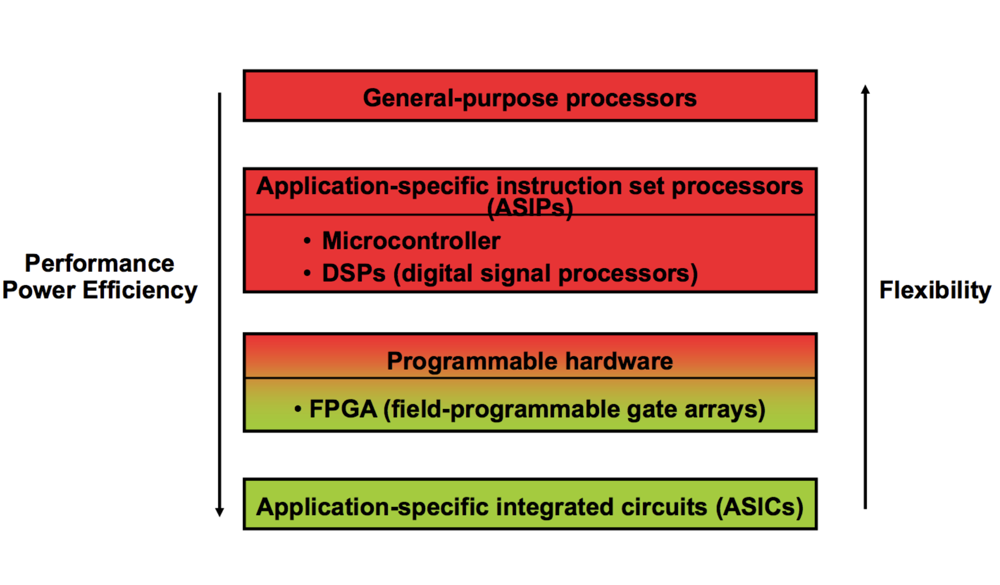
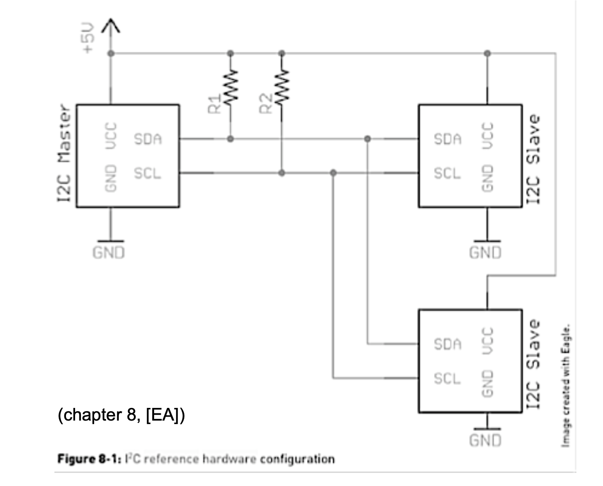

# IOT

## Richiami di Componenti e Circuiti Elettrici

## Carica Elettrica
- **Atomo**: Composto da elettroni (carica negativa), protoni (carica positiva) e neutroni (senza carica).
- **Carica dell'elettrone (Q)**: Misurata in Coulomb (C). 1 C = carica di 6.25 * 10^18 elettroni.
- **Materiali**:
  - **Conduttori**: Molti elettroni liberi (es. rame, argento).
  - **Semiconduttori**: Meno elettroni liberi (es. silicio).
  - **Isolanti**: Pochissimi elettroni liberi.

## Campo Elettrico
- **Carica netta**: Eccesso di elettroni (carica negativa) o protoni (carica positiva).
- **Forza elettrica**: Cariche opposte si attraggono, cariche uguali si respingono.
- **Ioni**: Atomi con carica netta positiva (ioni positivi) o negativa (ioni negativi).

## Tensione (Differenza di Potenziale)
- **Definizione**: Energia potenziale per unità di carica. \( V = \frac{W}{Q} \).
- **Unità**: Volt (V). 1 V = 1 Joule/Coulomb.
- **Generatori di Tensione**:
  - **Batteria**: Trasforma energia chimica in elettrica.
  - **Alimentatore**: Converte tensione alternata in continua.
  - **Celle solari**: Trasformano luce in energia elettrica.
  - **Generatori**: Trasformano energia meccanica in elettrica.

## Corrente Elettrica
- **Definizione**: Flusso ordinato di carica elettrica. \( I = \frac{Q}{t} \).
- **Unità**: Ampère (A). 1 A = 1 Coulomb/secondo.
- **Tipi di Corrente**:
  - **Continua (DC)**: Verso costante (es. batterie).
  - **Alternata (AC)**: Verso variabile periodicamente (es. rete elettrica).

## Potenza Elettrica
- **Definizione**: Energia consumata per unità di tempo. \( P = \frac{W}{t} \).
- **Unità**: Watt (W). 1 W = 1 Joule/secondo.
- **Consumo di Energia**: \( W = P \cdot t \) (es. kWh).

## Resistenza
- **Definizione**: Opposizione al passaggio della corrente. \( R = \frac{V}{I} \).
- **Unità**: Ohm (Ω). 1 Ω = 1 Volt/Ampère.
- **Legge di Ohm**: \( V = I \cdot R \).
- **Potenza Dissipata**: \( P = V \cdot I = I^2 \cdot R = \frac{V^2}{R} \).

## Componenti Elettronici
- **Passivi**: Resistori, condensatori, induttori, diodi.
- **Attivi**: Transistor, circuiti integrati.
- **Resistori**: Caduta di potenziale al passaggio della corrente. Codice colore per il valore.
- **Condensatori**: Immagazzinano carica elettrica. Capacità misurata in Farad (F).
- **Induttori**: Generano campo magnetico con corrente variabile.
- **Diodi**: Permettono il passaggio di corrente in una sola direzione.
- **LED**: Diodi emettitori di luce.
- **Transistor**: Amplificano segnali o agiscono come interruttori.

## Leggi di Kirchhoff
- **Prima Legge (dei Nodi)**: La somma delle correnti entranti in un nodo è uguale alla somma delle correnti uscenti.
- **Seconda Legge (delle Maglie)**: La somma algebrica delle tensioni in una maglia chiusa è zero.

## Resistenze e Condensatori in Serie e Parallelo
- **Resistenze**:
  - **Serie**: \( R_{eq} = R_1 + R_2 \).
  - **Parallelo**: \( R_{eq} = \frac{R_1 \cdot R_2}{R_1 + R_2} \).
- **Condensatori**:
  - **Serie**: \( C_{eq} = \frac{C_1 \cdot C_2}{C_1 + C_2} \).
  - **Parallelo**: \( C_{eq} = C_1 + C_2 \).

## Strumenti di Misura
- **Amperometro**: Misura la corrente in un circuito. Montato in serie. Resistenza interna piccola.
- **Voltmetro**: Misura la differenza di potenziale. Montato in parallelo. Resistenza interna grande.
- **Multimetro**: Strumento combinato per misurare tensione, corrente e resistenza.
  

##  Introduzione ai Sistemi Embedded

## 1. Concetti di base

### Definizione
I sistemi embedded sono sistemi di calcolo dedicati a svolgere una funzione specifica all'interno di dispositivi elettronici. Interagiscono con il mondo fisico tramite sensori e attuatori e possono essere costituiti da hardware e software.

### Caratteristiche principali
- **Scopo specifico:** progettati per un'unica applicazione.
- **Efficienza e risorse limitate:** ottimizzati per consumare meno energia e occupare poco spazio.
- **Criticità:** utilizzati in settori dove l'affidabilità è essenziale (sanità, automotive, industria).
- **Reattività e real-time:** devono rispondere velocemente agli input ambientali.

### Applicazioni comuni
- Elettronica di consumo (smartphone, smartwatch, fotocamere)
- Domotica (termostati, sistemi di illuminazione)
- Automotive (navigazione, sistemi di sicurezza)
- Sanità (monitor biomedicali, wearable)
- Industria (controllo processi, automazione)

## Differenza tra General Purpose Processor, ASIP, Programmable Hardware e ASIC

## General Purpose Processor (GPP)
- **Descrizione**: Un processore progettato per eseguire un'ampia gamma di applicazioni e compiti generici.
- **Caratteristiche**:
  - **Flessibilità**: Può eseguire qualsiasi tipo di software, grazie a un set di istruzioni generico.
  - **Utilizzo**: Comunemente utilizzato in computer desktop, laptop e server.
  - **Esempi**: CPU Intel, AMD, ARM Cortex-A.
- **Vantaggi**:
  - Adatto a una vasta gamma di applicazioni.
  - Facile da programmare e aggiornare.
- **Svantaggi**:
  - Meno efficiente per compiti specifici rispetto a hardware specializzato.

## Application-Specific Instruction-set Processor (ASIP)
- **Descrizione**: Un processore progettato per un'applicazione specifica o un dominio di applicazioni.
- **Caratteristiche**:
  - **Set di Istruzioni Personalizzato**: Ottimizzato per compiti specifici, migliorando l'efficienza.
  - **Utilizzo**: Utilizzato in applicazioni come elaborazione del segnale, telecomunicazioni, automobilistica.
  - **Esempi**: DSP (Digital Signal Processor) per l'elaborazione di segnali audio/video.
- **Vantaggi**:
  - Maggiore efficienza per compiti specifici rispetto ai GPP.
  - Bilancio tra flessibilità e prestazioni.
- **Svantaggi**:
  - Meno flessibile rispetto ai GPP per applicazioni generiche.

## Programmable Hardware (FPGA)
- **Descrizione**: Hardware riconfigurabile che può essere programmato per eseguire specifiche funzioni logiche.
- **Caratteristiche**:
  - **Riconfigurabilità**: Può essere riprogrammato per diverse applicazioni dopo la produzione.
  - **Utilizzo**: Utilizzato in prototipazione, accelerazione hardware, applicazioni di nicchia.
  - **Esempi**: FPGA (Field-Programmable Gate Array) di Xilinx, Intel (ex Altera).
- **Vantaggi**:
  - Alta flessibilità e capacità di aggiornamento.
  - Ideale per applicazioni che richiedono personalizzazione e velocità.
- **Svantaggi**:
  - Maggiore consumo energetico rispetto agli ASIC.
  - Costo più elevato per volumi di produzione elevati.

## Application-Specific Integrated Circuit (ASIC)
- **Descrizione**: Circuito integrato progettato per un'applicazione specifica.
- **Caratteristiche**:
  - **Ottimizzazione**: Massima efficienza per un compito specifico.
  - **Utilizzo**: Utilizzato in dispositivi di consumo, automobilistica, IoT, mining di criptovalute.
  - **Esempi**: Chip per smartphone, chip per mining Bitcoin.
- **Vantaggi**:
  - Massima efficienza energetica e prestazioni per l'applicazione specifica.
  - Costo ridotto per grandi volumi di produzione.
- **Svantaggi**:
  - Nessuna flessibilità dopo la produzione.
  - Costi di sviluppo e produzione iniziali elevati.

## Confronto Riassuntivo
| Caratteristica            | GPP                     | ASIP                    | Programmable Hardware (FPGA) | ASIC                     |
|---------------------------|-------------------------|-------------------------|------------------------------|--------------------------|
| **Flessibilità**           | Alta                   | Media                   | Alta                         | Bassa                    |
| **Efficienza**             | Bassa per compiti specifici | Alta per compiti specifici | Media-Alta                   | Massima                  |
| **Costo di Sviluppo**      | Basso                  | Medio                   | Alto                         | Molto Alto               |
| **Costo per Volume**       | Medio                  | Medio                   | Alto                         | Basso (per grandi volumi)|
| **Tempo di Mercato**       | Rapido                 | Medio                   | Medio                        | Lungo                    |
| **Esempi**                 | CPU Intel, AMD         | DSP per telecomunicazioni | FPGA Xilinx, Intel           | Chip per smartphone      |



## Embedded Systems: Interaction with the Environment via Sensors and Actuators

An **embedded system** is designed to interact with its environment through two key components: **sensors** and **actuators**. These components enable the system to perceive external conditions and respond appropriately, forming the basis of its functionality.

| **Aspect**          | **Sensors**                                                                 | **Actuators**                                                             |
|----------------------|-----------------------------------------------------------------------------|---------------------------------------------------------------------------|
| **Function**         | Measure or detect environmental phenomena                                  | Produce physical effects or actions                                      |
| **Output Type**      | Analog or digital                                                          | Mechanical, thermal, optical, etc.                                       |
| **Examples**         | Temperature sensors, humidity sensors, accelerometers                      | Motors, LEDs, heaters, relays                                             |
| **Role in System**   | Provide input data for decision-making                                     | Execute decisions by interacting with the environment                   |

### Comunication Protocols

#### **Summary of Concepts**
1. **UART/USART**:
   - UART is an asynchronous protocol for simple serial communication, while USART extends it with synchronous capabilities using a clock signal.

2. **I2C**:
   - A synchronous protocol with only two wires (clock and data), suitable for multi-device communication on the same bus.
   - master-slave architecture (tipically the microcontroller)
     - every slave has 7bit unique id (sent by master)
     - only target can respond to master
     - SDA = standard data
     - SCL = standard clock
   - Two lines:
     - clock 
     - bidirectional data line



1. **SPI**:
   - A faster, synchronous protocol requiring more wires, ideal for high-speed communication with peripherals.

2. **JTAG**:
   - A testing and debugging protocol used for hardware fault detection and software debugging in embedded systems.

3. **CAN-BUS**:
   - A robust, message-based protocol designed for automotive and industrial applications, capable of handling electromagnetic interference and supporting multiple nodes.

These protocols cater to different needs in embedded systems, ranging from simple communication (UART/I2C) to high-speed data transfer (SPI) and robust, multi-node networks (CAN-BUS). JTAG stands out as a specialized tool for testing and debugging.

## Signals 

The information associated to physical quantities are called signals:

- analog signals
- discrete signals 
- that can be further classified as:
  - logical signals, only two admissible values
  - codified signals, if more than two values
## 2. Microcontrollori e Architettura

### Elementi principali di un Microcontrollore
- **CPU**
- **Memoria (Flash, SRAM, EEPROM)**
- **GPIO (General Purpose Input/Output)**
- **Convertitori Analogico/Digitale (ADC)**
- **Timer**
- **Bus di comunicazione seriale**

### Esempio: Arduino Uno
- MCU: **ATMega328P** (8-bit, 16 MHz, 32 KB Flash, 2 KB SRAM, 1 KB EEPROM)
  - based on von neumann machine
    
- **14** pin digitali, **6** pin PWM, **6** ingressi analogici
- **Alimentazione:** 5V, input consigliato 7-12V

### Architetture CPU
- **Von Neumann:** memoria unica per dati e istruzioni
- **Harvard:** memorie separate per dati e istruzioni (usata nei microcontrollori)

# Embedded Systems and Object-Oriented Modelling

## Summary
This module focuses on the modelling of embedded software using paradigms such as Object-Oriented (OO) modelling. It explores the design and development of embedded software through top-down and bottom-up approaches, emphasizing the importance of modelling in understanding system complexities, reusability, portability, and extensibility.

## Key Concepts

### Modelling and Programming
- **Programming Paradigms**: OO is both a programming and modelling paradigm.
- **Model**: A representation of relevant aspects of a system, abstracting from irrelevant details.
- **Strong Relationships**: Between modelling and programming, as highlighted by the Scandinavian school.

### Importance of Modelling
- **Advantages**:
  - Better understanding of system complexities.
  - Reusability, portability, and extensibility.
  - Rigorous approaches to verify system correctness.

### Fundamental Dimensions of Modelling
- **Structure**: Parts composing a system.
- **Behaviour**: Computational behaviour of each part.
- **Interaction**: How parts interact.

### Paradigms and Languages
- **Modelling Paradigms**: Set of concepts and principles defining models (e.g., OO).
- **Modelling Languages**: Provide a rigorous way to represent models (e.g., UML).

### Object-Oriented Paradigm
- **Main Paradigm**: Effective abstraction for capturing and representing essential aspects of a problem.
- **Properties**:
  - Modularity, encapsulation, reuse, and extensibility.
- **Limitations**: Does not directly capture concurrency, asynchronous interactions, and distribution.

### Modelling Embedded Software
- **Two Main Parts**:
  - **Controller**: Encapsulates control/application logic.
  - **Controlled Elements**: Resources and devices managed by the controller.

### Button-LED Example
- **Model**: A button controlling an LED.
- **Interfaces**:
  - `Button`: `isPressed(): boolean`
  - `Led`: `switchOn()`, `switchOff()`
- **Control Loop**: Super-loop architecture for controlling the LED based on button state.

### From Models to Code: Arduino in Wiring/C++
- **Light Interface**: Abstract class in C++.
- **Led Device**: Concrete implementation of the Light interface.
- **Button Interface**: Basic button interface.
- **ButtonImpl**: Concrete implementation of the Button interface.
- **Setup and Loop**: Object creation and control loop in Arduino.

### Extension: LED with Light Intensity
- **LightExt Interface**: Extends the Light interface with `setIntensity(int)`.
- **LedExt Class**: Implements the LightExt interface, allowing control of LED intensity.

### Smart Light Controller
- **Evolution**: From a simple button-LED system to a smart light system.
- **Components**:
  - `MovementDetector`: Detects presence.
  - `LightDetector`: Measures light intensity.
  - `SmartLightController`: Controls the light based on presence and light intensity.

### Control Loop and Finite State Machines
- **Execution Model**: Based on a control loop (super-loop).
- **Finite State Machines (FSM)**: Used to describe state-based behaviours.

### Controller as an Active Entity
- **Conceptual Nature**: The controller is an active entity with its own control flow.
- **Agent Concept**: Used to model controllers as first-class active entities.

### Agents in Literature
- **Adopted in**: Artificial Intelligence, modelling and simulation, software engineering.
- **Agent-Oriented Software Engineering**: Agents encapsulate reactive and proactive behaviours.

### From Individual Agents to Multi-Agent Systems
- **Complex Systems**: Distributed systems with interacting/cooperating sub-systems.
- **Multi-Agent Systems**: Used to model systems like smart homes and smart cities.

## Bibliography
- **[OLE]**: Ole Lehrmann Madsen, Birger Møller-Pedersen. A Unified Approach to Modeling and Programming.
- **[GOF]**: Erich Gamma; Richard Helm, Ralph Johnson, John M. Vlissides. Design Patterns: Elements of Reusable Object-Oriented Software.
- **[WOO]**: Michael Wooldridge. An Introduction to MultiAgent Systems.
- **[JEN]**: Nicholas R. Jennings. An agent-based approach for building complex software systems.
- 
## 3. Programmazione dei Microcontrollori

### Struttura del codice in Wiring (Arduino)
```cpp
void setup() {
  pinMode(13, OUTPUT); 
}

void loop() {
  digitalWrite(13, HIGH);
  delay(1000);
  digitalWrite(13, LOW);
  delay(1000);
}
```

### Concetti chiave
- **Super-loop:** ciclo infinito senza sistema operativo.
- **Interfacciamento GPIO:** gestione di input e output digitali/analogici.
- **Interrupt:** gestione asincrona degli eventi.
- **Comunicazione seriale:** invio e ricezione dati (UART, I2C, SPI).

## 4. Sensori e Attuatori

### Sensori
Dispositivi che rilevano grandezze fisiche e le trasformano in segnali elettrici.
- **Analogici:** generano segnali continui (termistori, LDR, microfoni)
- **Digitali:** generano segnali discreti (sensori di prossimità, encoder)

### Attuatori
Dispositivi che trasformano segnali elettrici in azioni fisiche.
- **Motori (DC, stepper, servo)**
- **LED, display, buzzer**
- **Relè, elettrovalvole**

### Conversione ADC
Gli ingressi analogici vengono convertiti in valori numerici (0-1023 su Arduino con ADC a 10 bit).
```cpp
int val = analogRead(A0);
```

## 5. Considerazioni su Misurazioni e Errori
- **Accuratezza:** differenza tra valore misurato e reale.
- **Precisione:** ripetibilità della misura.
- **Errori sistematici e casuali:** fonti di imprecisione nelle misurazioni.


## 3.1 Embedded Systems based on SoC and RTOS - Summary

#### Introduction

This module covers embedded systems based on **System-on-a-Chip (SoC)** and **Real-Time Operating Systems (RTOS)**. It explores the transition from microcontrollers to SoCs, the architecture of SoCs, and the role of RTOS in embedded systems.

---

#### Operating Systems: Some Recall

#### Modern Computing Systems: A Bird’s Eye View

- **Computing System**: Composed of **software** and **hardware**.
  - **Highest Levels**: High-level programming languages, applications, and complex software systems.
  - **Lowest Levels**: Electronic circuits, logical ports, and binary logic.
- **Design and Construction Complexity**: Managed through **hierarchical levels (layers)**.
  - **Decomposition in Modules**: Each module encapsulates functionalities and defines an abstraction level.
  - **Hierarchical Organisation**: Each module corresponds to a layer, providing an interface to exploit functionalities while hiding implementation details.

---

#### Layers/Levels

- **Highest-Level View**:
  - **High-level Languages / Applications**
  - **Operating System**
  - **Hardware**

---

#### Language/Application Level Zoom

- **Applications**
- **High-level Languages**
- **Compilers / Interpreters**
- **Virtual Machines**
- **Operating System**
- **Hardware**

---

#### Hardware Level Zoom

- **High-level Languages / Applications**
- **Operating Systems**
- **Assembler**
- **Machine Language (or Code)**
- **Computer Architecture**
  - **ALU (Arithmetic Logic Unit)**
  - **Memory**
  - **Boolean Arithmetic / Algebra**
  - **Combinatory & Sequential Logic Circuits**
  - **Boolean Logic**

---

#### Virtualisation Level Zoom

- **High-level Languages / Applications**
- **Operating System**
- **System Compiler**
- **System Virtual Machine**
- **Hardware**

---

#### Overall Software and Hardware Hierarchy

- **Software Hierarchy**:
  - **Applications**
  - **High-level Languages**
  - **Compilers / Interpreters**
  - **Virtual Machines**
  - **Operating System**
  - **System Compiler**
  - **System Virtual Machine**
- **Hardware Hierarchy**:
  - **Assembler**
  - **Machine Language**
  - **Computer Architecture**
  - **ALU and Memory**
  - **Boolean Arithmetic and Sequential Logic Circuits**
  - **Boolean Logic**

---

#### Levels and Interfaces

- **Main Interfaces**:
  - **Instruction Set Architecture (ISA)**:
    - **System ISA**: Interface for OS-level instructions.
    - **User ISA**: Interface for user-level instructions.
  - **Application Binary Interface (ABI)**: Combines user ISA and system call interface.
  - **System Call Interface**: Provides fundamental OS services to programs.
  - **Application Programming Interface (API)**: For high-level languages (e.g., C, Java).

---

##### Machine Interface: ISA

- **Application Software**
- **Operating System**
  - **System ISA**
  - **User ISA**
- **Execution Hardware**
  - **Physical Machine**
  - **System Interconnect (BUS)**
  - **Memory Translation**
  - **Controllers**
  - **I/O Device and Networking**
  - **Main Memory**

---

#### Machine Interface: ABI

- **Application Software**
  - **System Call Interface**
- **Operating System**
  - **Drivers**
  - **Memory Manager**
  - **Scheduler**
- **Execution Hardware**
  - **Abstract / Virtual Machine**
  - **System Interconnect (BUS)**
  - **Memory Translation**
  - **Controllers**
  - **I/O Device and Networking**
  - **Main Memory**

---

#### Key Concepts

- **ISA (Instruction Set Architecture)**: Separates hardware and software levels.
  - **User ISA**: Accessible by user programs.
  - **System ISA**: Accessible only by the OS (privileged instructions).
- **ABI (Application Binary Interface)**: Combines user ISA and system call interface.
- **System Call Interface**: Provides OS services to programs, transferring control to the OS kernel.

---

#### Conclusion

- **Operating Systems** act as intermediaries between **hardware** and **software**, providing abstraction and resource management.
- **Hierarchical layers** simplify the design and construction of computing systems.
- **Interfaces** like **ISA**, **ABI**, and **System Call Interface** enable communication between different levels of the system.

##### 1. **System-on-a-Chip (SoC)**

- **Definition**: An integrated circuit that combines most components of a computer system (CPU, memory, I/O controllers, etc.) on a single chip.
- **Examples**:
  - **Broadcom BCM2837**: Used in Raspberry Pi 3.
  - **ARM Sitara AM335x**: Used in BeagleBone and Arduino Tre.
  - **ESP8266** and **ESP32**: Popular IoT SoCs with Wi-Fi and Bluetooth capabilities.

###### 2. **Real-Time Operating Systems (RTOS)**

- **Definition**: Operating systems designed for embedded systems, providing deterministic and predictable behavior.
- **Features**:
  - Compactness, efficiency, reliability.
  - Support for multi-tasking and real-time scheduling.
- **Examples**:
  - **Open-source**: FreeRTOS, RT Linux.
  - **Commercial**: VxWorks, QNX Neutrino, Micrium uC/OS-III.

---

#### SoC Architecture

- **Components**:
  - Processors/cores (CPU, DSP).
  - Memory modules (ROM, RAM, Flash).
  - Clock, timers, and standard interfaces (USB, Ethernet, I2C, SPI).
  - Radio/network interfaces (Wi-Fi, Bluetooth).
  - DAC and ADC for analog signals.

---

#### RTOS Features

- **Determinism**: Predictable response times for real-time tasks.
- **Task Scheduling**:
  - **Preemptive**: Higher priority tasks can interrupt lower priority ones.
  - **Priority-based**: Tasks are executed based on their priority.
  - **Round-robin**: Tasks are executed in a cyclic order.
- **Task States**: Ready, Running, Waiting, Dormant.
- **Task Communication**: Semaphores, message queues, event flags.

---

#### Real-Time Systems

- **Hard Real-Time**: Deadlines must be met (e.g., safety-critical systems).
- **Soft Real-Time**: Deadlines are preferred but not critical.
- **Scheduling Algorithms**:
  - **Rate Monotonic (RM)**: Fixed priorities based on task periods.
  - **Earliest Deadline First (EDF)**: Dynamic priorities based on deadlines.

---

#### Benefits of RTOS

- **Improved Responsiveness**: Minimizes overhead and maximizes CPU utilization.
- **Resource Management**: Efficient sharing of resources among tasks.
- **Simplified Development**: Abstraction layer for hardware access.
- **Portability**: Applications can run on different hardware platforms.

---

#### When to Use RTOS

- **Useful for**:
  - Complex embedded systems with multiple tasks.
  - Systems requiring real-time responsiveness.
- **Not useful for**:
  - Simple super-loop applications.
  - Single-task applications with small memory footprints.

---

#### Examples of RTOS Architectures

- **FreeRTOS**: Open-source RTOS with a modular architecture.
- **QNX Neutrino**: Commercial RTOS with a microkernel architecture.
- **RT Linux**: Real-time extension of the Linux kernel.

---

#### Scheduling in RTOS

- **Temporal Parameters**:
  - **Release time**: When a task is ready to execute.
  - **Execution time**: Time required to complete the task.
  - **Deadline**: Maximum allowed time for task completion.
- **Scheduling Strategies**:
  - **Priority-based**: Tasks are executed based on priority.
  - **Round-robin**: Tasks are executed in a cyclic order.
  - **Preemptive**: Higher priority tasks can interrupt lower priority ones.

---

#### Conclusion

- **SoC** and **RTOS** are essential for modern embedded systems, enabling complex, real-time applications with efficient resource management.
- **RTOS** provides deterministic behavior, making it suitable for real-time tasks, while **SoC** integrates all necessary components on a single chip, reducing system complexity.

---

#### References

- **FreeRTOS**: [https://www.freertos.org/](https://www.freertos.org/)
- **Comparison of RTOS**: [Wikipedia](https://en.wikipedia.org/wiki/Comparison_of_real-time_operating_systems)

## 3.2 From Embedded Systems to Internet of Things (IoT) - Summary

This module explores the transition from **Embedded Systems** to the **Internet of Things (IoT)**, focusing on the evolution of IoT, its impact on industries, and the integration of IoT with web technologies.

---

### 1. Internet of Things (IoT)

- **Definition**: IoT refers to the network of physical objects (things) embedded with sensors, software, and connectivity to exchange data over the Internet.
- **Origin**: Introduced by Kevin Ashton in 1999, IoT aims to automate the digitalization of the physical world.
- **Impact**: IoT has transformed industries, enabling real-time data collection, automation, and predictive maintenance.

### 2. **IoT Evolution**

- **Stages**:
  1. **Product Stage**: Basic functionality (e.g., air conditioner).
  2. **Smart Product**: Programmable functionality (e.g., programmable air conditioner).
  3. **Smart Connected Products**: Internet-enabled (e.g., air conditioner controllable via smartphone).
  4. **Product Systems**: Interoperability between devices (e.g., smart thermostat, HVAC, and blinds).
  5. **System of Systems**: Integration across multiple domains (e.g., home, car, hospital).

### 3. **Industrial IoT (IIoT)**

- **Industry 4.0**: The fourth industrial revolution, characterized by the integration of IoT, big data, and automation in manufacturing.
- **Key Technologies**:
  - **SCADA Systems**: Supervisory Control and Data Acquisition systems for industrial automation.
  - **PLC Programming**: Programmable Logic Controllers (PLCs) are used to control industrial processes.
  - **OPC Standards**: Open Platform Communication for interoperability between industrial devices.

### 4. **IoT Architecture**

- **Core Components**:
  - **Things**: Embedded systems with sensors and actuators.
  - **Connectivity**: Communication protocols like MQTT, CoAP, and WebSockets.
  - **Cloud**: Data storage, processing, and analytics.
  - **Edge Computing**: Local data processing to reduce latency and bandwidth usage.

### 5. **IoT and Cloud Computing**

- **Cloud Services**:
  - **IaaS**: Infrastructure as a Service (e.g., virtual machines, storage).
  - **PaaS**: Platform as a Service (e.g., runtime environments, databases).
  - **SaaS**: Software as a Service (e.g., CRM, email).
- **IoT Applications**: Data collection, real-time analytics, and device management.

### 6. **Web of Things (WoT)**

- **Definition**: Extending IoT to the web by providing RESTful APIs for IoT devices.
- **Benefits**:
  - **Interoperability**: Standardized communication between devices.
  - **Ease of Integration**: Simplifies development and deployment of IoT applications.
  - **Scalability**: Supports large-scale IoT systems.

### 7. **IoT Challenges**

- **Security**: Ensuring data integrity and device authentication.
- **Privacy**: Protecting user data and ensuring compliance with regulations.
- **Interoperability**: Standardizing communication protocols and architectures.

---

### Applications of IoT

### 1. **Smart Cities**

- **Examples**: Traffic management, energy efficiency, and emergency response systems.
- **Technologies**: IoT-enabled sensors, cloud computing, and data analytics.

### 2. **Healthcare**

- **Examples**: Remote patient monitoring, wearable devices, and smart hospitals.
- **Technologies**: IoT sensors, mobile apps, and cloud-based data storage.

### 3. **Transportation and Logistics**

- **Examples**: Fleet management, predictive maintenance, and autonomous vehicles.
- **Technologies**: GPS, IoT sensors, and real-time data analytics.

### 4. **Smart Homes**

- **Examples**: Smart thermostats, lighting, and security systems.
- **Technologies**: IoT devices, mobile apps, and cloud integration.

---

### IoT Technologies and Protocols

### 1. **Communication Protocols**

- **MQTT**: Lightweight messaging protocol for IoT.
- **CoAP**: Constrained Application Protocol for resource-constrained devices.
- **HTTP/WebSockets**: For web-based IoT applications.

### 2. **Edge Computing**

- **Definition**: Processing data locally on edge devices to reduce latency and bandwidth usage.
- **Examples**: IoT gateways, edge servers.

### 3. **OPC Standards**

- **OPC-UA**: Unified Architecture for industrial IoT, enabling secure and interoperable communication.

---

### Conclusion

- **IoT** is transforming industries by enabling real-time data collection, automation, and predictive maintenance.
- **Industrial IoT (IIoT)** is driving the fourth industrial revolution (Industry 4.0) with advanced automation and data analytics.
- **Web of Things (WoT)** extends IoT to the web, enabling interoperability and simplifying IoT application development.
- **Challenges** such as security, privacy, and interoperability must be addressed to fully realize the potential of IoT.

---

### References

- Kevin Ashton. *The Internet of Things Thing*. RFID Journal, 2009.
- Luigi Atzori, Antonio Iera, Giacomo Morabito. *The Internet of Things: A survey*. Computer Networks, 2010.
- Samuel Greengard. *The Internet of Things*. MIT Press.
- IoT Fundamentals: Networking Technologies, Protocols, and Use Cases for the Internet of Things. Hanes et al., Cisco Press, 2017.
  
## 3.3 Technologies and Protocols for Wireless Communication - Summary

#### Introduction
This module provides an overview of **wireless communication technologies and protocols** used in **embedded systems** and **IoT (Internet of Things)**. It covers the evolution of wireless communication, key protocols, and their applications in IoT.

---

#### Key Concepts

###### 1. **Wireless Communication in IoT**
- **Definition**: Wireless communication enables devices to exchange data without physical connections, crucial for IoT and M2M (Machine-to-Machine) systems.
- **Types**:
  - **Wired**: Ethernet, 802.11.
  - **Wireless**: Wi-Fi, Bluetooth, ZigBee, cellular networks (3G/4G/5G).

###### 2. **Internet Connection in IoT**
- **Indirect Connection**: Devices connect via a gateway (e.g., ZigBee, Bluetooth).
- **Direct Connection**: Devices connect directly to the Internet (e.g., Wi-Fi, 3G/4G/5G).
- **Protocols**: IP, TCP/IP, UDP/IP.

###### 3. **ISO-OSI Architecture**
- **Layers**: Application, Transport, Network, Data Link, Physical.
- **Internet Stack**: Hourglass model with IP at the core.

---

#### Wireless Technologies and Protocols

###### 1. **Short-Range Communication**
- **Examples**: Bluetooth (IEEE 802.15.1), Visible Light Communication (IEEE 802.15.7).
- **Range**: Up to 10 meters.

###### 2. **Medium-Range Communication**
- **Examples**: Wi-Fi (IEEE 802.11), ZigBee (IEEE 802.15.4).
- **Range**: Up to 100 meters.

###### 3. **Long-Range Communication**
- **Examples**: Cellular networks (2G, 3G, 4G, 5G), LPWA (Low-Power Wide-Area) technologies.
- **Range**: Over 1 mile.

---

#### Key Wireless Protocols

###### 1. **Wi-Fi (IEEE 802.11)**
- **Characteristics**: High data rate (up to 54 Mbps), range up to 150 meters, 5 GHz frequency.
- **Use Case**: Internet connectivity in embedded systems.

###### 2. **Bluetooth (IEEE 802.15.1)**
- **Characteristics**: Short-range, low power consumption, 2.4 GHz frequency.
- **Versions**: Classic Bluetooth, Bluetooth Low Energy (BLE), Bluetooth 5.
- **Topology**: Piconet (master-slave) and Scatternet (multiple piconets).

###### 3. **ZigBee (IEEE 802.15.4)**
- **Characteristics**: Low power, low data rate (up to 250 kbps), range up to 100 meters.
- **Topology**: Star, Mesh, Cluster Tree.
- **Use Case**: Home automation, industrial IoT.

###### 4. **Cellular Networks (2G, 3G, 4G, 5G)**
- **Characteristics**: High data rates (up to 10 Gbps for 5G), long range (km), high power consumption.
- **Use Case**: IoT applications requiring wide-area connectivity.

###### 5. **5G**
- **Characteristics**: High speed (1-10 Gbps), low latency (1-10 ms), designed for IoT.
- **Use Case**: Smart cities, autonomous vehicles, industrial IoT.

---

#### IoT-Specific Protocols

###### 1. **6LoWPAN**
- **Definition**: IPv6 over Low-Power Wireless Personal Area Networks.
- **Use Case**: Enables IP communication in low-power IoT devices.

###### 2. **Thread**
- **Definition**: IPv6-based protocol for low-power IoT devices.
- **Characteristics**: Secure, reliable, self-healing mesh network.
- **Use Case**: Home and building automation.

###### 3. **Matter**
- **Definition**: Open-source connectivity standard for smart home devices.
- **Characteristics**: Interoperable, secure, royalty-free.
- **Use Case**: Smart home ecosystems.

---

#### Application-Level Protocols

###### 1. **CoAP (Constrained Application Protocol)**
- **Transport**: UDP.
- **Use Case**: Lightweight, RESTful communication for IoT devices.

###### 2. **MQTT (Message Queuing Telemetry Transport)**
- **Transport**: TCP.
- **Use Case**: Publish/subscribe messaging for IoT.

---

#### Conclusion
- **Wireless communication** is essential for IoT, enabling devices to connect and exchange data.
- **Key technologies** include Wi-Fi, Bluetooth, ZigBee, and cellular networks (5G).
- **IoT-specific protocols** like 6LoWPAN, Thread, and Matter ensure efficient, secure communication in constrained environments.
- **Application-level protocols** like CoAP and MQTT facilitate data exchange in IoT systems.

---

#### References
- **IoT Fundamentals**: Networking Technologies, Protocols, and Use Cases for the Internet of Things. Hanes et al., Cisco Press, 2017.
- **Building Internet of Things with Arduino**, Charalampos Doukas.
# Resistenza per LED con Arduino e ESP32

La resistenza per un LED si calcola con la **Legge di Ohm**:

\[
R = \frac{V_{cc} - V_f}{I}
\]

Dove:
- \( R \): resistenza in ohm (Ω).
- \( V_{cc} \): tensione di alimentazione (5V per Arduino, 3.3V per ESP32).
- \( V_f \): tensione diretta del LED (tipicamente 1.8V-3.3V).
- \( I \): corrente desiderata (di solito 20 mA = 0.02 A).

---

## Esempi di calcolo

### Arduino (5V)
- \( V_{cc} = 5V \)
- \( V_f = 2V \) (LED rosso)
- \( I = 20 mA \)

\[
R = \frac{5V - 2V}{0.02A} = 150 \, \Omega
\]

**Usa una resistenza da 150 Ω** (o 220 Ω come valore standard).

---

### ESP32 (3.3V)
- \( V_{cc} = 3.3V \)
- \( V_f = 2V \) (LED rosso)
- \( I = 20 mA \)

\[
R = \frac{3.3V - 2V}{0.02A} = 65 \, \Omega
\]

**Usa una resistenza da 68 Ω** (valore standard più vicino).

---

## Tabella riassuntiva

| Componente       | \( V_{cc} \) | \( V_f \) | \( I \) | Resistenza (\( R \)) |
|------------------|--------------|-----------|---------|----------------------|
| Arduino (5V)     | 5V           | 2V        | 20 mA   | 150 Ω                |
| Arduino (5V)     | 5V           | 3.3V      | 20 mA   | 85 Ω                 |
| ESP32 (3.3V)     | 3.3V         | 2V        | 20 mA   | 68 Ω                 |
| ESP32 (3.3V)     | 3.3V         | 3.3V      | 20 mA   | 0 Ω (non necessaria) |

---

## Note
1. **Corrente massima dei pin**:
   - Arduino: max 20 mA.
   - ESP32: max 12-20 mA (per sicurezza).
2. Se \( V_f = V_{cc} \) (es. 3.3V su ESP32), usa una piccola resistenza (es. 10 Ω) per limitare la corrente.
3. Usa valori standard di resistenza (es. 220 Ω invece di 150 Ω).

©