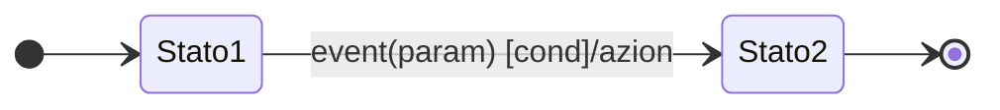

<script type="text/javascript" async
  src="https://cdnjs.cloudflare.com/ajax/libs/mathjax/2.7.7/MathJax.js?config=TeX-MML-AM_CHTML">
</script>
<script type="text/javascript" src="http://cdn.mathjax.org/mathjax/latest/MathJax.js?config=TeX-AMS-MML_HTMLorMML"></script>
<script type="text/x-mathjax-config"> MathJax.Hub.Config({ tex2jax: {inlineMath: [['$', '$']]}, messageStyle: "none" });</script>

# INGEGNERIA SW

- [INGEGNERIA SW](#ingegneria-sw)
  - [Ciclo di vita](#ciclo-di-vita)
    - [1. Definizione Strategica](#1-definizione-strategica)
    - [2. Pianificazione](#2-pianificazione)
    - [3. Controllo di Qualità](#3-controllo-di-qualità)
    - [4. Analisi dei Requisiti](#4-analisi-dei-requisiti)
    - [5. Progettazione del Sistema](#5-progettazione-del-sistema)
    - [6. Progettazione Esecutiva](#6-progettazione-esecutiva)
    - [7. Realizzazione e Collaudo in Fabbrica](#7-realizzazione-e-collaudo-in-fabbrica)
    - [8. Certificazione](#8-certificazione)
    - [9. Installazione](#9-installazione)
    - [10. Collaudo del Sistema Installato](#10-collaudo-del-sistema-installato)
    - [11. Esercizio](#11-esercizio)
    - [12. Diagnosi](#12-diagnosi)
    - [13. Manutenzione](#13-manutenzione)
    - [14. Evoluzione](#14-evoluzione)
      - [Riassunto](#riassunto)
    - [Analisi requisiti](#analisi-requisiti)
    - [Come modellare?](#come-modellare)
      - [Analisi Oggetti (Informazioni complesse, funzioni relativamente semplici)](#analisi-oggetti-informazioni-complesse-funzioni-relativamente-semplici)
      - [Analisi Funzioni (complessità nelle trasformazioni input-output)](#analisi-funzioni-complessità-nelle-trasformazioni-input-output)
      - [Analisi Stati (Modellare la sincronizzazione tra diverse attività cooperanti nel sistema)](#analisi-stati-modellare-la-sincronizzazione-tra-diverse-attività-cooperanti-nel-sistema)
    - [Come costruire una base di conoscenza ?](#come-costruire-una-base-di-conoscenza-)
    - [Linguaggi per specificare requisiti](#linguaggi-per-specificare-requisiti)
    - [Uso di notazioni](#uso-di-notazioni)
    - [Progettazione](#progettazione)
  - [Paradigma a Oggetti](#paradigma-a-oggetti)
    - [Oggetti](#oggetti)
      - [Interfaccia](#interfaccia)
      - [Dati astratti](#dati-astratti)
      - [Classi](#classi)
      - [Incapsulamento](#incapsulamento)
      - [Operazioni e metodi](#operazioni-e-metodi)
    - [Ereditarietà](#ereditarietà)
      - [Ereditarietà multipla](#ereditarietà-multipla)
    - [Polimorfismo](#polimorfismo)
    - [Oggetto complesso e delegazione](#oggetto-complesso-e-delegazione)
    - [Obbiettivo OOP](#obbiettivo-oop)
    - [Approccio funzionale](#approccio-funzionale)
    - [Approccio a Oggetti VS Funzionale](#approccio-a-oggetti-vs-funzionale)
      - [Benefici oggetti](#benefici-oggetti)
  - [UML](#uml)
    - [Struttura](#struttura)
    - [Costituenti fondamentali - ENTITÀ](#costituenti-fondamentali---entità)
      - [STRUTTURE](#strutture)
      - [COMPORTAMENTI](#comportamenti)
      - [RAGGRUPPAMENTI](#raggruppamenti)
      - [INFORMAZIONI](#informazioni)
    - [Costituenti fondamentali - RELAZIONI](#costituenti-fondamentali---relazioni)
    - [Costituenti fondamentali - DIAGRAMMI](#costituenti-fondamentali---diagrammi)
      - [STATICI](#statici)
      - [DINAMICI](#dinamici)
      - [FUNZIONALI](#funzionali)
    - [Specifiche](#specifiche)
    - [Ornamenti](#ornamenti)
    - [Distinzioni Comuni](#distinzioni-comuni)
    - [Estendibilità e personalizzazione](#estendibilità-e-personalizzazione)
      - [Stereotipo](#stereotipo)
      - [Proprietà](#proprietà)
      - [Vincolo](#vincolo)
      - [Profilo](#profilo)
      - [Differenza tra classe e componente](#differenza-tra-classe-e-componente)
    - [Architettura - Viste del software](#architettura---viste-del-software)
      - [Vista dei casi d’uso](#vista-dei-casi-duso)
      - [Vista Logica](#vista-logica)
      - [Vista dei processi](#vista-dei-processi)
      - [Vista di implementazione](#vista-di-implementazione)
      - [Vista di deployment](#vista-di-deployment)
    - [DIAGRAMMI - casi d’uso](#diagrammi---casi-duso)
      - [Attore e Casi d'uso](#attore-e-casi-duso)
      - [Ruolo casi d’uso](#ruolo-casi-duso)
      - [Come disegnare casi d’uso](#come-disegnare-casi-duso)
      - [Scenario](#scenario)
    - [DIAGRAMMI - diagramma delle classi](#diagrammi---diagramma-delle-classi)
      - [Attributi](#attributi)
      - [Operazioni](#operazioni)
        - [Parametri](#parametri)
      - [Associazione](#associazione)
        - [VINCOLI E CLASSI ASSOCIATIVE](#vincoli-e-classi-associative)
        - [ASSOCIAZIONI QUALIFICATE](#associazioni-qualificate)
        - [ASSOCIAZIONI N-ARIE](#associazioni-n-arie)
      - [Elementi derivati](#elementi-derivati)
      - [Aggregazione](#aggregazione)
      - [Composizione](#composizione)
      - [Differenze tra le due](#differenze-tra-le-due)
      - [Generalizzazione](#generalizzazione)
      - [Classi astratte](#classi-astratte)
      - [Powertype](#powertype)
      - [Dipendenza](#dipendenza)
      - [Template](#template)
      - [Raffinamento](#raffinamento)
      - [Interfacce](#interfacce)
      - [Analisi vs Progettazione](#analisi-vs-progettazione)
        - [ANALISI](#analisi)
        - [PROGETTAZIONE](#progettazione-1)
        - [Identificazione classi analisi](#identificazione-classi-analisi)
      - [Classi di progettazione](#classi-di-progettazione)
      - [Associazione molti-a-uno molti-molti](#associazione-molti-a-uno-molti-molti)
      - [Associazioni uno-uno](#associazioni-uno-uno)
      - [Associazioni ternarie](#associazioni-ternarie)
      - [Classe associativa](#classe-associativa)
    - [DIAGRAMMI - diagramma degli oggetti](#diagrammi---diagramma-degli-oggetti)
    - [DIAGRAMMI - diagramma dei package](#diagrammi---diagramma-dei-package)
    - [DIAGRAMMI - diagramma di interazione](#diagrammi---diagramma-di-interazione)
    - [DIAGRAMMI - diagramma di sequenza](#diagrammi---diagramma-di-sequenza)
      - [Possibilità di specificare vincoli e visualizzare stati](#possibilità-di-specificare-vincoli-e-visualizzare-stati)
      - [Frammenti combinati](#frammenti-combinati)
    - [DIAGRAMMI -  diagramma degli stati](#diagrammi----diagramma-degli-stati)
      - [Tipi di eventi](#tipi-di-eventi)
      - [Stati compositi](#stati-compositi)
      - [Comunicazione automi](#comunicazione-automi)
    - [DIAGRAMMI - diagramma di attività](#diagrammi---diagramma-di-attività)
      - [Attività](#attività)
      - [Corsie](#corsie)
    - [DIAGRAMMI - diagramma dei componenti](#diagrammi---diagramma-dei-componenti)
    - [DIAGRAMMI - diagramma di deployment](#diagrammi---diagramma-di-deployment)
      - [Nodi](#nodi)
      - [Manufatto](#manufatto)
    - [Conclusioni UML](#conclusioni-uml)
    - [DIFFERENZE TRA VARI MODELLI](#differenze-tra-vari-modelli)
  - [Ingegneria SW](#ingegneria-sw-1)
    - [Qualità software](#qualità-software)
    - [Principi di progettazione](#principi-di-progettazione)
      - [PRINCIPI: formalità](#principi-formalità)
      - [PRINCIPI: anticipazione dei cambiamenti](#principi-anticipazione-dei-cambiamenti)
        - [Tipi di Cambiamenti](#tipi-di-cambiamenti)
        - [Aree di Cambiamento](#aree-di-cambiamento)
      - [PRINCIPI: Separazione degli Aspetti di un Problema Complesso](#principi-separazione-degli-aspetti-di-un-problema-complesso)
        - [Criteri di Suddivisione](#criteri-di-suddivisione)
      - [PRINCIPI: Modularità](#principi-modularità)
        - [Benefici della Modularizzazione](#benefici-della-modularizzazione)
        - [Linee Guida per la Modularizzazione](#linee-guida-per-la-modularizzazione)
        - [Definizione dell'Interfaccia dei Moduli](#definizione-dellinterfaccia-dei-moduli)
        - [Requisiti dell'Interfaccia](#requisiti-dellinterfaccia)
      - [PRINCIPI: Astrazione](#principi-astrazione)
      - [PRINCIPI: generalità](#principi-generalità)
    - [Misurazione](#misurazione)
      - [Fonti di Costo](#fonti-di-costo)
      - [Fattori di Costo](#fattori-di-costo)
      - [Metriche del Software: Function Points (FP)](#metriche-del-software-function-points-fp)
        - [Caratteristiche Principali](#caratteristiche-principali)
      - [Utilizzo dei Function Points (FP) nelle Organizzazioni](#utilizzo-dei-function-points-fp-nelle-organizzazioni)
      - [Conteggio dei Function Points](#conteggio-dei-function-points)
        - [Pesi delle Funzioni](#pesi-delle-funzioni)
    - [Numero Ciclomatico](#numero-ciclomatico)
      - [Introduzione](#introduzione)
      - [Calcolo del Numero Ciclomatico](#calcolo-del-numero-ciclomatico)
        - [Grafo Fortemente Connesso](#grafo-fortemente-connesso)
        - [Formula](#formula)
        - [Esempio](#esempio)
      - [Interpretazione](#interpretazione)
      - [Grafo di Esempio](#grafo-di-esempio)
      - [Teorema di Mills](#teorema-di-mills)
      - [Programmi con Procedure](#programmi-con-procedure)
      - [Interpretazione del Numero Ciclomatico](#interpretazione-del-numero-ciclomatico)
      - [Esempio Pratico](#esempio-pratico)
        - [Caso 1: Punti di Decisione](#caso-1-punti-di-decisione)
      - [Caso 2: Programma con Procedure](#caso-2-programma-con-procedure)
      - [Conclusione](#conclusione)
    - [COCOMO: Constructive Cost Model](#cocomo-constructive-cost-model)
      - [Modello intermedio](#modello-intermedio)
    - [Produzione](#produzione)
    - [Modelli prescrittivi](#modelli-prescrittivi)
    - [Modello a cascata](#modello-a-cascata)
    - [Modello incrementale](#modello-incrementale)
    - [RAD](#rad)
    - [Incrementale vs iterativo](#incrementale-vs-iterativo)
    - [Modelli evolutivi](#modelli-evolutivi)
    - [Prototipazione evolutiva](#prototipazione-evolutiva)
    - [Prototipazione usa e getta](#prototipazione-usa-e-getta)
    - [Modello a spirale](#modello-a-spirale)
    - [Model driven development](#model-driven-development)
    - [Modelli agili](#modelli-agili)
    - [Extreme programming](#extreme-programming)
    - [Unified Process (UP)](#unified-process-up)
    - [Modello di UP (RUP - Rational Unified Process)](#modello-di-up-rup---rational-unified-process)
    - [Manufatti (Artefatti)](#manufatti-artefatti)
    - [Flussi di lavoro](#flussi-di-lavoro)
    - [Fasi del UP](#fasi-del-up)
    - [Milestone](#milestone)
    - [Verifica del software](#verifica-del-software)
      - [Testing in the **Small**](#testing-in-the-small)
      - [**Testing in the Large**](#testing-in-the-large)
      - [Code inspection/ Code walk-through](#code-inspection-code-walk-through)
      - [Analisi flusso dati](#analisi-flusso-dati)
    - [Certificazione e Norme Tecniche](#certificazione-e-norme-tecniche)
    - [Obiettivi della ISO 9000](#obiettivi-della-iso-9000)
    - [Certificazione ISO 9000](#certificazione-iso-9000)
    - [Iter di Certificazione](#iter-di-certificazione)
    - [Non Conformità](#non-conformità)
    - [Documenti del Progetto](#documenti-del-progetto)
    - [Tipi di Manutenzione](#tipi-di-manutenzione)
    - [Analogie con il Mondo Reale](#analogie-con-il-mondo-reale)
    - [Fattori Chiave per la Manutenibilità](#fattori-chiave-per-la-manutenibilità)

## Ciclo di vita

### 1. Definizione Strategica

- Si decide quale area aziendale sarà oggetto di automazione.

### 2. Pianificazione

- Si definiscono gli obiettivi, si evidenziano i fabbisogni e si realizza uno studio di fattibilità per identificare strategie, costi, benefici e tempi.

### 3. Controllo di Qualità

- Si prepara un piano per garantire il rispetto delle specifiche e verificare che il sistema funzioni come previsto.

### 4. Analisi dei Requisiti

- Si formalizzano i requisiti utilizzando tecniche di modellazione e si producono macro-specifiche per la progettazione.

### 5. Progettazione del Sistema

- I requisiti vengono trasformati in una soluzione architetturale di massima, con specifiche indipendenti dagli strumenti di sviluppo.

### 6. Progettazione Esecutiva

- Si descrivono struttura e comportamento dei componenti, producendo specifiche che porteranno a un prodotto funzionante.

### 7. Realizzazione e Collaudo in Fabbrica

- Il sistema viene implementato e testato internamente (**α-test**) utilizzando i casi di prova definiti.

### 8. Certificazione

- Si verifica che il software sia stato sviluppato seguendo i criteri previsti e in conformità con le specifiche e la documentazione.

### 9. Installazione

- Il sistema viene installato, configurato e si recuperano eventuali dati pregressi.

### 10. Collaudo del Sistema Installato

- Gli utenti testano il sistema (**β-test**) per identificare:
  - Errori bloccanti (malfunzionamenti critici).
  - Errori non bloccanti (malfunzionamenti minori).
  - Problemi di operatività (funzionalità non adeguate).
  - Problemi funzionali (funzionalità mancanti).

### 11. Esercizio

- Dopo il collaudo positivo, il sistema entra in produzione, sostituendo gradualmente l'eventuale sistema precedente.

### 12. Diagnosi

- Durante l'esercizio, gli utenti segnalano eventuali errori.

### 13. Manutenzione

- Gli errori riscontrati vengono corretti (**manutenzione correttiva**).
- Il software viene adattato ai cambiamenti del dominio applicativo (**manutenzione adattativa**).

### 14. Evoluzione

- Si valutano possibilità di evolvere il sistema con nuove funzionalità o miglioramenti (**manutenzione evolutiva o perfettiva**).

#### Riassunto

- Il processo parte dalla **pianificazione** e dall'**analisi dei requisiti**, per definire cosa automatizzare e come farlo.
- Si prosegue con la **progettazione** (iniziale ed esecutiva) e l'**implementazione del sistema**.
- Seguono fasi di **test** (α e β), **certificazione** e **messa in produzione**.
- Infine, si monitora il funzionamento con **diagnosi** e **manutenzione**, considerando eventuali miglioramenti futuri.

### Analisi requisiti

- Lo scopo è produrre un documento che specifica i requisiti.
    utente finale e progettista si accordano sulle specifiche finali del sw e necessita:
  - chiarezza
  - non ambiguità
  - consistenza

### Come modellare?

In modo incrementale, non ambiguo esauriente coerente per rappresentare gli aspetti:

- Statici → Stati
- Dinamici  → Oggetti
- Funzionali  → Funzioni

#### Analisi Oggetti (Informazioni complesse, funzioni relativamente semplici)

**`identificazione`** oggetti e **`interazione`** tra essi

Le proprietà degli oggetti rimangono abbastanza stabili varia notevolmente l’uso che se ne fa.

#### Analisi Funzioni (complessità nelle trasformazioni input-output)

Sistema rappresentato come una **`rete di processi`** che trasforma **`flussi informativi`,**  tramite una progressiva costruzione di una gerarchia funzionale. Possono essere espresse inizialmente in modo **vago** (controllare il livello di gas nocivi nell'aria) e successivamente precisate (la programmazione del livello di soglia per l'allarme della centralina viene attivata premendo il pulsante P).

#### Analisi Stati (Modellare la sincronizzazione tra diverse attività cooperanti nel sistema)

Sistema pensato come un **`insieme di stati operativi`** e studio delle eventuali transizioni. Gli stati possono essere decritti a un elevato livello di astrazione

### Come costruire una base di conoscenza ?

si utilizzano i metodi di astrazione:

- **Classificazione**→ raggruppa in classi degli oggetti in base alle loro proprietà
- **Generalizzazione** → **is-a** astrae caratteristiche comuni in quelle di superclassi
- **Aggregazione** → **part-of** aggregazione tra oggetti, funzioni e stati
- **Associazioni**→ Associazioni tra varie classi (persona lavora per azienda)

### Linguaggi per specificare requisiti

- **INFORMALI** (naturale) → lunghi e ambigui
- **SEMI-FORMALI** (grafici, ER) → più utilizzati, ma con semantica leggermente sfumata
- **FORMALI**(predicati, algebrici, concettuale per DB) → più complessi e non usati

### Uso di notazioni

notazioni diverse vengono usate per rappresentare informazioni diverse

**Formalismi operazionali** → Definiscono il problema in base al comportamento

**Formalismi dichiarativi** → Definiscono sistema in base alle proprietà

### Progettazione

Ponte tra la fase di specifica alla fase di codifica, si passa da “che cosa” a “come”.

Il sistema generale viene diviso in sottoparti.

Due esigenze:

- Sufficientemente astratto per confrontarlo con specifiche
- Sufficientemente dettagliato per permettere l’implementazione

La progettazione è un’attività altamente creativa,  e ci sono vari obbiettivi che devono essere rispettati:

- affidabilità
- modificabilità
- comprensibilità
- riusabilità

Riassumibili come diminuzione costi, tempi di produzione e aumento qualità.

## Paradigma a Oggetti

### Oggetti

Elementi di base del paradigma (non necessariamente corrispondono a entità "fisiche"), possiedono:

- **Identità** (OID, object identifier)
- **Stato**: insieme di valori assunti in un determinato istante
- **Comportamento**: definito da un insieme di operazioni

**Oggetti complessi** -> composti da altri oggetti
Gli attributi esistono nel mondo reale, gli objectID no.

#### Interfaccia

**Signature** → operazione svolta dall’oggetto con parametri in input e output

**Interfaccia** → insieme di tutte le signature

#### Dati astratti

rappresentazione di un’insieme di oggetti “simili”, caratterizzati da **struttura** e **interfaccia** simili.

Un tipo è **sottotipo** di un **supertipo** se contiene l'interfaccia del supertipo. Il sottotipo eredita interfaccia supertipo, ma l'interfaccia non vincola l'implementazione dei metodi.

#### Classi

Realizzazione di un tipo astratto, fornendo i metodi a esso associati.
Un oggetto è sempre istanza di una classe.
Esistono metodi di due tipi:

- restituiscono astrazioni significative
- alterano stato oggetto

#### Incapsulamento

Protezione di attributi dell’oggetto e implementazione delle operazioni, e possibilità di modificarli solo attraverso i metodi pubblici che la classe mette a disposizione.

Vantaggi:

- per usare una classe basta conoscere interfaccia (vista come scatola nera)
- Modificando la classe non si modifica l’applicazione
- meno errori e debugging più facile

#### Operazioni e metodi

Il metodo implementa un’operazione:

Vari tipi:

- **Costruttori** → costruiscono obj con parametri
- **Distruttori** → distruggono obj e altri ogg collegati
- **Accessori** → informazioni su proprietà
- **Trasformatori** → modificano stato

Pubblici, protetti, privati

### Ereditarietà

permette di basare la definizione di una classe e implementazione su quella di altre classi.

Generalizzazione → super-classe

Classe specializzante → sotto-classe

Vengono ereditati metodi e attributi, con possibilità di aggiungerne altri o modificare quelli vecchi.

#### Ereditarietà multipla

quando una sotto-classe eredita da più super-classi, formando gerarchie di classi (ad albero o DAG). Relazione B is-a A, se B eredità da A, B è un A.

### Polimorfismo

Possibilità di creare metodi con stesso nome ma implementazioni differenti.

Stesso nome, ma **signature diversa**. Reso possibile grazie al meccanismo di overload.


Per permettere il polimorfismo è necessario l’istanziamento dinamico (a run-time). Fino a run-time non si è vincolati a una determinata implementazione.

### Oggetto complesso e delegazione

Quando un determinato oggetto contiene il riferimento ad un altro oggetto, e **delega** operazioni a quest’ ultimo.

Permette di implementare **associazione tra classi**.

### Obbiettivo OOP

migliorare produttività e garantire estendibilità e riusabilità.

### Approccio funzionale

Il sitema caratterizzato come un'unica funzionalità, e a livello è suddiviso in compiti (task), ma ci sono vari problemi:

- Discrepanza tra concetto di flusso di dati (analisi) e gerarchia di compiti (implementazione).
- mancanza di iterazione
- No estendibilità
- No riusabilità, ogni sistema viene progettato da zero
- Progettazione dei dati trascurata.
  
### Approccio a Oggetti VS Funzionale

- Fin da subito **focus sugli oggetti**, non ci sono confini distinti tra fase di progettazione e implementazione.
- Processo **iterativo**
- Grazie all'ereditarietà vi è una migliore **estendibilità** e **riusabilità** del codice, rendendo gli aggiornamenti meno onerosi.
- Più **flessibile**, cambiare implementazione non modifica il sistema.

#### Benefici oggetti

- Sistemi più stabili
- Produttività più alta
- Si possono sviluppare prototipi velocemente
- Drastica diminuzione del costo di manutenzione.

## UML

Sintesi di metodi attualmente utilizzati e fornisce costrutti per le fasi di sviluppo SW, Standard dal 1997:

- è un linguaggio e non un metodo
- definisce notazioni standard basate su metamodello
- indipendente dai modelli
  
- analisi requisiti tramite use cases
- analisi e progettazione a OOP
- modellazione componenti
- modellazione struttura e configurazione

→ Ogni entità può apparire più volte per garantire una visione sotto i punto di vista statico dinamico e funzionale.

→ Un diagramma rappresenta uno stesso modello ma da un punto di vista diverso.

**MODELLO** → rappresentazione dominio applicativo

**DIAGRAMMA** → una particolare vista del dominio

**ELEMENTO** → in più diagrammi ma in un solo modello, sempre con stessa nomenclatura.


### Struttura

### Costituenti fondamentali - ENTITÀ


#### STRUTTURE

- **INTERFACCIA** → comportamento di una classe
- **COLLABORAZIONE** → per ottenere un certo comportamento, alcune classi dentro l’ovale collaborano tra di loro, ma **non lo useremo**
- **CASO D’USO** → i metodi devono essere basati su casi d’uso, è una funzionalità del sistema. (es: iscriviti ad appello)
- **COMPONENTE** → parte di SW, composizione SW
- **NODO** → parte di HW (stampante, pc), composizione HW

#### COMPORTAMENTI

- **STATI** → insieme dei valori di attributi di un oggetto in un determinato istante, non interessano tutti i valori di un oggetto, ma le astrazioni di uno stato
- **INTERAZIONE** → un oggetto manda un messaggio ad un altro oggetto, ovvero **invocare un’operazione su un altro oggetto**

#### RAGGRUPPAMENTI

- **PACKAGE** → una cartella dentro cui possiamo mettere elementi del modello che sono semanticamente correlati

#### INFORMAZIONI

- **ANNOTAZIONE** → informazioni aggiuntive

### Costituenti fondamentali - RELAZIONI


- **ASSOCIAZIONE** → astrazione per associazione, relationship delle ER, lega non solo le classi ma anche tipi diversi
- **PART-OF (aggregazione, composizione)** → rombo dove sta il tutto, il composto e non il componente. La differenza sta nella forza del part of. Aggregazione debole, il tutto non possiede le parti, le parti esistono senza il tutto se distruggo team corse non muoiono gli studenti. Composizione forte, il tutto possiede le parti, se distruggo aula le pareti non esistono.
- **IS-E (generalizzazione)** → UML supporta ereditarietà multipla (DAG directed a-ciclic graph)
- **DIPENDENZA** → entità A dipende da entità B quando una modifica in B può implicare modifica in A in questo caso la freccia va verso B. Per capire quali sono le entità impattate quando viene fatta una modifica.
- **CONTENIMENTO** → package sta dentro un altro
- **REALIZZAZIONE** → Realizzazione di una interfaccia da parte di una classe.

    Es: interfaccia stack con push pop ecc.. che può essere implementata in vari modi, per esempio con classe che contiene un array. Classe StackArray realizza interfaccia Stack, sulla punta si ha l’interfaccia.

  - **RAFFINAMENTO →** Collegare due entità a diversi livelli progettuali.

      Es: Collegare classi di analisi con classi di progetto. (collegato con la stessa freccia di realizzazione).


verde esercizi, giallo anche teoria

### Costituenti fondamentali - DIAGRAMMI

#### STATICI

- **Diagramma classi →** diagramma fondamentale, modella la struttura delle classi da cui si può generare il codice.
- **Diagramma Oggetti →** istanza del diagramma delle classi, mostro il comportamento di alcuni oggetti specifici. Utile in alcune situazioni in cui il programmatore può non capire come concatenare
- **Diagramma dei package →** Collega vari package con relazioni di: dipendenza, contenimento, specializzazione.
- **Diagramma dei componenti →**  Architettura sistema, i moduli
- **Diagramma di deployment →** struttura del HW e allocazione SW

#### DINAMICI

- **Diagramma degli stati** → completamente dinamico, notazione di Harel. Notazione degli automi a stati finiti.  NEGLI ESERCIZI
- **Diagramma attività** → molto espressivo, coniuga aspetti funzionali e dinamici. Quando devo fare un’azione, mostra la **sequenza delle cose da fare**. Nativamente **dinamico** ma viene associata una parte **funzionale**. Workflow aziendale.
- **Diagramma di interazione** → messaggi tra i vari oggetti all’interno di una interazione di un sistema.
- **Diagramma di sequenza** → porta in primo piano l’ordine delle informazioni

#### FUNZIONALI

- **CASI D’USO** → elenco casi uso del sistema, il primo che si disegna, il più semplice. Specificazione dei requisiti con il cliente. Un caso d’uso è una funzionalità, perchè i casi d’uso sono dei processi. NEGLI ESERCIZI

### Specifiche

Sono la descrizione testuale della semantica di un elemento

### Ornamenti

Rendono visibili gli aspetti particolari della specifica dell’elemento, non sono indispensabili. Negli esercizi non ci saranno mai ornamenti completi.


### Distinzioni Comuni

**Classificatore** → Classe

**Istanza** → Stessa cosa di classificatore ma sottolineata


**Interfaccia** → Separa signatura da implementazione di un oggetto  

**Implementazione** → Implementa i metodi di una interfaccia specifica  


### Estendibilità e personalizzazione

#### Stereotipo

Uno **stereotipo** → variazione di un elemento di modellazione esistente, *stessa forma ma diverso scopo*.  

Permette quindi di **introdurre nuovi elementi** di modellazione a partire da quelli esistenti. Dico di più rispetto al linguaggio UML.


Classe utente stereotipata attore

#### Proprietà

Sono caratteristiche o attributi di un elemento UML. Espresso associato a una stringa dell’elemento.
`{ author = “Joe Smith”, status = analysis }` → **proprietà**

#### Vincolo

È una regola o condizione che limita il comportamento o la struttura di un elemento.

`{ disjoint , complete}`  → **vincolo**, una regola di un elemento del dominio che deve sempre risultare vera

`{ subset }` → **vincolo**

#### Profilo

Insieme di stereotipi, proprietà e vincoli, usato per personalizzare UML.

#### Differenza tra classe e componente

Classe: Astrazione logica (cosa è).

Componente: Implementazione fisica (cosa fa).

**Esempio:** Un componente Database potrebbe rappresentare un modulo che gestisce l'accesso ai dati.
Una classe Auto potrebbe avere attributi come marca e modello, e metodi come accelera() o frena().

### Architettura - Viste del software

Le **viste** sono **raggruppamenti** logici di diagrammi che rappresentano un aspetto specifico del sistema. Ogni vista si concentra su una prospettiva diversa (es: funzionale, strutturale, comportamentale).

**Esempio**: La vista logica (classi) e la vista fisica (componenti).

I **diagrammi** invece sono rappresentazioni grafiche specifiche all'interno di una vista. Mostrano dettagli concreti, come classi, oggetti, interazioni o flussi.

**Esempio**: Diagramma delle classi, diagramma di sequenza.

#### Vista dei casi d’uso

Descrive le **funzionalità del sistema** come vengono percepite dagli utenti, dagli analisti e dagli esecutori del testing. Non specifica l’organizzazione del software ma è la **base per le altre viste**.

#### Vista Logica

Stabilisce la **terminologia del dominio del problema sotto forma di classi e oggetti**, illustrando come essi implementano il comportamento richiesto

#### Vista dei processi

È una variante **orientata ai processi della vista logica**; modella i thread e i processi sotto forma di classi attive

#### Vista di implementazione

Descrive i **moduli implementativi e le loro dipendenze**, illustrandone la configurazione così da definire il concetto di versione del sistema

#### Vista di deployment

Mostra la distribuzione fisica del sistema software sull’architettura hardware

### DIAGRAMMI - casi d’uso

Ruoli di utilizzo del sistema da parte dei vari attori (utilizzatori).

- Non rappresenta la logica ma le interazioni tra il sistema e gli attori.
- Comprensibile anche per non programmatori, devono descrivere i casi d’uso dal punto di vista del cliente.

#### Attore e Casi d'uso

**Attore** → entità esterna al sistema ma che interagisce con esso

- Lancia i casi d’uso
- Stereotipo di classe

**Caso d’uso** → Funzionalità come percepita da un attore, e deve fare qualcosa di visibile e utile, e deve essere completo.

L’unico modo per collegare un attore e un caso d’uso è tramite l’associazione di comunicazione


**TIPI DI RELAZIONI IN CASI D’USO:**

- **Relazioni tra attori** → esclusivamente generalizzazioni, quindi specializzazioni
- **Attori e casi d’uso** → associazione unidirezionale, e la freccia è aperta.
- **Relazioni tra casi d’uso** → Dipendenza e generalizzazione

Controllo impronta → IS-E e non è un PART-OF

Dipendenza, A→B se una modifica fatta in B comporta una modifica su A

- **Include** → va dal principale al secondario
- **Extend** → va dal secondario al principale  (la liberatoria per libri rari è un’estensione particolare di una richiesta di prestito)

Include deve essere vista come una chiamata a funzione, ogni volta che faccio prelievo bancomat, deve essere fatta una “chiamata a funzione” di verifica identità.


Errore perché Login è una precondizione ma non viene fatto ogni volta che viene fatta una iscrizione.


Versione corretta con precondizione di Login

#### Ruolo casi d’uso

- Ruolo contrattuale per fare capire la specificazione dei requisiti del cliente e chiarire cosa deve essere sviluppato.
- Sono il punto di partenza per il testing
- Rappresentano le unità di rilascio, per seguire un approccio incrementale.

#### Come disegnare casi d’uso

- Confini sistema
- Elenco attori
- Pero ogni attore pensare ai casi d’uso che utilizza
- Relazioni tra attori e casi d’uso

#### Scenario

Una **specifica esecuzione** (istanza) di un caso d’uso.

Successo → termina con esito positivo

Insuccesso → termina con esito negativo


### DIAGRAMMI - diagramma delle classi

Generalmente alcuni attori rientrano nel diagramma delle classi, i tipici attori esterni che il sistema deve memorizzare.

**Classe** → astrazione per classificazione di oggetti simili

**Attributi** → proprietà che tutti gli oggetti hanno

**Comportamento** → elenco delle operazioni


#### Attributi

- **Visibilità**  : pubblica +, privata - , protected # (visibile da gerarchia), package ~
- **Molteplicità**: String [5], Real [2..*], Boolean [0..1]
- **Tipo**:  Integer, UnlimitedNatural, Real, Boolean, String
- **Ambito**: istanza o classe, ambito di classe, quindi attributi statici che sono sempre uguali per ogni classe

#### Operazioni


##### Parametri

direzione nomeParametro: tipoParametro=valoreDefault

- **Direzione:**
  - in
  - out
  - inout
  - return (si usa quando l’operazione restituisce più valori)
- **Ambito:**
    istanza o classe

#### Associazione

Connessione tra classi, tipicamente bidirezionale.

Le cardinalià vengono lette sulla classe di arrivo.


Persona possiede una o più case

**ASSOCIAZIONI UNIDIREZIONALI →** il flusso dati avviene principalmente o esclusivamente in una direzione, ma è molto raro.

Indicare il verso di lettura si può fare ma non è obbligatorio. Si possono anche specificare i ruoli della classe all’interno della associazione


L’opzionalità in dirigente è obbligatoria perché altrimenti si creerebbe una gerarchia infinita.

##### VINCOLI E CLASSI ASSOCIATIVE


Una persona può essere a capo del comitato se ne fa parte, e un comitato ha un solo capo. {Subset} è una property


**Proprietà per rappresentare un vincolo**, {proprietà} e vincolo or già integrato nella sintassi

![Possibilità di inserire una annotazione. Dot notation, data una  persona, percorro l’associazione e trovo il suo capo. Tra graffe quindi è un vincolo. Si possono scrivere in linguaggio naturale. [Va letta al contrario → il datore della persona = persona.datore e il datore del capo della persona = persona.capo.datore]](Screenshot_2024-10-02_at_15.41.29.png)

Possibilità di inserire una **annotazione**. Dot notation, data una  persona, percorro l’associazione e trovo il suo capo. Tra graffe quindi è un vincolo. Si possono scrivere in linguaggio naturale. [Va letta al contrario → il datore della persona = persona.datore e il datore del capo della persona = persona.capo.datore]

**Classe associativa**, per rappresentare attributi di associazione


Il **vincolo della classe associativa** rapporto uno uno tra istanze della classe associativa e istanze della associazione, quindi per ogni istanza di persona e azienda si ha una istanza di Posizione. In presenza di classi associative tutte le classi appartenenti all’istanza possono entrare una volta sola, come negli E/R.


##### ASSOCIAZIONI QUALIFICATE

Servono per ridurre le associazioni molti a molti ad associazioni uno a molti grazie all'aggiunta di un id che permette di selezionare in modo univoco un elemento.


##### ASSOCIAZIONI N-ARIE

definite tra n classi


Tutte le n-arie devono essere vere n-arie e non false, quindi non devono essere scindibili.

Le molteplicità di un ruolo rappresenta il numero di istanze quando sono fissati n-1 og. Questa ternaria ha 2 dipendenze funzionali, perchè ha due cardinalità a 1.

**Come valutare le cardinalità :**

Aula 2.12, ingegneria Sw → n slot, quindi *

mercoledì 14, ingegneria Sw → 1 aula

Aula 2.12, mercoledì 14→  1 corso

#### Elementi derivati

Rappresentare il fatto che un attributo o una associazione sono derivabili da un’altra.


/attribute → significa che è derivabile da altri. {} tra graffe vincoli.

**Associazioni derivate →** Molto spesso determinate relazioni (quando sono cicliche) possono essere considerate derivabili, per lasciare il vincolo che si vuole esprimere si possono inserire delle relazioni ridondanti.

#### Aggregazione

Sia il tutto e le parti esistono indipendentemente


Nell’aggregazione il legame è debole, il composto non contiene le parti e le parti esistono indipendentemente dal tutto.

Se io sciolgo una squadra i giocatori esistono ancora indipendentemente dalla squadra.

#### Composizione

Sempre un part-of. Ogni parte appartiene esattamente al tutto.


Sul rombo nero va sempre cardinalità 1.


Non mi interessa mai sapere a che poligono appartiene un punto, viene utilizzata anche una freccia monodirezionale.


**Gerarchia part of** Una finestra è costituita da…

#### Differenze tra le due

La squadra conterrà riferimento agli oggetti  →**aggr**

La stanza viene istanziata dentro l’oggetto edificio → **comp**

#### Generalizzazione

Tutti attributi e operazioni della superclasse venfonon ereditati dalle sotto-classi


Possibile usare notazione a tridente

**Supportata ereditarietà multipla**, ma possibilità di conflitti tra operazioni.


Possono essere indicati insiemi di generalizzazione e vincoli
(overlapping, disjoint, complete, incomplete) overlapping → sovrapposto

Se c’è assenza di vincolo sono overlapping e incomplete.

#### Classi astratte

Sono implementabili ma non istanziabili.


#### Powertype

Tipizzazione potente, le istanze di tipoArticolo sono le classi che specializzano articolo e quindi possono essere solo quelle disponibili.


#### Dipendenza

*A dipende da B quando una variazione in B può
comportare una variazione in A*


#### Template

descrive una classe in cui uno o più parametri formali non sono istanziati, parametri formali T,k. È simile ai generici di Java.

Bound element → una classe che istanzia i parametri di un template.


#### Raffinamento

Raffinamento tra un tipo astratto e una classe che lo realizza. Tra classe di analisi e una di progetto, tra una classe semplice e una complessa. IN GENERALE: serve per marcare la distinzione dello stesso concetto sotto due differenti punti di vista.


#### Interfacce

Stereotipo definito e particolare rappresentazione grafica. Meccanismo di astrazione potente, è una classe senta struttura, dotata solo di operazioni. Non tutte le classi astratte sono interfaccie ma una interfaccia è una classe astratta.


la rappresentazione lollipop è migliore perchè è più sintetica delle altre.

#### Analisi vs Progettazione

##### ANALISI

- astrazione problema
- corrisponde a concetti concreti
- indicano operazioni principali e sono ad un livello più alto
- non ci sono dettagli implementativi ed è un insieme ridoto

##### PROGETTAZIONE

- Nascono dal dominio del problema e raffinano le classi di analisi
- Ideate per implementare direttamente

##### Identificazione classi analisi

Corrispondono a concetti del dominio e a entità fisiche, NO classi onnipotenti.

- Generalmente **3-5 metodi**
- Nome riferito a **natura intrinseca** e non al ruolo nel dominio (Uomo si, Marito no)
- Nomi che descrivono oggetti = **attributi** e non classe.
- Ogni riferimento da una classe a un'altra è **associazione**
- Una associazione -> descrive proprietà **strutturale** e non transitoria.
- **Aggregazione** -> semantica "part-of", (auto, ruota).
- Evitare **ternarie inutili** e specificare eventualmente ruoli
- No attributi derivati  

#### Classi di progettazione

Si specifica come le classi devono essere implementate.

requisiti di ogni classe :

- completa
- sufficiente
- essenziale
- massimamente coesa
- minimamente interdipendente

Alcuni costrutti come le associazioni o classi associative non sono implementabili direttamente, ma devono essere trasformate in base al carico di lavoro.

#### Associazione molti-a-uno molti-molti


Dipendenza trace. Posso sapere l’azienda di una persona, ma se voglio sapere tutti i dipendenti di una azienda devo guardare tutte le persone. quella sopra è una soluzione completa, efficiente per determinate query. Devo poter accedere a tutti gli oggetti che ho creato (contenitore).


Se il carico di lavoro è bilanciato, meglio usare questa soluzione. Può creare ridondanza che è risolta con l’incapsulamento.

#### Associazioni uno-uno


rombo bianco → collegamento riferimento

rombo nero → collegamento per valore

#### Associazioni ternarie


reificare la relazione con una classe. No legami diretti tra corso e aula o corso e orario. Reificare sempre n-aria

sempre progettare da una classe verso classe reificata e poi verso le altre classi.

le cardinalità da esterne e reificata sono quelle di andata della ternaria.

le dipendenze funzionali che c’erano nei diagrammi di analisi, non ci sono nei diagrammi di progettazione

soluzione 1 ottima se so corso e voglio ottenere orario e aula, mentra la seconda soluzione è ridondande parzialmente, per capire quante lezioni ci sono in una determianta aula, ma senza sapere il corso

#### Classe associativa

Rimane così anche nel diagramma di progettazione.


### DIAGRAMMI - diagramma degli oggetti


Al centro un oggetto anonimo, a destra una composizione, dove c’è una gerarchia di composizione si possono comunque inserire le istanze.

Serve per mostrare esempi delle strutture dati.


Da diagramma degli oggetti a diagramma delle classi

### DIAGRAMMI - diagramma dei package

i package annidati vedono lo spazio die nomi dei package che li contengono, il contrario non è vero.

4 tipi di dipendenza tra package:

- $<<use>>$ quando un elemento del package cliente usa un elemento del opackag efornitore
- $<<trace>>$ evoluzione di un elemento (dipendenza)
- $<<import>>$ quando gli elementi pubblici dello spazio dei nomi del package fornitore
vengono aggiunti come elementi pubblici allo spazio dei nomi del package cliente

GENERALIZZAZIONE

quando un package specifico si deve conformare all’interfaccia del package generale.


Non ci sono indicazioni precise su come identificare package. Seguendo gerarchie del diagramma delle classi (gerarchie part-of e gerarchie is-e suddivise). Oppure secondo i casi d’uso. Tra 4 e 10 classi in un package, no dipendenze circolari.

### DIAGRAMMI - diagramma di interazione

4 tipi di interazione, cose simili ma enfasi diversa:

- **sequenza** → enfasi sulla sequenza teporale
- **comunicazione** → enfasi  chi parla con chi (oggetto parla con chi)
- **sintesi interazione** → spezzare l’interazione in più parti
- **temporizzazione** → aspetti real time

**Terminologia:**

- **Interazione** → serie messaggi tra oggetti per ottenere obbiettivo
- **contesto** → ambito dell’interazione, generalmente una parte specifica del caso d’uso, molto spesso un caso d’uso.
- **linea di vita** → è un oggetto, istanza di classificatore. Rappresenta come un oggetto partecipa nell’interazione, ma non una particolare istanza.
- **messaggio** →   tipo specifico di comunicazione istantanea tra due linee di vita in un’interazione, e trasporta informazione nella prospettiva che seguirà una attività


**Messaggio di chiamata** → operazione su un altro oggetto

**Messaggio di  creazione** → invocano il construttore, entrano in una linea di vita

**Messaggio di  distruzione** → cancellano oggetto.


### DIAGRAMMI - diagramma di sequenza

Sono la forma più **ricca** e **flessibile** di diagramma di **interazione**

- **due dimensioni**: verticale → tempo, orizzontale → linee di vita
- **attivazione** → intervallo in cui linea di vita è attiva


#### Possibilità di specificare vincoli e visualizzare stati


#### Frammenti combinati


**iterazione con loop**
ripeto l’operazione per ogni elemento dell’ordine, se elevato → riguardo altrimenti distibutore qualsiasi,

uscito dal loop → se bisogno conferma la mando altrimenti niente


### DIAGRAMMI -  diagramma degli stati

**I diagrammi di stato** descrivono in modo esaustivo l’**evoluzione temporale** delle istanze di un classificatore (classe, caso d’uso, sottosistema) in risposta alle interazioni con altri oggetti. Ogni classe può avere asosciato un diagramma di stato. Viene usata la notazione di **Harel**.

**stato di un oggetto** → **astrazione** degli attributi in un determinato istante

- **Condizione** → se si verifica avviene il cambiamento di stato

- **Evento** → provoca la transizione tra uno stato e l’altro, **durata nulla**

- **Azioni** → sono operazioni **istantanee**, atomiche e non interrompibili; sono associate a transizioni attivate da eventi

- **Attività** → fatte durante uno stato, potenzialmente continue, ma possono anche finire. Entrambe richiedono uno stato, fino a che sei in quello stato fai quella cosa

- **Transizioni** → passaggio da uno stato a un altro, associata a uno o più eventi.

ESEMPIO :




Event condition action (**eca** rule), abbinate alle transizioni, quando si verifica questo evento se condizione vera fai l’azione

Transizione con nome implicito → Stato in cui esco è abbinato a una attività che termina

Se ogni volta che entro nello stato faccio la stessa azione, l’azione la scrivo dentro allo stato con :

- (entry/ azione)

stessa cosa per l’uscita:

- (exit/ azione)


permette di dirigere il flusso secondo condizioni specificate

#### Tipi di eventi

- Evento di variazione: quando una condizione diventa vera, denotato da espressione booleana
- Evento di segnale: nel momento in cui un oggetto riceve un oggetto segnale da un altro oggetto.
- Evento di chiamata: invocazione di una operazione
- Evento temporale: scadere di un periodo di tempo:
  - when(data = 01/01/2008)
  - after (10 seconds)

#### Stati compositi

Uno stato che contiene altri stati annidati. Ogni stato annidato eredita tutte le transizioni dello stato che lo contiene.


#### Comunicazione automi


### DIAGRAMMI - diagramma di attività

Modellano un processo come un’attività costituita da un insieme di nodi connessi da archi


#### Attività

Modellate come deti di nodi connessi da archi

Categorie di nodi:

- Nodi azione -> rappresentano compiti atomici nell'attività

- Nodi controllo -> controllano il flusso nell'attività

- Nodi oggetto -> rappresentano oggetti usati nell'attività


Categorie Archi:

- Flussi di **controllo** attraverso l'attività
- Flussi di **oggetti** attraverso l'attività

#### Corsie

Le attività possono essere partizionate in corsie che raggruppano insiemi di azioni correlate


### DIAGRAMMI - diagramma dei componenti

Rappresenta i componenti e le loro interdipendenze. Un **Componente** è una parte modulare del sistema che incapsula i contenuti (black box), può avere attributi e operazioni e può partecipare a associazioni e generalizzazioni.


Possono contenere oggetti e sono interconnessi tramite dipendenze, possibilmente tramite **interfacce** per indicare ch eun componente usa i servizi di un altro.


### DIAGRAMMI - diagramma di deployment

Specifica l'hardware su cui viene eseguito il software, e può avere due forme:

- **Descrittore** -> modelal i tipi di archtetture
- **Istanza** -> modella u deployment dell'architettura su un particolare sito

#### Nodi

Rappresentano una tipo di risorsa computazionale su cui i SW girano, ne esistono due tipologie:

- **Device** rappresenta un tipo di periferica fissa
- **executionEnvironment** rappresenta un tipo di ambiente sw di esecuzione, tipo browser
  
Associazione tra nodi significa creare un canale di comunicazione tra essi. Molti stereotipi per migliorare leggibilità.

#### Manufatto

Rappresenta un'entità concreta del mondo reale, esempio: file sorgenti, eseguibili, script, tabelle DB, documenti, UML.


### Conclusioni UML

- UML è uno **standard**, e questo è un bene (uniformità nei concetti e nelle notazioni utilizzate, interoperabilità tra strumenti di sviluppo, indipendenza dai produttori, dalle tecnologie, dai metodi)
- UML è **articolato**: può rappresentare qualunque sistema software, a diversi livelli di astrazione
- UML è **complesso**: va adattato (“ritagliato”) in base alle specifiche esigenze dei progettisti e dei progetti, utilizzando solo ciò che serve nello specifico contesto

### DIFFERENZE TRA VARI MODELLI

| Caratteristica          | Diagrammi di Attività                                      | Diagrammi di Sequenza                                  | Diagrammi degli Stati                                | Diagrammi delle Classi                              | Diagrammi dei Casi d'Uso                           |
|-------------------------|-----------------------------------------------------------|-------------------------------------------------------|-----------------------------------------------------|----------------------------------------------------|---------------------------------------------------|
| **Scopo**               | Modellare flussi di attività o processi                   | Modellare interazioni tra oggetti                     | Modellare il comportamento di un oggetto nel tempo  | Descrivere la struttura statica del sistema        | Descrivere le funzionalità del sistema            |
| **Focus**               | Flusso di controllo e dati                                | Sequenza temporale dei messaggi                       | Transizioni tra stati di un oggetto                 | Classi, attributi, metodi e relazioni              | Attori, casi d'uso e loro relazioni               |
| **Elementi principali** | Nodi di attività, decisioni, fork/join                    | Oggetti, messaggi, attivazioni                        | Stati, transizioni, eventi, azioni                  | Classi, interfacce, associazioni, ereditarietà     | Attori, casi d'uso, relazioni (include/extend)    |
| **Quando usarlo**       | Processi aziendali, workflow complessi                    | Interazioni dinamiche, casi d'uso                     | Comportamento di un singolo oggetto o componente    | Progettazione della struttura del sistema          | Analisi dei requisiti e delle funzionalità        |
| **Esempi di contesti**  | - Processo di approvazione di un documento                | - Prelievo da un bancomat                             | - Ciclo di vita di un ordine (es. "In attesa", "Spedito") | - Modellazione di un sistema di gestione libreria  | - Sistema di prenotazione online                  |
|                         | - Flusso di lavoro di una fabbrica                        | - Acquisto online                                     | - Stati di un semaforo (es. "Verde", "Giallo", "Rosso") | - Relazioni tra classi in un'app di e-commerce     | - Interazione tra utente e sistema di login       |
|                         | - Processo di prenotazione di un viaggio                  | - Login in un'app                                     | - Comportamento di un utente in un'app (es. "Loggato", "Non loggato") | - Gerarchia di classi in un gioco                  | - Flusso di interazione per un carrello acquisti  |
| **Dettagli aggiuntivi** | - Mostra attività parallele e condizioni (if-else)        | - Mostra l'ordine temporale delle interazioni         | - Utile per oggetti con comportamenti complessi     | - Mostra la struttura e le relazioni tra classi    | - Descrive come gli attori interagiscono con il sistema |
|                         | - Utile per descrivere flussi di lavoro complessi         | - Utile per analizzare collaborazioni tra oggetti     | - Si concentra su cambiamenti di stato              | - Fondamentale per la progettazione OOP (Object-Oriented Programming) | - Aiuta a identificare i requisiti funzionali     |
|                         | - Rappresenta il comportamento globale di un sistema      | - Si concentra su un caso d'uso specifico             | - Rappresenta il ciclo di vita di un oggetto        | - Supporta l'astrazione e l'organizzazione del codice | - Facilita la comunicazione con gli stakeholder   |

## Ingegneria SW

L’ingegneria del software tratta la realizzazione di sistemi software (sw) di
dimensioni e complessità talmente elevate da richiedere uno o più team di persone
per la loro costruzione

### Qualità software

Le caratteristiche su cui si basa la valutazione di qualità di un SW sono classificate in:

- **Interne I** -> legate allo sviluppo e non visibili agli utenti
- **Esterne E** -> visibili agli utenti
- **Relative al prodotto P** -> sempre valutabili e riguardano le carratterisctiche del prodotto
- **Relative al processo PC** -> riguardano i metodi usati per sviluppare il sw

Vengono poi definiti altri criteri, indirettamente composti da quelli dalle qualità elencate sopra:

- **Correttezza (E,P)** -> se rispetta specifiche
- **Affidabilità (E,P)** -> se l'utente può dipendere da esso
- **Robustezza (E,P,PC)** -> se si comporta in modo ragionevole anche in presenza di casi limite (input errati)
- **Efficienza (E,P)** -> se vengono usate efficacemente le risorse
- **Faciltà d'uso (E,P)** -> se l'utilizzo risulta naturale da parte dell'utente
- **Verificabilità (I,P,PC)** -> se le sue caratteristiche sono facilmente verificabili
- **Riusabilità (I,P)** -> riusato per costruire nuovi sistemi
- **Portabilità (E,P)** -> può essere utilizzato su diverse piattaforme
- **Facilità di manutenzione (I,P)** -> se permette le tre tipologie di modifiche:
  - adattive
  - perfettive
  - correttive
- **Interoperabilità (E,P)** -> Possibilità di operare con altri sistemi (es word con grafici)
- **Produttività (PC)** -> valutazione del processo di produzione sw
- **Tempestività (PC)** -> velocità di produzione
- **Trasparenza (PC)** -> possibilità di valutare stato di avanzamento

### Principi di progettazione

- **Software design:** è il processo che trasforma le specifiche dettate dall'utente a specifiche direttamente utilizzabili dai programmatori, attraverso un insieme di passi intermedi.
- **Architettura software:** è il risultato del processo di design, e comprende tutti i moduli del sistema con relativa descrizione, funzione e relazioni tra di loro.
- **Tutte le fasi sono basate su principi prestabiliti**

#### PRINCIPI: formalità

L’utilizzo di formalismi e di metodologie standardizzate nelle fasi di progettazione,implementazione e documentazione del sistema permette di ridurre fortemente gli errori di progetto (es. incompletezza, inconsistenza, ambiguità)

#### PRINCIPI: anticipazione dei cambiamenti

La progettazione deve considerare specifiche attuali e future per garantire manutenzione e riusabilità.

##### Tipi di Cambiamenti

1. **Noti a Priori**:  
   - Evoluzione del software e servizi futuri da considerare in fase di progettazione.
2. **Non Noti a Priori**:  
   - Progettazione flessibile per modifiche impreviste.

##### Aree di Cambiamento

- **Hardware e Periferiche**
- **Dominio di Applicazione**
- **Algoritmi e Strutture Dati**:  
  - Semplici nelle prime versioni per velocizzare sviluppo e debugging.

#### PRINCIPI: Separazione degli Aspetti di un Problema Complesso

È necessario individuare e trattare separatamente i diversi aspetti di un problema complesso per semplificare la soluzione.

##### Criteri di Suddivisione

1. **Tempo**:  
   - Modelli di ciclo di produzione del software che identificano e separano le attività da svolgere.

2. **Livello di Qualità**:  
   - Progettazione iniziale corretta, seguita da ristrutturazione parziale per migliorare l'efficienza.

3. **Vista**:  
   - Analisi distinta dei flussi di dati tra le attività e del flusso di controllo durante l'analisi dei requisiti.

4. **Livello di Astrazione**:  
   - Raffinamento progressivo delle specifiche.

5. **Dimensione**:  
   - Modularizzazione del sistema.

#### PRINCIPI: Modularità

Un **modulo** è il componente di base di un sistema software che raccoglie un insieme di funzionalità strettamente correlate.

##### Benefici della Modularizzazione

1. **Scomposizione**:  
   - Dividere un sistema complesso in parti più semplici.
2. **Composizione**:  
   - Costruire sistemi complessi a partire da moduli esistenti.
3. **Comprensione**:  
   - Capire un sistema in funzione delle sue parti.
4. **Modificabilità**:  
   - Modificare un sistema agendo solo su un piccolo insieme di moduli.

##### Linee Guida per la Modularizzazione

1. **Coesione**:  
   - Servizi strettamente connessi devono appartenere allo stesso modulo.
2. **Indipendenza**:  
   - Ogni modulo deve essere realizzato in modo indipendente dagli altri.
3. **Conoscenza Limitata**:  
   - I programmatori devono poter lavorare su un modulo con una conoscenza minima degli altri.

##### Definizione dell'Interfaccia dei Moduli

L'interfaccia di un modulo deve rispettare il principio di **information hiding**, mostrando solo le informazioni necessarie per il suo utilizzo e nascondendo i dettagli implementativi. Questo permette di modificare l'implementazione senza impattare altre componenti del sistema.

##### Requisiti dell'Interfaccia

1. **Funzionalità a Disposizione**:  
   - Devono essere chiaramente specificati i servizi offerti dal modulo.

2. **Modalità di Fruizione di un Servizio**:  
   - Indicare la sequenza di routine da chiamare per ogni servizio.

3. **Definizione dei Parametri di Input**:  
   - Specificare tipo, numero e semantica dei parametri di input in modo chiaro.

4. **Descrizione dell'Output**:  
   - Definire semantica e tipologia dei valori restituiti.  
   - Includere una **tabella dei codici di errore** per ogni routine, con:  
     - Tipo di errore.  
     - Motivi che lo hanno provocato.

La suddivizione di un sistema in moduli rende necessario tener traccia delle interazioni tra gli stessi. le relazioni di cui si deve tenere traccia sono di **USO**, **PART-OF**

#### PRINCIPI: Astrazione

Consente di identificare gli aspetti importanti di un fenomeno e tralasciare quelli superflui.

#### PRINCIPI: generalità

Ogni volta che si risolve un problema è utile cercare di ricondurlo aun problema generale, che spesso risulta più semplice da risolvere, la soluzione può essere già stata trovata e può essere riusabile.

### Misurazione

Necessaria per stimare tempi e costi di produzione, e in generale per comparare soluzioni differenti col fine di segliere quella più conveniente.

Gli scopi sono:

- **Previsione** delle caratteristiche del sw
- **Stima** delle caratteristiche possedute dal sw

Misurazioni nelle fasi:

- **Progettazione** per prevedere manutenibilità ed eventuali problemi
- **Collaudo/ Test** per confrontare con le specifiche
- **Rilascio** per misurare l'impatto del prodotto dull'efficienza del lavoro svolto ed eventualmente migliorarlo anche grazie a confronti con altri sw.

#### Fonti di Costo

1. **Costo del Personale Tecnico**:  
   - Sviluppatori, analisti, progettisti.
2. **Costo del Personale di Supporto**:  
   - Testers, tecnici di assistenza.
3. **Costo delle Risorse Informatiche**:  
   - Hardware, software, licenze.
4. **Materiali di Consumo**:  
   - Attrezzature, forniture.
5. **Costi Generali della Struttura**:  
   - Affitto, utenze, manutenzione.

#### Fattori di Costo

1. **Numero di Istruzioni da Codificare**:  
   - Benefici del riuso del codice.
2. **Capacità, Motivazione e Coordinamento del Team**:  
   - Efficienza del personale.
3. **Complessità del Programma**:  
   - Difficoltà tecnica e logica.
4. **Stabilità dei Requisiti**:  
   - Cambiamenti frequenti aumentano i costi.
5. **Caratteristiche dell’Ambiente di Sviluppo**:  
   - Strumenti, tecnologie e infrastrutture utilizzate.

#### Metriche del Software: Function Points (FP)

I **Function Points (FP)** sono una delle metriche più antiche (introdotta da Allan Albrecht negli anni '70) e ancora ampiamente utilizzata per misurare la dimensione del software.

##### Caratteristiche Principali

1. **Parametro Adimensionale**:  
   - Restituisce un valore numerico senza unità di misura.

2. **Misura delle Funzionalità**:  
   - Valuta la dimensione del software in base alle funzionalità offerte all'utente, non alle funzioni del linguaggio di programmazione.

3. **Basato sul Disegno Logico**:  
   - Utilizza specifiche in linguaggio naturale, schemi Entity-Relationship, diagrammi di flusso dei dati, ecc.

4. **Applicabile dalle Prime Fasi**:  
   - Può essere utilizzato fin dall'inizio dello sviluppo e ripetuto se le specifiche cambiano.

5. **Indipendenza Tecnologica**:  
   - Non dipende dall'ambiente tecnologico utilizzato.

6. **Confrontabilità**:  
   - Consente confronti tra progetti e organizzazioni diversi.

#### Utilizzo dei Function Points (FP) nelle Organizzazioni

I Function Points (FP) possono essere utilizzati da un'organizzazione per:

1. **Determinare la Complessità di un Pacchetto Applicativo**:  
   - Quantificare tutte le funzioni di un software acquistato.

2. **Valutare il Beneficio di un Pacchetto Commerciale**:  
   - Quantificare solo le funzioni che soddisfano i requisiti specifici dell'organizzazione.

3. **Misurare la Qualità e la Produttività**:  
   - Supportare analisi sulla qualità e sulla produttività del software.

4. **Stimare Costi e Risorse**:  
   - Prevedere i costi di sviluppo e manutenzione del software.

5. **Normalizzare Confronti**:  
   - Facilitare confronti tra progetti e organizzazioni.

#### Conteggio dei Function Points

Si individuano 5 tipi di funzioni:

- **Funzioni di Tipo Dati**:
  - **File Interni Logici (ILF):**
      È un gruppo di dati o informazioni di controllo logicamente collegati e riconoscibili dall’utenteche sono mantenuti all’interno dei confini dell’applicazione Il compito primario di un ILF è di contenere dati mantenuti attraverso uno o più processi elementari dell’applicazione che si sta contando
     **Esempio:**
      Dati sulle entità gestite dall’applicazione come: informazioni sugli impiegati, sui prodotti, sui clienti, ecc
  - **File Esterni di Interfaccia (EIF):**
      È un gruppo di dati o informazioni di controllo logicamente collegati e riconoscibili dall’utente che sono referenziati dall’applicazione ma sono mantenuti all’interno dei confini di un’altra applicazione. Il compito primario di un EIF è di contenere dati referenziati da uno o più processi elementari dell’applicazione che si sta contando. Questo significa che un EIF contato per un’applicazione deve essere un ILF in un’altra applicazione
      **Esempio:**
      Dati su entità gestite da altre applicazioni
- **Funzioni di Tipo Transazione**:
  - **Input Esterno (EI):**
   Processo elementare dell’applicazione che elabora dati o informazioni di controllo provenienti dall’esterno. Il compito di un EI è di mantenere uno o più ILFs e/o di modificare il comportamento del sistema.
  - **Output Esterno (EO):**
   È un processo elementare dell’applicazione che manda dati o informazioni di controllo all’esterno del confine dell’applicazione
  - **Interrogazioni Esterne (EQ)**
   È un processo elementare che manda dati o informazioni di controllo fuori dal confine dell’applicazione

##### Pesi delle Funzioni

| Tipo di Funzione                      | Peso (Semplice) | Peso (Medio) | Peso (Complesso) |
|---------------------------------------|-----------------|--------------|------------------|
| **Input Esterno (EI)**                | 3               | 4            | 6                |
| **Output Esterno (EO)**               | 4               | 5            | 7                |
| **Interrogazione Esterna (EQ)**       | 3               | 4            | 6                |
| **File Interno Logico (ILF)**         | 7               | 10           | 15               |
| **File Esterno di Interfaccia (EIF)** | 5               | 7            | 10               |

**Assegnazione dei Pesi**:

- A ciascuna funzione viene assegnato un peso in base alla quantità di dati e alla complessità delle relazioni.

**Calcolo del Numero di Function Points Non Pesato**:  

- Somma dei pesi di tutte le funzioni identificate.

**Fattore di Aggiustamento**:  

Il numero totale di FP viene moltiplicato per un fattore di aggiustamento per tenere conto di funzionalità del sistema non rappresentate dalle funzioni dati e transazionali. Il **valore** del fattore di aggiustamento varia fra 0.65 e 1.35 (+/-35%) e viene calcolato sulla base del grado di influenza di ciascuna delle 14 caratteristiche Generali del Sistema

Il grado di influenza di una caratteristica è compreso tra 0 (nessuna influenza) e 5 (forte influenza):

**$fattore\ di\ aggiustamento = 0.65 + (TDI*0.01)$**

con **TDI (Total Degree of Influence)** somma dei gradi di influenza per ciascuna
caratteristica:

- comunicazione dati
- distribuzione dell’elaborazione
- prestazioni
- utilizzo estensivo della configurazione
- frequenza delle transazioni
- inserimento dati interattivo
- efficienza per l’utente finale
- aggiornamento interattivo
- complessità elaborativa
- riusabilità
- facilità di installazione
- facilità di gestione operativa
- molteplicità di siti
- facilità di modifica


### Numero Ciclomatico

#### Introduzione

Il **numero ciclomatico** è una metrica del software proposta da **McCabe** nel **1976**. Misura la **complessità** del flusso di controllo di un programma, aiutando a identificare i cammini necessari per una copertura completa del codice.

---

1. **Definizione Operativa**:  
   - Misura la complessità del flusso di controllo, legata alla produzione, comprensione e modifica del software.

2. **Focus sul Flusso di Controllo**:  
   - Considera solo il flusso di controllo, ignorando la complessità dei dati (basato sul grafo del flusso di controllo).

3. **Indipendenza dal Linguaggio**:  
   - È una metrica universale, non legata a particolari linguaggi di programmazione.

---

#### Calcolo del Numero Ciclomatico

##### Grafo Fortemente Connesso

Il numero ciclomatico di un grafo fortemente connesso è il **numero minimo di archi** da eliminare per trasformarlo in un albero.

##### Formula

Il numero ciclomatico \( V(G) \) si calcola con la formula:

$$
V(G) = e - n + 1
$$

Dove:

- \( e \): numero di archi (edges).
- \( n \): numero di nodi (nodes).

---

##### Esempio

Consideriamo un grafo con:

- \( e = 10 \) archi.
- \( n = 8 \) nodi.

Applicando la formula:

$$
V(G) = 10 - 8 + 1 = 3
$$

Il numero ciclomatico è **3**.

---

#### Interpretazione

- Un numero ciclomatico **basso** indica un codice semplice e facile da mantenere.
- Un numero ciclomatico **alto** suggerisce una maggiore complessità, con più cammini possibili e potenziali difficoltà di manutenzione.

---

#### Grafo di Esempio

```plaintext
Nodi: A, B, C, D, E, F, G, H
Archi: A→B, B→C, C→D, D→E, E→F, F→G, G→H, H→A, B→E, C→F
```

#### Teorema di Mills

Il numero ciclomatico \( v(G) \) può essere calcolato anche utilizzando il **Teorema di Mills**:

$$
v(G) = d + 1
$$

Dove:

- \( d \): numero di punti di decisione nel programma.
  - Un punto di decisione con \( k \) uscite contribuisce come \( k-1 \) punti di decisione a 2 uscite.

---

#### Programmi con Procedure

Se il programma contiene procedure (o sottoprogrammi), il numero ciclomatico dell'intero grafo è dato da:

$$
v(G) = e - n + 2p
$$

Dove:

- \( e \): numero totale di archi (edges).
- \( n \): numero totale di nodi (nodes).
- \( p \): numero di grafi indipendenti (procedure).

---

#### Interpretazione del Numero Ciclomatico

1. **Misura della Complessità**:  
   - Il numero ciclomatico cattura la complessità del flusso di controllo in modo intuitivo.

2. **Correlazione con gli Errori**:  
   - Studi sperimentali mostrano una correlazione tra il numero ciclomatico e il numero di errori riscontrati nel software.

3. **Raccomandazione**:  
   - La complessità ciclomatica di un modulo **non dovrebbe superare il valore 10**.  
   - Valori più alti indicano una maggiore complessità e difficoltà di manutenzione.

---

#### Esempio Pratico

##### Caso 1: Punti di Decisione

- Un programma ha 4 punti di decisione (\( d = 4 \)).
- Applicando il Teorema di Mills:

$$
v(G) = 4 + 1 = 5
$$

#### Caso 2: Programma con Procedure

- Un programma ha:
  - \( e = 15 \) archi.
  - \( n = 10 \) nodi.
  - \( p = 2 \) procedure.
- Applicando la formula:

$$
v(G) = 15 - 10 + 2 \times 2 = 15 - 10 + 4 = 9
$$

---

#### Conclusione

Il numero ciclomatico è uno strumento utile per valutare la complessità del flusso di controllo e identificare potenziali problemi di manutenzione. Mantenere il valore sotto 10 è una buona pratica per garantire codice comprensibile e manutenibile.

### COCOMO: Constructive Cost Model

Stima iniziale dei costi di svilipppo del sw, successivamente si migliora in base a determinati parametri.

#### Modello intermedio

1. **Stima dimensione SW** Calcolata come numerodi righe codice: (KDSI). Basato su esperienza manager o su calcolo FP.

2. **Determinare clase SW**: ci sono 3 categorie ordinati con difficoltà crescente espressi in mesi uomo:
   1. Organic $MNom=3.2 x KDSI^{1.05}$
   2. Semi-Detached $MNom=3.0 x KDSI^{1.12}$
   3. Embedded $MNom=2.8 x KDSI^{1.2}$

L’appartenenza ad uno dei tre profili viene determinata sulla base dei seguenti parametri:

| Parametro                                          | Organic       | Semi-det.     | Embedded      |
|----------------------------------------------------|---------------|---------------|---------------|
| Conoscenza richiesta nel settore applicativo       | Limitata      | Normale       | Completa      |
| Esperienza del team nello sviluppo di software     | Estesa        | Considerevole | Moderata      |
| Necessità di comunicare con sistemi esterni        | Limitata      | Considerevole | Elevata       |
| Presenza di vincoli di progetto                    | Limitata      | Considerevole | Elevata       |
| Necessità di sviluppare apparecchiature hardware   | Limitata      | Normale       | Elevata       |
| Necessità di sviluppare strutture dati e algoritmi | Limitata      | Normale       | Elevata       |
| Premi per la consegna anticipata                   | Bassi         | Normali       | Elevati       |
| Dimensione del prodotto                            | <50 KDSI      | <300 KDSI     | >300 KDSI     |

| Proprietà del prodotto                              | Molto Bassa | Bassa | Normale | Alta | Molto Alta | Extra |
|-----------------------------------------------------|-------------|-------|---------|------|------------|-------|
| Affidabilità del software richiesto                | 0.75        | 0.88  | 1.00    | 1.15 | 1.40       | -     |
| Complessità della base di dati                     | 0.94        | 1.00  | 1.08    | 1.16 | -          | -     |
| Complessità del prodotto                           | 0.70        | 0.85  | 1.00    | 1.15 | 1.30       | 1.65  |

| Caratteristiche dell’hardware                      | Molto Bassa | Bassa | Normale | Alta | Molto Alta | Extra |
|-----------------------------------------------------|-------------|-------|---------|------|------------|-------|
| Vincoli di efficienza                              | 1.00        | 1.11  | 1.30    | 1.66 | -          | -     |
| Vincoli di memoria                                 | 1.00        | 1.06  | 1.21    | 1.56 | -          | -     |
| Variabilità dell’ambiente di sviluppo              | 0.87        | 1.00  | 1.15    | 1.30 | -          | -     |
| Tempi di risposta                                  | 0.87        | 1.00  | 1.07    | 1.15 | -          | -     |

| Caratteristiche del team                           | Molto Bassa | Bassa | Normale | Alta | Molto Alta | Extra |
|-----------------------------------------------------|-------------|-------|---------|------|------------|-------|
| Capacità degli analisti                            | 1.46        | 1.19  | 1.00    | 0.86 | 0.71       | -     |
| Esperienza nella classe di applicazioni            | 1.29        | 1.13  | 1.00    | 0.91 | 0.82       | -     |
| Capacità dei programmatori                         | 1.42        | 1.17  | 1.00    | 0.86 | 0.70       | -     |
| Esperienza nel linguaggio di programmazione        | 1.14        | 1.07  | 1.00    | 0.95 | -          | -     |
| Esperienza nell’ambiente di sviluppo               | 1.21        | 1.10  | 1.00    | 0.90 | -          | -     |

| Caratteristiche del progetto                       | Molto Bassa | Bassa | Normale | Alta | Molto Alta | Extra |
|-----------------------------------------------------|-------------|-------|---------|------|------------|-------|
| Modernità del processo di sviluppo                 | 1.24        | 1.10  | 1.00    | 0.91 | 0.82       | -     |
| Utilizzo di tool di sviluppo                       | 1.24        | 1.10  | 1.00    | 0.91 | 0.83       | -     |
| Presenza di un piano temporale di sviluppo         | 1.23        | 1.08  | 1.00    | 1.04 | 1.10       | -     |

### Produzione

la sequenza di operazioni che viene seguita per costruire, consegnare e modificare un prodotto.

### Modelli prescrittivi

Definiscono un insieme di attività azioni e compiti che sono necessari per ingengerizzare un sw di qualità

Producono programmi documenti e dati, e tutti i modelli comprendono le stesse attività:

- comunizazione (raccolta requisiti)
- pianificazione
- modellazione
- costruzione (comprende testing)
- deployment

### Modello a cascata

Approccio sistematico e sequenziale lineare


Output 1 = input 2, questo modello è obsoleto, versione funzionale solo alla fine del progetto, e non sono permesse modifiche alle fasi precedenti.

### Modello incrementale

Modello iterativo che consiste nell’applicare più sequenze lineari che produce uno stadio operativo del SW


Prima si sviluppa un prodotto base e poi in seguito sl riscontro del cliente si perfeziona il risultato.

### RAD

Rapid application developement, punta ad esser ebreve. Adattamento del modello a cascata, ogni funzionalità che parallelizzo deve essere sviluppabile in meno di 3 mesi perchè deve essere rapid.

NON si usa quando:

- gli utenti non seguono
- il sistema è modularizzabile
- sono richieste alte prestazioni di ottimizzazione


### Incrementale vs iterativo

Similarità:

- Entrambi **più versioni successive** del sistema.
- Ad ogni istante dopo il primo rilascio esiste una **versione in esercizio e una versione in sviluppo**

Differenze:

- ***incrementale***: ogni versione aggiunge nuove funzionalità o sottosistemi
- ***iterativo***: da subito sono presenti le funzionalità/sottosistemi di base che vengono successivamente raffinate e migliorate. I requisiti possono cambiare

### Modelli evolutivi

Sono iterativi, caratterizzati per consentire sviluppo di versioni sempre più complete del SW

si basano sulla prototipazione:

Obbiettivi:

- animare e dimostrare i requisiti
- addestramento dell’utente prima del pordotto finale

Benefici:

- Equivoci e funzionalità mancanti possono emergere
- Un sistema funzionante è subito disponibile e si possono derivare specifiche aggiuntive


### Prototipazione evolutiva

**Prototipo:** Versione approssimata, parziale (funzionante), dell’applicazione che deve essere sviluppata. Usati sempre di più per GUI.

Sistemi in cui le specifiche non possono essere sviluppate in anticipo,

**Difetti:** I cambiamenti continui corrompono il sistema e il mantenimento è costoso, sono richieste grandi capacità e il tempo di vita è corto.


### Prototipazione usa e getta

Non deve essere considerato un sistema finale perchè è creato per sperimentazione poi eliminato, e non è strutturato per essere mantenuto a lungo termine. e aslcune specifiche possono essere state ignorate.


### Modello a spirale


Crescita incrementale del grado di definizione e implementazione del sistema.

### Model driven development

I modelli diventano la guida del processo di sviluppo, si creano modelli formali del sw che vengono fatti evolvere mentre il sw viene progettato e implementato.


### Modelli agili

insieme di linee guida che trascurano la fragilità delle persone che realizzano il software. Cicli di operazioni incrementali consegnate velocemente al cliente. Ricerca della velocità, sconsigliato UML, semplicità di sviluppo. Comunicazione continua tra user e developer.

### Extreme programming

Modello agile più diffuso

**Pianificazione**: definizione di User story, funzionalità del sistema. L’utente attribuisce priorità e il developer costo. Se user story impiega più di 3 settimane deve essere frammentata.

**Design:** massima semplicità, no funzionalità aggiuntive e uso di *schede CRC* (classe responsabilità collaborazione) . Se c’è un problema viene ideato uno spike (prototipo operativo), incoraggiando il refactoring. L’architettura viene rimessa in discussione ogni iterazione.

**Programmazione:** basata sul pair programming, due persone sulla stessa workstation.

**Testing:** test di regressione a ogni modifica del SW. testare tutto il SW ogni iterazione, perchè c’è la possibilità che le nuove funzionalità intacchino quelle testate in precedenza.

Dopo il primo rilascio il team calcola la velocità del progetto (numero di User story implementate). Determinare se le user story sono state sottovalutate e modificano il contenuto e le date di consegna.

### Unified Process (UP)

- **Definizione**: Processo di sviluppo del software ideato da Booch, Rumbaugh e Jacobson (autori di UML).
- **Caratteristiche principali**:
  - **Guidato dai casi d’uso**: I requisiti sono definiti attraverso casi d’uso.
  - **Centrato sull’architettura**: L'architettura del sistema è un elemento chiave.
  - **Iterativo e incrementale**: Il progetto è suddiviso in iterazioni, con aggiunte progressive di funzionalità.
  - **Model-based e component-based**: Basato su modelli e componenti software.
  - **Object-oriented**: Utilizza i principi della programmazione orientata agli oggetti.
  - **Configurabile**: Adattabile alle esigenze specifiche del progetto.

---

### Modello di UP (RUP - Rational Unified Process)

Iterativo e incrementale: Significa che il progetto è suddiviso in cicli (iterazioni), in cui vengono aggiunte funzionalità gradualmente. Questo permette di gestire meglio i cambiamenti e i rischi.

- **CHI**: Ruoli e responsabilità definiti per individui o gruppi.
- **COSA**: Comportamento espresso in termini di attività e manufatti (artefatti prodotti durante il processo).
- **QUANDO**: Flussi di lavoro, ovvero sequenze di attività correlate che producono manufatti.

---

### Manufatti (Artefatti)

Manufatti (Artefatti): Sono i documenti, i modelli e i prodotti generati durante il processo di sviluppo. Rappresentano il "risultato tangibile" di ogni fase.

- **Set di gestione**:
  - Elaborati di pianificazione (es. piano di sviluppo, studio economico).
  - Elaborati operazionali (es. stato di avanzamento, descrizione della versione).
- **Set dei requisiti**:
  - Documento di visione.
  - Modello dei casi d’uso.
  - Modello di business.
- **Set di progettazione**:
  - Modello di design.
  - Modello architetturale.
  - Modello di test.
- **Set di implementazione**:
  - Codice sorgente ed eseguibili.
  - File di dati.
- **Set di rilascio agli utenti**:
  - Script di installazione.
  - Documentazione utente.
  - Materiale formativo.

---

### Flussi di lavoro

Flussi di lavoro non sequenziali: A differenza dei modelli a cascata, i flussi di lavoro non seguono un ordine rigido, ma possono essere eseguiti in parallelo o ripetuti in più iterazioni.

- **Non sequenziali**: Eseguiti in ogni iterazione del progetto.
- **Principali flussi**:
  - **Requisiti**: Definisce cosa il sistema deve fare.
  - **Analisi**: Struttura e raffina i requisiti.
  - **Progettazione**: Trasforma i requisiti in un'architettura.
  - **Implementazione**: Costruzione del software.
  - **Test**: Verifica che il software rispetti i requisiti.
  - **Deployment**: Configurazione del sistema.
  - **Gestione configurazione**: Mantiene le versioni del sistema.
  - **Gestione progetto**: Pianifica e gestisce il processo iterativo.
  - **Ambiente**: Definisce le infrastrutture di sviluppo.

---

### Fasi del UP

- **Sequenziali**: Ogni fase rappresenta una milestone significativa.
- **Fasi principali**:
  1. **Inception (Avvio)**:
     - Definisce obiettivi e fattibilità del progetto.
     - Stima costi, potenziale di mercato e rischi.
     - Analizza prodotti concorrenti.
  2. **Elaboration**:
     - Pianifica il progetto.
     - Definisce caratteristiche funzionali, strutturali e architetturali.
  3. **Construction**:
     - Sviluppa il prodotto attraverso iterazioni.
     - Esegue testing e prepara la documentazione.
  4. **Transition**:
     - Consegna il sistema agli utenti finali.
     - Include marketing, installazione, configurazione, formazione e supporto.

---

### Milestone

Sono punti chiave nel progetto che segnano il completamento di una fase e aiutano a valutare lo stato del progetto.

- **Inception**:
  - Documenti di fattibilità.
- **Elaboration**:
  - Specifica dei requisiti software.
  - Architettura consolidata e verificata.
- **Construction**:
  - Versione del sistema in pre-produzione (Beta).
- **Transition**:
  - Versione del sistema in produzione.

### Verifica del software

Serve per controllare se il sistema corrisponde alle specifiche del progetto. La verifica segue passo passo il progetto.

- **Dinamiche o di testing**, verifica lanciando il sw
- **Statiche o di analisi,** analizzando la struttura e i moduli.

#### Testing in the **Small**

parto dalle operazioni più critiche


- Criterio di copertura dei **programmi** (statement test) garantire che un’operazione viene eseguita almeno una volta.
- Criterio di copertura delle **decisioni** (branch test), controllare che almeno ogni nodo del grafo di controllo deve essere toccato almeno una volta.
- Criterio di copertura delle **decisioni e delle condizioni**, per ogni predicato composto devo valutare almeno una volta un sottopredicato true e una volta false.

#### **Testing in the Large**

Tecnica black-box, analizzando le corrispondenze input-output.

- **test di modulo** → correttezza modulo in base a comportamento esterno
- **test d’integrazione** → comportamento di sottoparti. Utile per scoprire eventuali bug durante lo sviluppo.
- **test di sistema** → verifica il comportamento intero

#### Code inspection/ Code walk-through

**Code inspection:** Mira a ricercare classi specifiche di errori piuttosto che verificare comportamento.
**Code walk-through** Eseguita da un team di persone che dopo aver selezionato opportune porzioni del codice e opportuni valori di input ne **simulano su carta il comportamento**.

#### Analisi flusso dati

Tipo particolare di code inspection, Analisi dell’evoluzione del valore associato alle variabili durante l’esecuzione di un programma. Ad ogni comando è possibile associare staticamente il tipo di operazioni eseguite sulle variabili:

definizioni d, usi u, annullamenti a.

```c
1 procedure swap (x1, x2: real)
2 var x: real;
3 begin
4 x2 := x;
5 x2 := x1;
6 x1 := x;
```

x -> auu
x1 -> duu
x2 -> ddd

Analizzare il flusso dati di una variabile permette di verificare se ci sono anomalie.

**Uso** di una variabile x sempre  **preceduto** in ogni sequenza da **definizione** della stessa variabile x, **senza annullamenti intermedi**

**Definizione** di una variabile x sempre seguita da un **uso** della variabile x, prima di un’altra definizione o di un annullamento della stessa variabile x

### Certificazione e Norme Tecniche

- **Regole tecniche**: Emesse dalla pubblica amministrazione, sono obbligatorie e rispettano le direttive comunitarie.
- **Norme tecniche consensuali**: Elaborate da organismi di normazione (UNI, CEI, EN, ISO, IEC), non sono obbligatorie ma possono esserlo se imposte da leggi o regolamenti. La famiglia **ISO 9000** rientra tra queste norme.

### Obiettivi della ISO 9000

1. **Gestione per la qualità**: Guida le aziende nel miglioramento dei processi e delle attività.
2. **Assicurazione della qualità**: Definisce i requisiti per valutare l’adeguatezza del sistema qualità di un fornitore.

### Certificazione ISO 9000

- **Certificazione**: Atto con cui un organismo accreditato dichiara la conformità di un prodotto, processo o sistema qualità a una norma specifica.
- **Acreditamento**: Riconoscimento formale dell’idoneità di un organismo a svolgere attività di certificazione.

### Iter di Certificazione

1. **Predisposizione della documentazione**: Creazione del manuale qualità.
2. **Esame di conformità**: Verifica del manuale e azioni correttive se necessario.
3. **Verifica ispettiva**: Visita in azienda per valutare l’applicazione delle procedure.
4. **Concessione della certificazione**: Rilascio del certificato se conforme.
5. **Visite di sorveglianza**: Controlli periodici per mantenere la certificazione.

### Non Conformità

- **Tipologie**:
  - Mancato rispetto dei requisiti della norma.
  - Documentazione incompleta o non conforme.
  - Procedure non attuate correttamente.
- **Esempi comuni**:
  - Ciclo di sviluppo non documentato.
  - Procedure di controllo della sub-fornitura non conformi.
  - Politica per la qualità non compresa o attuata.

### Documenti del Progetto

- **Gestione della qualità**: Standardizzazione delle operazioni tramite documentazione.
- **Tipologie**:
  - **Documenti tecnici**.
  - **Documenti di pianificazione** (es. piano della qualità, piano di gestione del progetto).


### Tipi di Manutenzione

1. **Manutenzione Correttiva**:
   - **Scopo**: Risolve malfunzionamenti causati da errori di analisi, progettazione, codifica o test.
   - **Esempi**: Bug, crash, risultati errati.
   - **Costi**: Elevati (fino al 40% del totale).
   - **Risultati**: Ripristino della qualità, ma aumento dell’entropia e degrado del sistema.

2. **Manutenzione Adattiva**:
   - **Scopo**: Mantiene il livello di servizio al mutare delle condizioni operative.
   - **Esempi**: Aggiornamento di tasse, listini, routine di calcolo.
   - **Costi**: Altri (20-30%), spesso imputati allo sviluppo.
   - **Risultati**: Nessun aumento del valore informativo, ma ripristino della qualità.

3. **Manutenzione Perfettiva**:
   - **Scopo**: Migliora le caratteristiche funzionali o tecniche del sistema.
   - **Esempi**: Ottimizzazione delle performance, nuove interfacce, modifiche architetturali.
   - **Costi**: Spesso imputati allo sviluppo.
   - **Risultati**: Aumento del valore informativo e dell’utilizzabilità, ma possibile degrado della qualità.

4. **Manutenzione Evolutiva**:
   - **Scopo**: Migliora qualitativamente e quantitativamente il sistema.
   - **Esempi**: Nuove funzioni, passaggio a nuove tecnologie (es. da file indexed a DBMS).
   - **Costi**: Elevati, spesso nascosti fino all’esercizio.
   - **Risultati**: Aumento della potenza e della qualità, ma solo se ben progettata.

---

### Analogie con il Mondo Reale

- **Automobili**: Progettazione modulare e mirata alla manutenzione.
- **Hi-Fi**: Componenti strettamente legate, spesso non riparabili.
- **Casa**: Costruzione non modulare, con elementi nascosti (tubi, cavi).
- **Software**: Spesso costruito come una casa ma gestito come un’automobile, con difficoltà di manutenzione.

---

### Fattori Chiave per la Manutenibilità

- **Architettura modulare**: Facilita interventi mirati.
- **Documentazione**: Essenziale per comprendere il sistema.
- **Progettazione iniziale**: Deve considerare la manutenzione futura.
