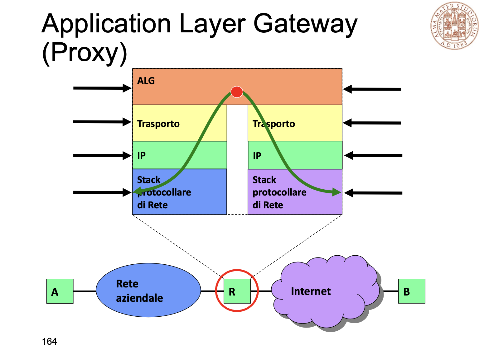
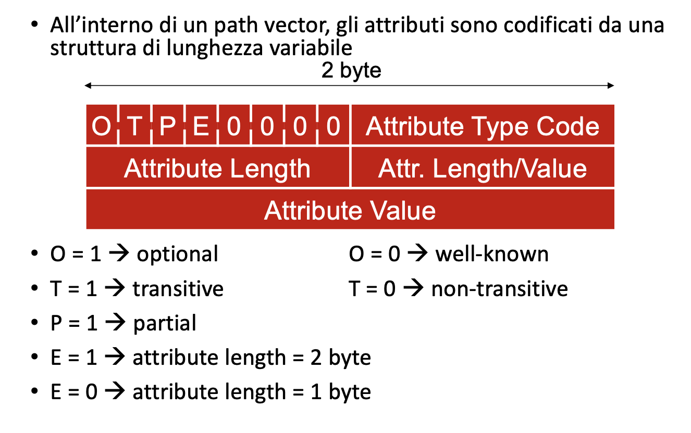
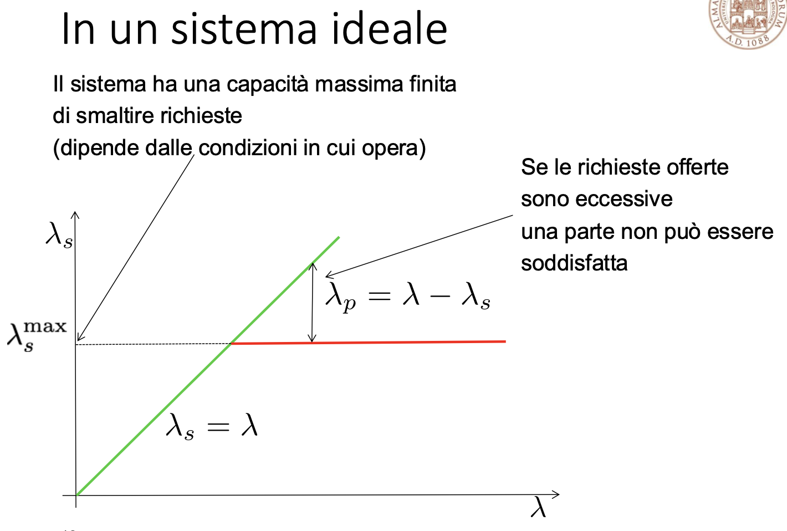

# Appunti reti

## IP e internet

### Composizione Indirizzo IP

IP→ Progettato per funzionare a commutazione di pacchetto in modalità connectionless.

identifica Host e router tramite indirizzi di lunghezza fissa, raggruppandoli in reti IP.

### Funzioni

| Funzione            | Descrizione|
|-|-|
| `Version`           | Indica il formato dell’intestazione, attualmente 4                           |
| `IHL`               | IP header length, lunghezza dell’intestazione                                |
| `Type of service`   | Tipo di servizio richiesto, usato anche come sorta di priorità               |
| `Total length`      | Lunghezza totale del datagramma                                              |
| `Identification`    | Valore intero che identifica univocamente il datagramma (pacchetto)          |
| `Flag`              | Vari flag utilizzati per il controllo della frammentazione dei pacchetti    - |
| `Fragment offset`   | Indica quale è la posizione di questo frammento nel datagramma, come distanza in unità di 64 bit dall’inizio|

**Flags per la frammentazione**:

- Bit 0: sempre 0
- Bit 1 (DF - Don't Fragment):
  - 0 = si può frammentare
  - 1 = non si può frammentare (nel caso fosse a 1 e fosse necessario frammentarlo lo distruggo)
- Bit 2 (MF - More Fragments):
  - 0 = ultimo frammento (aiuta a riordimare i paccheti in arrivo, è tecnicamente superfluo ma ci risparmia il calcolo di vedere quanto era lungo)
  - 1 = frammento intermedio

**Calcolo del Fragment Offset**:
Il datagramma è diviso in **blocchi di 8 byte (64 bit)** l'offset è calcolato in unità di 8 byte dall'inizio del datagramma originale (non ho bisogno di mappare tutti i bit ma posso mapparli a blocchi di 8 byte per ridurre a 13 il numero di bit necessari a tenerne traccia, ciò implica che la frammentazione non potrà mai scendere sotto i 64 bit perché non sarei più in grado di ricomporre il pacchetto)

**Time to Live (TTL)**:
Imposta un limite al numero di hop che un pacchetto può attraversare,il valore iniziale tipicamente è 64 (massimo 255) decrementato di 1 ad ogni hop quando raggiunge 0, il pacchetto viene scartato

Se non posso frammentare il pacchetto lo distruggo.

**Fragment offset→** indica quale è la posizione di questo frammento (della dimensione di 8 byte , 64 bit)nel datagramma, come distanza dall’inizio. Il numero logico del primo blocco viene scritto nel Fragment Offset del datagramma

**Implementazione frammentazione:**

- Effettuata da qualsiasi apparato di rete dotato di protocollo.
- I nodi intermedi non riassemblano, solo il terminale ricevente
- Sono possibili frammentazioni multiple

Grazie alla numerazione tramite offset permette di rinumerare facilmente i segmenti.

La segmentazione è fondamentale perché non sempre la dimensione del pacchetto è corretta per essere elaborata dai macchinari disponibili sulla rete

**Riassemblaggio dei datagrammi**:
I frammenti possono arrivare fuori sequenza o con tempi diversi. Il riassemblaggio avviene solo al terminale di destinazione. Utilizza i campi **Identification**, **Flags** e **Fragment** Offset per ricostruire correttamente il datagramma originale

**Time to travel (TTL)→** max numero nodi attraversabili

**Protocol→** quale protocollo di livello superiore appartengono i dati del datagramma

**Header checksum→** controllo di errore di intestazione. Ricalcolato da ogni nodo attraversato dal datagramma

**Source and Destination→** indirizzi sorgente e destinazione

**Options→** lunghezza variabile perché contiene opzioni relative al trasferimento

**Padding→** bit inutili per fare tornare intestazione multiplo di 32 bit

## Instradamento IP

**Internet** → rete a commutazione di pacchetto, con più percorsi disponibili

Come funziona internet → Rete di reti.

### Diretto

Una consegna **diretta** avviene quando l'IP sorgente e destinatario sono nella stessa rete. In questo caso, il pacchetto viene inviato utilizzando il MAC del destinatario, che viene trovato tramite il protocollo ARP se non già noto. **ARP effettua una richiesta broadcast per associare l'IP al MAC corretto**.

### Indiretto

Nella consegna **indiretta**, quando l'IP destinatario è su un'altra rete, il pacchetto viene prima inviato al router della rete sorgente. A livello di collegamento dati, il MAC sarà quello del router, che instraderà il pacchetto verso il prossimo router fino a raggiungere la rete di destinazione. Il TTL limita il numero massimo di salti. **Anche nei passaggi indiretti, ARP viene utilizzato per ottenere il MAC del gateway successivo.**

**ICMP** -> internet control message protocoll

L’ICMP (Internet Control Message Protocol) è un protocollo di rete utilizzato per inviare messaggi di controllo e diagnostica all’interno di reti IP. Trasporta **direttamente su ip** senza un protocollo di trasporto. Serve a segnalare errori (ad esempio, host irraggiungibile) e a fornire informazioni sullo stato della rete. ICMP **non trasporta dati applicativi**, ma aiuta a gestire la comunicazione tra dispositivi di rete. Viene utilizzato da strumenti come **ping** (per verificare la raggiungibilità di un host) e **traceroute** (per tracciare il percorso dei pacchetti). Fa parte della famiglia dei protocolli IP, operando al livello di rete.

### Network IP → componente elementare

Isola che contiene calcolatori che fanno da **Host**

**Gateway o Router** → componenti che fanno da ponte.

Ogni Network IP viene implementata con una tecnologia specifica, per esempio :

- Wi-Fi
- Ethernet, cavo breve distanza locale
- ADSL e xDSL, cavo a media distanza
- **GPRS/EDGE/LTE,** radio media distanza

I calcolatori di una network IP devono potersi scambiare pacchetti in modo diretto tra di loro.

**La tecnologia IP è agnostica rispetto alla tecnologia con cui sono realizzate le network** quindi non dipende dalla tipologia di tecnologia utilizzata

Quando un terminale invia un pacchetto ha due alternative:

- Dentro la network **→** **Direct delivery**
- Fuori network, usando gateway **→** **Indirect delivery**

La scelta è binaria, ma deve essere fatta in poco tempo.

Ogni nodo ha una **base di dati** che contiene la lista degli ip che può raggiungere

I collegamenti fra router vengono visti come network

### Invio pacchetto e semantica

1. Il **calcolatore instrada** il pacchetto verso il router
2. il **router** decide che direzione seguire e **instrada nuovamente** il pacchetto
  
Un salto viene detto **hop**

**Semantica indirizzo IP**
Due parti :

- Network ID → identifica network di appartenenza
- Host ID → identifica l’host vero e proprio (interfaccia) contenuto nella network

Per entrambi vengono usati bit contigui.

000000 e 111111 sono due numeri speciali e non possono essere usati come Host id

Per ogni elemento hardware che si connette a una rete è necessario avere un IP

IP è un indirizzo locator, che indica la posizione.

**Net Mask** → deve essere configurata localmente. Calcolatori della stessa network devono avere la stessa Net Mask

### Problematiche dell’IP

#### Mobilità

- **Indirizzi riferiti alla rete di appartenenza**: Gli indirizzi IP sono legati alla rete a cui appartengono. Se un host viene spostato in un’altra rete, il suo indirizzo IP deve cambiare.
- **Configurazione automatica con DHCP**: Il Dynamic Host Configuration Protocol (DHCP) permette la configurazione automatica degli indirizzi IP, facilitando la gestione degli indirizzi in reti dinamiche.
- **Mobile IP**: Mobile IP è una tecnologia che permette agli utenti di spostarsi tra diverse reti mantenendo lo stesso indirizzo IP, garantendo la continuità delle sessioni di rete.

#### Sicurezza

- **Scarsa protezione del datagramma IP**: L'intestazione dei datagrammi IP è in chiaro, rendendo vulnerabili i dati in transito.
- **IPSec**: Il protocollo IPSec può essere applicato anche a IPv4 per migliorare la sicurezza delle comunicazioni, fornendo autenticazione e cifratura dei dati.

**Dimensioni delle reti prefissate**: Il subnetting e il Classless Inter-Domain Routing (CIDR) sono tecniche utilizzate per suddividere le reti in sottoreti più piccole e per ottimizzare l'uso degli indirizzi IP.

**Esaurimento degli indirizzi IPv4**: A causa dell'enorme diffusione di Internet, il numero di indirizzi IPv4 disponibili è insufficiente. Le reti IP private e il Network Address Translation (NAT) sono soluzioni temporanee per mitigare questo problema.

### 1. DHCP (Dynamic Host Configuration Protocol)

- **Funzione**: Il DHCP si occupa di assegnare automaticamente gli indirizzi IP ai dispositivi connessi a una rete.
- **Come funziona**: Quando un dispositivo si collega a una rete, invia una richiesta di DHCP. Il server DHCP risponde con un indirizzo IP disponibile, una subnet mask, un gateway, e altre configurazioni di rete (come i DNS).
Livello del modello OSI: Lavora a livello Applicazione (Livello 7).
- **Obiettivo**: Assicurare che ogni dispositivo connesso alla rete ottenga un indirizzo IP unico e una configurazione di rete corretta senza la necessità di configurazioni manuali.

### 2. ARP (Address Resolution Protocol)

- **Funzione**: ARP è utilizzato per tradurre un indirizzo IP in un indirizzo MAC (fisico) in una LAN.
- **Come funziona**: Quando un dispositivo conosce l’indirizzo IP di un altro dispositivo nella rete locale ma non il suo indirizzo MAC, invia una richiesta ARP in broadcast. Il dispositivo destinatario risponde con il proprio indirizzo MAC, permettendo così la comunicazione a livello di collegamento dati.
Livello del modello OSI: Lavora a livello Collegamento Dati (Livello 2) ma può anche interagire con il Livello di Rete (Livello 3).
- **Obiettivo**: Consentire la comunicazione tra dispositivi in una rete locale traducendo indirizzi IP in indirizzi MAC, necessari per l’instradamento dei pacchetti a livello di collegamento dati.

#### Differenze Chiave

- **Funzione**: DHCP assegna indirizzi IP e configurazioni di rete, mentre ARP traduce indirizzi IP in indirizzi MAC.
- **Livello OSI**: DHCP opera a livello Applicazione, mentre ARP opera a livello Collegamento Dati.
- **Ambito di utilizzo**: DHCP è usato per l'assegnazione iniziale della configurazione di rete; ARP è usato per risolvere indirizzi IP in MAC all'interno della stessa rete locale.
In sintesi, DHCP fornisce gli indirizzi IP, mentre ARP permette di individuare l'indirizzo MAC associato a un IP specifico per comunicare nella LAN.

### ARP approfondimento 

Protocollo di rete utilizzato per mappare un indirizzo IP a un indirizzo MAC corrispondente all'interno di una rete locale (LAN). Funziona a livello **2 (Data Link)** e si interfaccia con il livello **3 (Rete)** del modello OSI, consentendo la comunicazione tra dispositivi in una rete Ethernet o simile.

Quando un dispositivo vuole comunicare con un altro sulla stessa rete:

1. Conosce l'indirizzo IP del destinatario (ad esempio 192.168.1.2).
2. Non conosce il corrispondente indirizzo MAC, necessario per inviare i pacchetti a livello di collegamento.
3. Usa il protocollo ARP per scoprire l'indirizzo MAC associato all'IP.

Quando un host deve inviare un pacchetto:

1. **Controllo della cache ARP**:  
   - L'host verifica se l'indirizzo IP è già mappato a un indirizzo MAC nella propria cache ARP (una tabella locale).  
   - Se trova un'associazione valida, utilizza l'indirizzo MAC e invia direttamente il pacchetto.
2. **Richiesta ARP (ARP Request)**:  
   - Se l'indirizzo non è presente nella cache, l'host genera una richiesta ARP:
     - La richiesta è un messaggio broadcast inviato a **tutti i dispositivi** della LAN (MAC di destinazione = `FF:FF:FF:FF:FF:FF`).
     - Contiene l'indirizzo IP di cui si vuole conoscere il MAC. 
3. **Risposta ARP (ARP Reply)**: Il dispositivo con l'indirizzo IP richiesto risponde con un messaggio unicast, fornendo il proprio indirizzo MAC.  
4. **Aggiornamento della cache ARP**: L'host salva nella cache l'associazione IP-MAC per usi futuri.

### Tabella di instradamento

Ogni nodo, che sia un host o un router, possiede una tabella di instradamento che descrive come gestire i pacchetti in rete. Questa tabella contiene diverse informazioni essenziali, organizzate in cinque colonne principali:

1. **Destination**: Indica gli IP o i gruppi di IP raggiungibili. in forma di singoli o insiemi
2. **Netmask**: Specifica la netmask per interpretare correttamente l'IP e identificare la rete.
3. **Gateway**: Mostra l'IP del gateway successivo (o se è l'host finale, può indicare il proprio IP o "self").
4. **Interface**: Definisce l'interfaccia di rete attraverso cui inviare il pacchetto e da cui eseguire richieste ARP, se necessario.
5. **Metric**: Rappresenta il costo del percorso, aiutando a scegliere il percorso migliore quando esistono più opzioni di instradamento.

### Table look-up

Per selezionare la riga corretta vengono fatti 2 passaggi:

- Selezione ip destinazione da **datagramma**
- AND bit a bit con il relativo ip attraverso la **netmask** di ogni riga e viene selezionato il primo corretto.

la riga numero 1 è quella di default, perchè AND è sempre 0.0.0.0

il router ha lo stesso net-id mio e come ultimo numero ha 254, ma più generalmente il numero massimo di host-id.

Qual’è la configurazione minima dell’interfaccia IP?

numero ip e netmask

settando delle netmask apposite posso creare una aggregazione di righe (aggregazione di rotte). nel caso di r2 è comodo perchè ho solo due instradazioni possibili e posso ottimizzare gli AND da fare. Si può fare solo se sono righe contigue.

Le righe delle tabelle di route vanno ordinate, per dare precedenza alle route più specifiche.

### Intervalli di indirizzi

**Classfull vs Classless**
Inizialmente, gli indirizzi IP erano suddivisi in **classi** (A, B, C, D, E) con netmask implicite e fisse che limitavano la flessibilità nella gestione degli indirizzi. Questo sistema rigido causava inefficienze e sprechi di indirizzi. Per risolvere questi problemi, è stato introdotto il **Classless Inter-Domain Routing (CIDR)**, che utilizza netmask variabili, espresse in notazione slash (ad esempio, /24).
**VANTAGGI**
CIDR consente una suddivisione più **efficiente** e **flessibile** degli indirizzi IP, supportando anche il **supernetting** per ridurre la complessità delle tabelle di routing e migliorare l’efficienza e la scalabilità della rete.

### Supernetting o CIDR

la soluzione è stata quella di utilizzare reti più piccole con indirizzi consecutivi, per ottimizzare l’utilizzo degli indirizzi.  Lo stesso indirizzo può essere interpretato diversamente in base a dove si trova nella rete, quindi le tabelle di instradamento devono

### Routing aggregato

Un router aggregato è un concetto che si riferisce alla combinazione di più router in una singola entità logica per migliorare la gestione e l'efficienza della rete. Questo può includere tecniche come il routing virtuale e la ridondanza

## Metodologie di filtraggio dei datagrammi

## Packet filter

I nodi di rete eseguono delle operazioni di tipo attivo sui dati, generalmente per scopi di filtraggio. Quindi in nodi assumono un ruolo attivo nell'instradamento.

**Come si fa?**

l'instradamento selettivo viene fatto attraverso un packet filter, che instrada solo alcuni pacchetti che rispettano le caratteristiche indicate. I filtri operano a **livello IP**, quindi il filtro si basa al massimo sull'header IP, es: pacchetti con questo TTl passano e altri no.
Viene fatto attraverso tabelle affiancate a tabelle di indirizzamento.

**Che vantaggio ha ?**

dal punto di vista architetturale è in linea ai soliti protocolli (OSI).

### Statefull packet inspection

Utilizzano informazioni prese dagli header di livello superiore (es : numero di porta utilizzata ecc...)
Questa operazione "viola" l'idea del protocollo iso-osi.

### Application layer gateway (proxy)

Da più funzionalità possibili ma è anche il più dispendioso di tutti perchè controlla tutto il pacchetto (livello 3 e 4).
Posso anche decidere di fare passare solo determinati protocolli
(FTP HTTP)

#### Firewall

Protegge interno da esterno ed esterno da interno. Solitamente è una combinazione di packet filter, statefull packet inspection, e ALG.

#### Nat

Gateway che filtra pacchetti, statefull packet inspection tra due network, e modifica i pacchetti modificando gli indirizzi.
È un concetto, ma ci sono molte implementazioni diverse.

Il nat permette anche di modificare il verso dei pacchetti, permettendo a quelli che sono dentro di parlare all'esterno, mentre quelli all'esterno possono parlare solo se hanno ricevuto una richiesta.
Oggi è concepito come uno strumento di protezione, ma inizialmente è nato perchè stavano finendo i numeri IP. Infatti tutti quelli che stanno alla sinistra del NAT possono essere visti come lo stesso numero IP.
NAPT -> traduce anche i nueri di porta.
Esistono degli **indirizzi privati**, che vengono utilizzati storicamente solo per essere attribuiti all'interno dei NAT.

| Tipo di Indirizzo | Descrizione |
|-------------------|-------------|
| Pubblico          | Utilizzato per comunicare su Internet |
| Privato           | Utilizzato all'interno di una rete locale |

## Instradamento nelle reti a pacchetto e in Internet

Scelta del percorso = scegliere il nodo successivo sapendo che esiste una connessione 
Tutte le metodologie di instradamento si devono adattare a modifiche della rete in due modi:

- dinamici -> percosi aggionrati periodicamente per sopportare anche cambiamenti repentini
- statico -> i percorsi vengono aggiornati e nel breve periodo non cambiano

### Algoritmi di instradamento

I nodi di commutazione per applicare l’algoritmo possono utilizzare informazioni predisposte localente tipicamente sotto forma di tabelle

#### Senza tabella

##### Flooding (broadcast)

Pro:

- ogni nodo ritrasmette tutte le porte in uscita ogni pacchetto ricevuto
- Praticamente non c'è elaborazione
- il primo che arriva -> strada più breve

Contro:
I pacchetti proliferano in maniera esponenziale.
Soluzioni :

- fare si che i pacchetti non ritornano da dove sono venuti
- aggiungere TTl

##### Random

Poco usato perchè poco efficiente.

##### Deflection Routing (hot potato)

Il pacchetto viene inviato all aporta con meno pacchetti in fila da inviare.
Per reti con spazio e risorse limitate.
Problemi: possibili pacchetti che girano all'infinito e potrebbero non arrivare in ordine

#### Con tabella

instradamento principalmente statico  
Linee di ingresso -> funzione di instradamento -> linee di uscita

Il pacchetto viene prima memorizzato interamente nel nodo e quindi ritrasmesso nella direzione opportuna
In generale dovrebbe esistere una base dati per il confronto che è la tabella di instradamento

##### Shortest path routing

Ogni nodo ha una lunghezza, difficoltà per attraversare due punti.
Per implementare il routing shortest path verso una qualunque destinazione devono utilizzare:

- Uno o più **protocolli** di routing per scambiarsi informazioni ed apprendere la topologia della rete
- Uno o più **algoritmi** per il calcolo degli SP sulla base delle informazioni ottenute

Il problema di questi algormitmi è che il tempo di convergenza è generalmente pari al numero dei nodi della rete e non è particolarmente conveniente.
Se la rete è grande ci vuole troppo tempo, c'è la possibilità che la rete cambi prima del tempo di convergenza. Non si possono mandare sempre messaggi con **distance vector**, per una questione di prestazioni e vengono mandati periodicamente.

###### Cosa succede se la rete si modifica?

- **bouncing effect** la convinzione che un certo router per inviare pacchetti a un altro deve mandarli a lui e poi farseli rispedire indietro.
- **convergenza lenta** la possibilità che anche in una rete con 3 nodi ci si mettano anche 20/30 scambi di distance vector
- **count to infinity** nel caso di tre router collegati in fila A--B--C. 

SOLUZIONI  (temporanee):

- **Decidere una distanza massima**, che se raggiunta viene considerata infinito
- **Triggered update** -> un nodo deve inviare immediatamente notifiche ai vicini nel caso di modifiche di rete.
ma considerando il ritardo di propagazione non c'è comunque la certezza che le informazioni arrivino in tempo
- **Split horizon** ->  nodo A dice a B tutti i nodi che raggiunge senza passare da B

ma queste soluzioni non sono complete, nel caso di reti circolari ci sono comunque ancora errori

### Routing link state

L'idea è che ogni nodo conosca il grafo della rete e calcola le tabelle di routing in modo ottimale.
Sembra più difficile ma si è verificato molto più efficacie.

1. **HELLO PACKET** Il router scopre i vicini
2. **ECHO PACKET** invio per stimare la distanza
3. In seguito ogni nodo costituisce i **LINK STATE PACKET**, e li invia nella rete, questi pacchetti contengono la lista dei suoi vicini e le lunghezze dei collegamenti da raggiungere

I pacchetti vengono diffusi nella rete attraverso il Flooding.

### Cosa sono i nodi

i nodi di commutazione vengono chiamati router, e si dividono in macro famiglie:

- **SOHO** (small office and home) 100 mbs, utilizzo casalingo
- **Router di accesso**, molte porte non velocissime, raccoglie gli abitanti di una certa zona
- **Enterprise/campus router** collegati con campus router. Medie dimensioni, non troppe porte ma molta velocità
- **Backbone router**, router con poche porte con velocità ancora più elevata e garanzie di affidabilità

#### Ruolo router

- routing
  - Scambio informazioni
  - elaborazione locale
  - popolaizone tabelle routing
- forwarding
  - ip
  - table lookup
  - header update
- Switch
  - trasferimento datagramma da input a output
- trasmissione
  - Trasmissione usando il mezzo fisico

##### Tabella routing e forwarding

La **routing table** è usata dai router per determinare il percorso ottimale verso una destinazione, memorizzando informazioni come reti, metriche e next-hop per ciascun possibile percorso. È il risultato di algoritmi di routing (es. OSPF, BGP).

La **forwarding table** (o forwarding information base, FIB) è una versione ottimizzata della routing table, usata direttamente per inoltrare i pacchetti. Contiene solo le informazioni necessarie per decidere il next-hop e agisce più velocemente, spesso mantenuta in hardware.

**RIB (routing information base)**, insieme di tutte le informazioni che riguardano il routing e a cui bisogna credere.
Possono essere configurate manaualmente, staticamente o attraverso determinati algoritmi o protocolli. la politica con cui vengon inserite le informazioni nella rib possono essere variabili.

dopo il rib si applica il route selection process, per selezionare le route migliori

**FIB (forwarding information base)** in seguito si compila la route forwarding table che contiene le informazioni filtrate e ottimizzate

## Internet moderna

Insieme di sottoninsiemi (autonomus sistem), ordinati con un numero identificativo.
Si assume che valgano solo i nodi che fanno parlare un sottoinsieme con l'esterno, e in questo modo si semplifica il grafo della rete.
Si scompone anche il problema all'interno (intra Domain) dell'autonomus sistem e all'esterno di esso(inter Domain).

**autonomus sistem** insieme di router che utilizzano stesso protocollo di comunicazione. Oggi viene usata una terminologia più precisa:
Oggi un AS è:

- Un insieme di prefissi di rete IP (network IP definite secondo
la logica CIDR)
- Gestito in modo unitario e con una ben definita politica di routing
- Questo significa che chi gestisce l’AS ha definito in modo chiaro al suo interno come raggiungere le network IP

Un AS importa le informazioni di routing da solo determinati AS certificati.
RADb -> database contenente le politiche di routing

## ISP internet service provider

Una associazione che fornisce servizi di connnettività, web e mail hosting, registrazione e noleggio di indirizzi IP. Può essere a fini di lucro o no e coperativa o no. Tipocamente un ISP è un AS.

**Internet region** una porzione di internet contenuta in una determinata area.

Tipologie di ISP:

- Tier 1 ISP (più grandi tipo tim, collegato a internet globale)
- Tier 2 ISP (più piccoli che passano per tier 1 per andare a internet globale)
- Tier 3 o local ISP (vengono aiutati da livello 1 o 2 comprando servizi)

**PEERING** collegamento tra ISP, con lo scopo di scambiare servizi
**POP** Nelle reti, un PoP (Point of Presence) è un punto di accesso fisico che consente la connessione a una rete, come un ISP (Internet Service Provider) o una rete aziendale.
**Internet Exchange Point (IX o IXP)**

- Infrastrutture attraverso le quali gli ISP possono stabilire
relazioni di peering
- L’IXP è costruito per permettere l’interconnessione diretta degli AS senza utilizzare reti di terze parti
- L’IXP fornisce soluzioni di connettività con specifiche garanzie di qualità (disponibilità elevata, sicurezza fisica, banda garantita ecc.)

### IGP

Un IGP **(Interior Gateway Protocol)** è un protocollo di routing utilizzato per instradare il traffico all’interno di un’unica rete autonoma, chiamata AS (Autonomous System). È progettato per gestire la comunicazione tra router appartenenti alla stessa organizzazione o dominio amministrativo.

Esempi di IGP:

- **OSPF** (Open Shortest Path First), basato sullo stato dei collegamenti (link-state).
- **RIP** (Routing Information Protocol), basato sulla distanza (distance-vector).
    Il RIP (Routing Information Protocol) è un protocollo di routing dinamico basato sull’approccio distance-vector, progettato per reti IP di piccole dimensioni. È uno dei protocolli di routing più semplici ed è stato ampiamente utilizzato in passato, anche se oggi è meno comune a causa delle sue limitazioni.
- **EIGRP** (Enhanced Interior Gateway Routing Protocol), un protocollo ibrido.

L’IGP si differenzia dai EGP (Exterior Gateway Protocols), come BGP (funziona a sessioni), che gestiscono il routing tra AS differenti.

### RIP come funziona

**Metriche del percorso:**

- Utilizza il conteggio dei salti (hop count) come metrica per determinare il percorso migliore.

- Ogni router aggiunge un salto alla distanza e il limite massimo è di 15 salti (il 16° indica che la destinazione è irraggiungibile).

**Scambio di informazioni:**

- Ogni router invia periodicamente (default: ogni 30 secondi) la propria tabella di routing ai router adiacenti tramite messaggi broadcast o multicast.
- I router aggiornano le proprie tabelle di routing basandosi sulle informazioni ricevute, selezionando il percorso con il minor numero di salti.

**Aggiornamenti periodici:**

- RIP invia aggiornamenti anche se non ci sono cambiamenti nella rete, il che può causare overhead.

**Meccanismi di stabilità:**

- Split horizon: Evita di pubblicizzare un percorso indietro verso il router da cui è stato appreso.
- Hold-down timer: Impedisce aggiornamenti troppo frequenti per evitare instabilità.
- Poison reverse: Annuncia che un percorso non è più raggiungibile, impostando la metrica a 16.

**Versioni di RIP:**

- **RIP v1:** Supporta solo subnet classful (senza subnet mask).
- **RIP v2:** **Aggiunge supporto per reti classless (CIDR)**, **autenticazione** e multicast.

**Limiti di RIP:**

- Scalabilità ridotta (massimo 15 salti).
- Lento nel convergere rispetto a protocolli più moderni come OSPF o EIGRP.
- Overhead causato dagli aggiornamenti periodici.

Utilizzo attuale:

RIP è ormai superato da protocolli più efficienti e scalabili, ma viene ancora usato in reti semplici o per scopi didattici.

## OSPF (Open Shortest Path First)

È un protocollo di routing dinamico utilizzato nei sistemi autonomi per instradare i pacchetti all’interno di una rete. È uno dei più comuni (tra gli IGP), progettati per operare all’interno di una singola organizzazione o rete.

### Caratteristiche principali di OSPF

1. **Protocollo di routing a stato di collegamento (Link-State)**
    Un protocollo di routing a stato di collegamento crea una mappa completa della rete, condividendo informazioni sui collegamenti tra i router tramite pacchetti LSA. Ogni router calcola il percorso migliore verso ogni destinazione utilizzando un algoritmo come Dijkstra. Questo approccio garantisce una convergenza rapida, aggiornamenti selettivi e maggiore efficienza, rendendolo ideale per reti complesse. Esempi comuni sono OSPF e IS-IS.
    OSPF utilizza un approccio basato su mappature dettagliate della rete. Ogni router crea una rappresentazione della topologia completa e calcola i percorsi migliori utilizzando l’algoritmo di Dijkstra.

2. **Routing senza classe:**
Supporta subnet di dimensioni variabili grazie all’uso del VLSM (Variable Length Subnet Mask), permettendo un uso efficiente degli indirizzi IP.
3. **Scalabilità:**
Può gestire reti grandi suddividendole in aree gerarchiche, riducendo il carico di elaborazione e la dimensione delle tabelle di routing.
4. **Convergenza rapida:**
Rispetto ai protocolli basati su vettore di distanza (come RIP), OSPF converge rapidamente in caso di cambiamenti nella rete.
5. **Metriche basate sulla larghezza di banda:**
Determina il percorso migliore in base alla capacità di throughput dei collegamenti, non al numero di hop.
6. **Aggiornamenti efficienti:**
Invia aggiornamenti solo quando ci sono cambiamenti, anziché inviare l’intera tabella di routing periodicamente.

### Componenti chiave

- **Router ID:** Identificatore univoco per ogni router nella rete OSPF.
  **Router catalogati come:**
  - **Internal Router:** router interni a ciascuna area
  - **Area Border Router:** router che scambiano informazioni con
  altre aree
  - **Backbone Router:** router che si interfacciano con il backbone
  - **AS Boundary Router:** router che scambiano informazioni con
  altri AS usando un protocollo EGP
- **Designated Router (DR):** Router eletto per centralizzare la distribuzione delle informazioni di stato dei collegamenti.
- **Backup Designated Router (BDR):** Router eletto per assumere il ruolo di DR in caso di fallimento del DR.
- **Area:** Una rete OSPF può essere divisa in aree per migliorare la scalabilità e l’efficienza. Tutte le aree devono essere connesse all’Area 0 (area backbone).
- **Hello Packets:** Pacchetti inviati periodicamente per stabilire e mantenere le adiacenze tra i router.
- **LSA (Link-State Advertisement):** Messaggi che trasportano informazioni sulla topologia della rete.
- **Database LSDB (Link-State Database):** Contiene le informazioni sulla topologia dell’intera rete OSPF.

  

#### Utilizzi principali

- Grandi reti aziendali: Dove è richiesta scalabilità e convergenza rapida.
- Provider di servizi Internet: Per gestione reti interne.
- Ambienti misti: Dove si vogliono integrare diverse sottoreti con requisiti complessi.

OSPF è standardizzato dall’IETF (Internet Engineering Task Force) come parte della famiglia di protocolli TCP/IP ed è definito nell’RFC 2328.

#### Configurazione iniziale

ogni router ha un proprio Router-id. Come eleggere un router designato? inizialmente tutti i router si scambiano i propri vicini e vengono scartati quelli che hanno priorità 0. Viene designato tra i restanti quello con il numero più alto e diventa DR, quello subito dopo diventa il backup router BDR. Il DR diventa adiacente a tutti e diventa il punto di riferimento centrale  per la distribuzione delle informazioni di stato dei collegamenti (Link-State Advertisements, LSA) all'interno di una rete broadcast multi-access, come una rete Ethernet.

  

### Pacchetti HELLO

I pacchetti HELLO sono inviati sulle interfacce periodicamente secondo quanto specificato dal parametro `HelloInterval`. Questi pacchetti permettono di:

- **Scoprire i propri vicini**: Includono una lista di tutti i vicini (Neighbor) dai quali è stato ricevuto un pacchetto HELLO recente (cioè non più vecchio di `RouterDeadInterval`). Questo permette di conoscere se per ciascun vicino è presente un collegamento bidirezionale e se esso è ancora attivo.

### Campi dei Pacchetti HELLO

- **Router Priority, Designated Router e Backup Designated Router**: Utilizzati per l’elezione di DR e BDR.
- **Network Mask**: Indica la maschera relativa all’interfaccia del router (l’indirizzo è nell’header IP).
- **Options**: Indica se si supportano funzionalità opzionali.

### EXCHANGE protocol

Sincronizzazione dei Link State Database

Una volta stabilite le adiacenze, i router adiacenti devono sincronizzare i rispettivi Link State Database (LSDB). La procedura è asimmetrica e prevede i seguenti passaggi:

1. **Stabilire Master e Slave**: Si determina quale router sarà il master e quale sarà lo slave.
2. **Invio dei Database Description (DD) Packets**: 
   - Il master invia pacchetti DD (Type = 2) con l'elenco dei LSA del proprio database (tipo, età, router generatore, numero di sequenza).
3. **Risposta dello Slave**: Lo slave risponde con l'elenco dei LSA del suo database.
4. **Confronto delle Informazioni**: Entrambi i router confrontano le informazioni ottenute con quelle in proprio possesso.
5. **Richiesta di LSA Meno Recenti**: Se un router ha LSA meno recenti, richiede i LSA aggiornati con un pacchetto Link State Request (Type = 3).

Questa procedura garantisce che entrambi i router abbiano una visione coerente della topologia della rete.

### Flooding Protocol

La diffusione dei LSA (Link-State Advertisements) a tutti i router della rete avviene tramite l'invio di pacchetti Link State Update (Type = 4) nei seguenti casi:

- Cambiamento nello stato di un collegamento
- Ricezione di una Link State Request
- Periodicamente (ogni 30 minuti)

#### Modalità di Flooding

- **Flooding Efficiente**: Utilizza i numeri di sequenza dei LSA per garantire che tutti i router vedano gli aggiornamenti.
- **Affidabilità**: Gli aggiornamenti vengono inviati ripetutamente finché non viene confermata la loro ricezione dai nodi adiacenti tramite il pacchetto Link State Acknowledgment (Type = 5).

Questa procedura assicura che tutti i router abbiano una visione aggiornata e coerente della topologia della rete.

### Exterior Gateway Protocols (EGP)

I protocolli di tipo EGP sono diversi da quelli di tipo IGP. Le principali differenze e caratteristiche includono:

- **Ottimizzazione dei Percorsi**: All'interno di un AS (Autonomous System) si persegue l'ottimizzazione dei percorsi.
- **Politiche di Instradamento**: Nel routing tra diversi AS, si deve tener conto delle politiche di instradamento:
  - Ogni AS vuole mantenere autonomia e indipendenza dagli altri.
  - Alcuni AS non permettono ad altri AS di instradare il traffico attraverso le loro reti.
  - In alcuni casi, bisogna operare secondo accordi internazionali.

### Protocolli EGP per Internet

Due protocolli EGP per Internet:

- **Exterior Gateway Protocol (EGP)**
- **Border Gateway Protocol (BGP)**

#### EGP

- **Primo protocollo di routing tra AS** (anni '80, RFC 827).
- **Funzionalità principali**:
  1. **Neighbor Acquisition**: Verifica accordi per diventare vicini.
  2. **Neighbor Reachability**: Monitora connessioni con i vicini.
  3. **Network Reachability**: Scambia informazioni sulle reti raggiungibili.

EGP è simile a un protocollo di tipo distance vector, con le seguenti caratteristiche:

- Le informazioni inviate ai vicini sono sostanzialmente informazioni di raggiungibilità.
- Non sono specificate le regole per definire le distanze.
- La distanza minima può non essere il criterio migliore da seguire.

Queste caratteristiche rendono EGP un protocollo semplice ma limitato rispetto ai protocolli più moderni come BGP.

#### Limiti di EGP

- Progettato per topologie specifiche (es. ARPAnet).
- Funziona bene per topologie ad albero, non per reti a maglia complessa.
- Convergenza lenta e instabilità.
- Adattamento lento alle modifiche della topologia.
- Nessun meccanismo di sicurezza: vulnerabile a annunci falsi e guasti dei router.

### BGP: Border Gateway Protocol

BGP è stato concepito come sostituto di EGP e oggi è in uso la versione 4 (RFC 1771). I router BGP si scambiano informazioni attraverso connessioni TCP (porta 179) chiamate sessioni BGP.

#### Caratteristiche principali di BGP

- **Connessioni Affidabili**: Le comunicazioni sono affidabili grazie all'uso di TCP, con funzionalità di controllo degli errori demandate allo strato di trasporto.
  
- **Tipi di Sessioni BGP**:
  - **eBGP (External BGP)**: Sessioni instaurate tra router BGP appartenenti ad AS diversi.
  - **iBGP (Internal BGP)**: Sessioni instaurate tra router BGP appartenenti allo stesso AS.
- **Informazioni Scambiate**: Le informazioni riguardano la raggiungibilità di reti IP secondo lo schema classless (CIDR).

Queste caratteristiche rendono BGP un protocollo robusto e scalabile per il routing tra diversi AS. Utilizza un **path vector** (non predilige il percorso migliore, basato su geopolitica o accordi commerciali  ), un'evoluzione del distance vector, nel vettore dei percorsi si elencano tutti gli AS da attraversare per raggiungere una destinazione per evitare percorsi ciclici. Quando un router riceve un path e c'è già lui dentro lo scarta, evitando di creare cicli.

##### Attributi

A ciascun path vector vengono associati degli attributi
Gli attributi BGP possono essere classificati in diverse categorie:

- **Well-known**: Riconoscibili da tutte le implementazioni BGP e devono essere inoltrati assieme al path vector (dopo un eventuale aggiornamento).
  - **Mandatory**: Devono essere presenti nel path vector.
  - **Discretionary**: Possono anche non essere indicati.
- **Optional**: Possono non essere riconosciuti da alcuni router.
  - **Transitive**: Devono essere inoltrati anche se non riconosciuti.
  - **Non-transitive**: Devono essere ignorati se non riconosciuti.
- **Partial**: Attributi optional-transitive che sono stati ritrasmessi senza modifiche da un router perché non riconosciuti. Indicano se un determinato path vector è stato riconosciuto o meno da tutti i router attraversati.

Queste categorie aiutano a gestire come gli attributi vengono trattati e propagati attraverso la rete BGP.

## Commutazione di etichetta: MPLS

**Router**

- Instrada i datagrammi IP
  - Longest prefix match
  - Shortest path routing
- Spesso implementa funzioni addizionali
  - packet filtering, QoS etc.
- Supporta interfacce (piano dati) e protocolli (piano di controllo) di tipo diverso

**Switch**

- Instradamento semplice in funzione di indirizzi statici
- Funzionalità limitate all’instradamento delle trame
- Supporto per un numero limitato di interfacce e di protocolli
- Considerando il traffico smaltito il rapporto costo/prestazioni in uno switch è migliore che in un router

**LER label edge router**

- Router normale che però può attaccare una label
  
**LPS Label Switch Path**

- È un percorso logico preconfigurato che i pacchetti seguono attraverso la rete MPLS.

**detti LSR, Label Switch Router**

- Ricevono trama e effettuano switch

### Label Switching

Il label switching è una tecnica usata nelle reti (come in MPLS, Multi-Protocol Label Switching) per instradare i dati in modo più veloce rispetto ai metodi tradizionali basati sugli indirizzi IP.

Ecco come funziona in modo semplice:

**Etichetta (Label):**

- Quando un pacchetto entra nella rete, gli viene assegnata una “etichetta” (un numero breve) che identifica il percorso che deve seguire.

**Switching basato sull’etichetta:**

- Ogni router (o switch) della rete non guarda l’indirizzo IP del pacchetto, ma legge solo l’etichetta.
- In base all’etichetta, il router sa subito dove inoltrare il pacchetto, senza dover fare calcoli complicati.

**Riassegnazione dell’etichetta:**

- Durante il percorso, ogni router può sostituire l’etichetta del pacchetto con una nuova, per aggiornare le istruzioni sul percorso successivo.

**Rimozione dell’etichetta:**

- Alla fine del percorso, l’ultima etichetta viene rimossa e il pacchetto continua verso la sua destinazione usando il metodo tradizionale (indirizzo IP).

**Vantaggi:**

- Velocità: Gli switch lavorano più velocemente perché analizzano solo etichette, non indirizzi complessi.
- Efficienza: Si possono creare percorsi ottimizzati per migliorare le prestazioni della rete.
- Flessibilità: Funziona con molti protocolli (non solo IP).

In pratica, il label switching semplifica e velocizza il trasferimento dei dati nella rete!

### label stacking

innestare domini MPLS, simile al concetto di routing gerarchico

- push label, quando si entra nel dominio si aggiunge etichetta
- pull label, si toglie etichetta quando esce dal dominio

### label allocation

chi decide le label? decide sempre il router a valle (il primo router)
## Ifrastruttura regionale italiana

In Italia, l'infrastruttura degli AS è distribuita tra reti private, reti pubbliche e diversi punti di interscambio fondamentali per il traffico Internet nazionale e internazionale. Gli AS italiani sono numerosi e variano per dimensione e scopo: dai provider di servizi Internet (ISP) alle reti aziendali, fino alle reti gestite dalle pubbliche amministrazioni. Due strutture cardine che facilitano l'interconnessione e migliorano l'efficienza del traffico Internet in Italia sono il **Milan Internet Exchange (MIX)** e la rete **LEPIDA**.

### Il Ruolo del MIX

Il MIX è uno dei più importanti punti di interscambio di traffico Internet in Italia e uno dei maggiori a livello europeo. Situato a Milano, permette l’interconnessione diretta tra AS di vari operatori, riducendo la latenza e ottimizzando il routing del traffico Internet a livello nazionale e internazionale. Il MIX è una struttura neutrale e indipendente che offre **servizi di peering pubblico e privato**, consentendo ai provider di scambiarsi traffico direttamente. Ciò riduce la necessità di instradare il traffico verso AS esteri, favorendo una maggiore autonomia della rete italiana e migliorando l’efficienza di trasmissione tra reti locali. Questo snodo è particolarmente importante per garantire la connettività tra le grandi reti italiane e l’infrastruttura globale di Internet.

### La Rete LEPIDA

LEPIDA è una rete regionale di proprietà pubblica, gestita dalla società Lepida S.p.A., che supporta il sistema di interconnessione digitale per le pubbliche amministrazioni dell’Emilia-Romagna. Nasce con l’obiettivo di interconnettere le amministrazioni pubbliche regionali, migliorando la qualità dei servizi digitali rivolti ai cittadini e garantendo la sicurezza e la gestione diretta delle reti di pubblica utilità. LEPIDA opera anche come AS e stabilisce connessioni con altri AS nazionali e internazionali, facilitando l'accesso a risorse e servizi pubblici in tutta Italia. Grazie a LEPIDA, la Regione Emilia-Romagna gode di un’infrastruttura autonoma e indipendente, riducendo la dipendenza da operatori privati e aumentando la resilienza della rete regionale.

In questo scenario, MIX e LEPIDA contribuiscono a una maggiore autonomia della rete italiana. Il MIX facilita l'interconnessione tra grandi reti commerciali e nazionali, mentre LEPIDA supporta un’infrastruttura dedicata alla pubblica amministrazione, assicurando una comunicazione efficiente e sicura per il settore pubblico e migliorando il servizio per i cittadini e le imprese a livello regionale.

## Virtualizzazione di Rete

La virtualizzazione di rete permette la creazione di **versioni virtuali di infrastrutture di computazione, memorizzazione e reti**, realizzando componenti che si comportano come sistemi software indipendenti dall'hardware fisico. Questo approccio garantisce vantaggi significativi come la condivisione delle risorse fisiche e il disaccoppiamento tra progetto software e hardware, migliorando flessibilità, mobilità e scalabilità. Tuttavia, la virtualizzazione comporta criticità legate alla sicurezza e all'isolamento dei sistemi che condividono lo stesso hardware fisico.

**Obiettivo e Tecniche della Virtualizzazione di Rete**:
La virtualizzazione di rete risponde alla crescente complessità dei requisiti di servizio dell’utenza, consentendo di realizzare topologie o funzionalità su infrastrutture esistenti, altrimenti difficili da modificare. Questo approccio spesso si basa su **reti overlay**, ovvero reti logiche sovrapposte all'infrastruttura fisica per creare funzionalità aggiuntive, le network IP nel loro piccolo ne sono un esempio. Tra le tecnologie che consentono questo tipo di virtualizzazione troviamo **VLAN (IEEE 802.1Q)**, **GRE (RFC 1701)**, **VXLAN (RFC 7348)** e **VPN**, che rappresentano alcune delle soluzioni per segmentare, incapsulare e isolare il traffico di rete virtuale.

### GRE

**Un tunnel GRE** (Generic Routing Encapsulation) è un protocollo di tunneling usato per incapsulare una varietà di protocolli di rete all’interno di una connessione IP.

Come funziona:

1. Encapsulamento: I dati originali (pacchetti) vengono racchiusi in un nuovo header GRE.
2. Trasporto: Il pacchetto incapsulato viene inviato attraverso una rete IP.
3. Decapsulamento: Il router di destinazione rimuove l’header GRE e consegna il pacchetto originale.

Caratteristiche principali:

- **Flessibilità**: Supporta diversi protocolli (IPv4, IPv6, MPLS).
- **Indipendenza**: Funziona sopra un’infrastruttura IP senza modifiche.
- **Overhead**: Aggiunge un piccolo sovraccarico ai pacchetti per includere l’header GRE.

Utilizzi comuni:

- Creazione di VPN semplici (ma senza crittografia).
- Collegamento di reti separate (ad esempio, reti aziendali remote).
- Trasporto di protocolli che non possono essere instradati direttamente su IP.

Se viene modificata la rete fisica non c'è modifica nella rete logica.

**L’header GRE** è una struttura di dati utilizzata per incapsulare pacchetti all’interno di un tunnel GRE. Serve a fornire le informazioni necessarie per gestire il pacchetto incapsulato durante il suo transito attraverso la rete.

**Struttura dell’header GRE base**
L’header base di GRE è lungo 4 byte (32 bit) e contiene i seguenti campi principali:

1. Flags e Version (16 bit):

   - C (Checksum Present): Indica se un checksum è incluso (1 = presente).
   - K (Key Present): Indica se un campo di chiave è presente per identificare il tunnel.
   - S (Sequence Number Present): Indica se un numero di sequenza è incluso.
   - Version: Solitamente impostato a 0 per GRE standard.

2. Protocol Type (16 bit):
   - Specifica il tipo di protocollo incapsulato (es. 0x0800 per IPv4, 0x86DD per IPv6).

**Header GRE opzionale**
A seconda delle impostazioni, possono essere aggiunti altri campi:

- Checksum (32 bit): Per verificare l’integrità del pacchetto.
- Key (32 bit): Per identificare il tunnel o la sessione.
- Sequence Number (32 bit): Per garantire l’ordine dei pacchetti.

Funzionamento

1. Il router sorgente aggiunge un header GRE al pacchetto originale.
2. Il pacchetto incapsulato viene inviato attraverso il tunnel GRE.
3. Il router di destinazione legge l’header GRE, estrae il pacchetto originale e lo consegna alla rete di destinazione.

GRE è semplice e flessibile, ma non offre crittografia o meccanismi di sicurezza avanzati. Per proteggere i dati, può essere combinato con protocolli come IPsec.

### VXLAN

**VXLAN (Virtual eXtensible LAN)**: VXLAN, ampiamente usato nel cloud computing, consente l'incapsulamento di traffico Layer 2 in pacchetti UDP, garantendo un isolamento scalabile con identificatori unici per ciascun segmento. Creado un tunnel VXLAN ottengo la fusione di 2 LAN distinte dato che grazie al tunnel esse **risponderanno alla stessa ARP request**. Il tunnel VXLAN funziona incapsulando i frame Ethernet in pacchetti UDP, che vengono poi trasmessi attraverso una rete IP. Ogni segmento VXLAN è identificato da un **VXLAN Network Identifier (VNI)**, che consente di isolare il traffico tra diversi segmenti. I dispositivi che terminano i tunnel VXLAN, noti come **VXLAN Tunnel Endpoints (VTEP)**, aggiungono e rimuovono l'incapsulamento VXLAN. Quando un frame Ethernet entra in un VTEP, viene incapsulato in un pacchetto UDP con un header VXLAN e inviato attraverso la rete IP. Il VTEP di destinazione rimuove l'incapsulamento e inoltra il frame Ethernet alla rete locale.

Nonostante i vantaggi, l'uso di VXLAN può introdurre alcuni problemi di prestazione:

**Overhead di Incapsulamento**: L'aggiunta di header VXLAN e UDP aumenta la dimensione dei pacchetti, riducendo l'efficienza della trasmissione e aumentando il carico sulla rete.

**Latenza**: L'incapsulamento e il decapsulamento dei pacchetti richiedono tempo di elaborazione aggiuntivo, che può aumentare la latenza end-to-end.

**Fragmentazione dei Pacchetti**: L'aumento della dimensione dei pacchetti può causare la frammentazione, che a sua volta può ridurre le prestazioni e aumentare il rischio di perdita di pacchetti.

### VLAN (Virtual Local Area Network)

Le VLAN creano domini di broadcast separati all'interno della stessa rete fisica. VLAN statiche e dinamiche permettono una gestione ottimizzata delle risorse, mentre l'uso del protocollo IEEE 802.1Q facilita l'instradamento su più switch. Se una VLAN corrisponde a una rete IP, i broadcast di una rete non raggiungono gli host di un’altra. Senza VLAN, i broadcast inviati da un host possono raggiungere tutti gli altri host sulla stessa rete fisica, causando congestione e riducendo le prestazioni. Con le VLAN, i broadcast sono limitati al **broadcast domain** (dominio broadcast) della VLAN specifica, migliorando l'efficienza della rete e riducendo il traffico non necessario. Questo impatta anche sulla sicurezza, dato che un soggetto di un dominio broadcast non potrà conoscere attraverso un broadcast soggetti esterni al suo dominio.

#### Classificazione delle VLAN

**VLAN statiche (Port-Based)**:

- Ogni porta dello switch è associata a una VLAN specifica.
- Gli host appartengono alla VLAN corrispondente alla porta a cui sono connessi.
- Cambiare VLAN di un host richiede la riconfigurazione dello switch.
- Lo switch determina la VLAN di un host in base alla configurazione della porta di connessione.
- Configurazione tipica per semplificare la gestione in ambienti con strutture di rete fisse.

**VLAN dinamiche**:

- Prateicamente non più utilizzata.
- L’appartenenza alla VLAN dipende dall’indirizzo dell’host (MAC o IP).
- Gli host rimangono nella VLAN assegnata indipendentemente dalla porta di connessione.
- Cambiare VLAN richiede la modifica della configurazione associata all’indirizzo dell’host.

#### LAN Estesa e Gestione delle VLAN tra Switch

- **Definizione**: Una LAN estesa utilizza più switch per gestire una rete più ampia, mantenendo separazione tra VLAN.
- **Problema**: Come assicurare che le VLAN rimangano distinte e funzionino correttamente su switch multipli.

**Protocollo IEEE 802.1Q**

- **Funzione**: Consente l'uso delle stesse VLAN su più switch interconnessi.
- **Tagging VLAN**:
  - Aggiunta di un’etichetta (tag) nell’intestazione Ethernet per identificare la VLAN di appartenenza.
  - **Header IEEE 802.1Q**:
    - **4 byte** aggiunti al frame Ethernet:
      - **Tag Protocol Identifier (TPID)**: 16 bit, solitamente 0x8100.
      - **Priority**: 3 bit per la priorità del traffico.
      - **CFI**: 1 bit, formato del MAC address.
      - **VID**: 12 bit, identifica la VLAN (da 0 a 4095).

- **Modalità delle porte di uno switch**

**Access Mode**:

- Porta associata a una sola VLAN.
- Nessun tagging 802.1Q richiesto.
- Ideale per porte collegate agli host.

**Trunk Mode**:

- Porta associata a VLAN multiple.
- Richiede il tagging 802.1Q per identificare la VLAN dei frame Ethernet.
- Configurazioni:
  - Una VLAN “untagged” per il traffico non taggato.
  - Più VLAN “tagged”.
- Tipica per connessioni tra switch o router.

### Reti private

Aziende e/o enti di dimensioni medio/grandi in genere hanno necessità di interconnettere in maniera **sicura** sedi sparse sul territorio e distanti tra loro

Soluzione tradizionale: utilizzo di linee dedicate da affittare direttamente presso gli operatori (reti private)

- Implica costi di acquisto e di gestione dedicati
- Le normative non lo permettono

### VPN

Alternativa: utilizzo di una rete in “overlay” attraverso
reti pubbliche (reti private virtuali - VPN)

- flusso punto-punto di pacchetti autenticati (con contenuto
informativo criptato) incapsulati in pacchetti tradizionali - diverse tecnologie disponibili
- Diversi protocolli di tunnelling
  - livello 2: PPTP, L2TP ・livello 3: IPsec

  

#### Road warrior

Una VPN Roadwarrior è una configurazione VPN per utenti che si connettono da luoghi remoti e variabili, come lavoratori in viaggio o in smart working. Offre una connessione sicura attraverso protocolli di tunneling e crittografia, permettendo l’accesso remoto a risorse aziendali o personali tramite dispositivi come laptop, smartphone o tablet.

Funzionamento:
L’utente utilizza un client VPN per connettersi al server VPN, autenticandosi con credenziali o 2FA. Il server crea un tunnel sicuro per instradare il traffico verso le risorse della rete privata.

Vantaggi:

- Flessibilità: Accesso da qualsiasi luogo con Internet.
- Sicurezza: Protezione dei dati sensibili.
- Accesso centralizzato: Risorse aziendali disponibili in modo sicuro.

TOPOLOGIA : a stella

#### VPN rete a rete

Se ho molti host co-localizzati il rodawarrior è inefficiente

- N host richiedono N tunnel

Si crea un tunnel cifrato su rete pubblica fra due LAN o fra due network IP

- Su rete pubblica i pacchetti vengono cifrati
- Su rete pubblica l’indirizzamento reale può essere
mascherato

Viene utilizzato

##### IPsec

IPsec (Internet Protocol Security) è un insieme di protocolli utilizzati per garantire la sicurezza delle comunicazioni su reti IP. Fornisce cifratura, autenticazione e integrità dei dati, rendendolo ideale per proteggere le connessioni VPN.

Utilizzo nelle VPN Site-to-Site (Net-to-Net):

In una VPN Site-to-Site, IPsec viene utilizzato per creare un tunnel sicuro tra due reti geograficamente separate. Questo consente ai dispositivi di entrambe le reti di comunicare come se fossero nella stessa rete locale.

1. Fasi principali:

- Autenticazione dei peer: Le reti si autenticano tramite certificati digitali o chiavi pre-condivise (Pre-Shared Keys - PSK).
- Creazione del tunnel: IPsec stabilisce un tunnel cifrato tra i gateway delle reti.
- Scambio dei dati: I pacchetti vengono cifrati e autenticati durante il transito per proteggerli.

1. Protocolli utilizzati:

- **IKE** (Internet Key Exchange): autentica interlocutore negoziazione algoritmi e chiavi crittografiche
- **AH** (Authentication Header): Garantisce **integrità** e **autenticità** dei pacchetti.
- **ESP** (Encapsulating Security Payload): **Cifra** i dati per garantirne la riservatezza, **tunnel** (cifra anche l'header) e **transport** (cifra solo payload).

Vantaggi:

- Sicurezza robusta per le comunicazioni aziendali.
- Trasparenza per gli utenti, che non devono configurare nulla sui dispositivi finali.

È una soluzione comune per collegare filiali o data center tramite una rete pubblica come Internet.

## Strato fisico

La capacità dei collegament raddoppia ogni circa 18 mesi

### Attenuazione

Misura del degrado del segnale attraverso il mezzo trasmissivo, si misura in dB/km.
Se l'attenuazione è bassa posso creare collegamenti più lunghi, altrimenti no.

### Rame

$$A_{dB} = 10 \cdot \log_{10} \left( \frac{P_T}{P_R} \right) = \alpha \sqrt{f_{MHz}} L$$

L'attenuazione:

- cresce esponenzialmente con la lunghezza del collegamento
- cresce esponenzialmente con la radice della frequenza del segnale

#### Coppie Intrecciate (Twisted Pair)

##### Tipologie

1. **Shielded Twisted Pair (STP)**:

- Ogni coppia è avvolta in uno schermo conduttore.
- Costo maggiore e necessità di mettere lo schermo a massa.

1. **Unshielded Twisted Pair (UTP)**:

- Più economici e facili da installare.

##### Miglioramenti

- Aumento del diametro dei conduttori e miglioramento della qualità del dielettrico.
- Miglioramento della regolarità e infittimento del passo di avvolgimento.

##### Categorie (dalla Cat. 1 alla Cat. 7)

- **Cat. 1**: Rete telefonica e ISDN.
- **Cat. 3**: Rete fino a 16 MHz, Ethernet a 10 Mbit/s.
- **Cat. 5**: Frequenze fino a 100 MHz, Ethernet a 100 Mbit/s.
- **Cat. 5e**: Fino a 200 MHz, Fast e Gigabit Ethernet.
- **Cat. 6**: Frequenze fino a 250 MHz.
- **Cat. 6a**: Fino a 500 MHz.
- **Cat. 7**: Fino a 600 MHz, 4 STP in un cavo.
- **Cat. 7a**: Fino a 1 GHz.

#### Cavo Coassiale

- **D**: Diametro cavità conduttore esterno.
- **d**: Diametro conduttore interno.
- La qualità del cavo migliora con l’aumento di D (costo e prestazioni).
- **Cavo coassiale normalizzato**:
  - Diametro interno: 2.6 mm, esterno: 9.5 mm.
  - Attenuazione a 1 MHz = 2.35 dB/km.

##### Multiplazione a divisione di frequenza (FDM):

- Tecnica per inviare più segnali tramite lo stesso canale.

### Comunicazioni Radio

- **Vantaggi**:
  - Adatto per la mobilità.
  - Facilita i servizi di diffusione (broadcasting).

- **Problemi**:
  - Lo spettro radio è limitato.
  - Attenuazione delle onde elettromagnetiche: cresce con la distanza e la frequenza.
  - Propagazione: dipende dalla frequenza (onda di terra, ionosferica o diretta).

### Sistemi Satellitari

- **1960-1970**: Intelsat, satelliti in orbita geostazionaria (GEO).
- **Anni '90**: Satelliti sofisticati, con stazioni a terra economiche.
- **Oggi**: Costellazioni di satelliti in orbita bassa (LEO) e media (MEO).

### Sistemi Cellulari

- **Funzionalità**:
  - Servizi telefonici mobili.
  - Potenza di trasmissione bassa, ma alta efficienza nel riutilizzo delle frequenze (celle non adiacenti).
  
- **Tecnologie**:
  - **ETACS** (900 MHz, analogico).
  - **GSM** (digitale, copertura mondiale).
  - **Generazioni successive** (multimediali, roaming, hand-over).

### Fibra Ottica
La fibra ottica ha trasformato le reti di telecomunicazione a partire dagli anni 2000, sostituendo progressivamente il rame nella rete di trasporto. Grazie alla sua larghezza di banda superiore, la fibra ottica permette la trasmissione di grandi quantità di dati su lunghe distanze con minima perdita di segnale, migliorando significativamente la qualità e l'affidabilità delle comunicazioni.

**Caratteristiche**: le fibre ottiche sono sottili filamenti di vetro o plastica che trasportano dati sotto forma di impulsi luminosi. La fibra offre un'elevata capacità di trasporto dati e una bassa attenuazione, rendendola ideale per le tratte di lunga distanza. Negli anni, la tecnologia della fibra ha permesso di superare i limiti fisici delle trasmissioni terrestri e transoceaniche, anche in condizioni complesse come il fondo marino.

**Innovazioni**: grazie alla tecnica del **multiplexing a lunghezza d'onda (WDM)**, è possibile trasmettere simultaneamente più flussi di dati su diverse frequenze di luce all'interno dello stesso cavo in fibra ottica. Questo approccio sfrutta la scarsa selettività della fibra rispetto al colore della luce, permettendo a una singola fibra di trasportare diversi flussi di dati ad alta velocità, aumentando così la capacità totale di trasmissione senza necessità di nuovi cavi.

**Manutenzione e Sicurezza della Fibra Ottica**

  - **Giunzione e Allineamento**: le fibre ottiche devono essere giuntate con estrema precisione per evitare perdite di segnale e dispersione della luce, che potrebbero compromettere la qualità della trasmissione. Le giunzioni possono essere permanenti o temporanee, ma in entrambi i casi è fondamentale un allineamento perfetto tra i segmenti di fibra per garantire un'efficienza ottimale.
  - **Problemi di Sicurezza nelle Lunghe Tratte**: nelle tratte di lunga distanza, specialmente nelle trasmissioni transoceaniche, emergono problemi di sicurezza e manutenzione. Le lunghe distanze e la difficoltà di accesso rendono complicato il monitoraggio e la protezione delle fibre da potenziali danni o manomissioni. Per garantire sicurezza e affidabilità, sono necessari sistemi di sorveglianza avanzati e misure di protezione che preservino l'integrità del segnale su queste distanze estese.

### Micro-Electro-Mechanical Systems
I MEM (Micro-Electro-Mechanical Systems) sono dispositivi miniaturizzati che combinano componenti meccanici ed elettrici su un singolo chip di silicio. Funzionano attraverso l'integrazione di sensori, attuatori e circuiti elettronici, permettendo la rilevazione e la manipolazione di segnali fisici. Nei sistemi di telecomunicazione, i MEM vengono applicati in matrici per creare **switch ottici**, utilizzati per instradare segnali luminosi nelle reti in fibra ottica. Questi switch sfruttano micro-specchi mobili per deviare i fasci di luce, consentendo una commutazione rapida e precisa dei segnali ottici senza conversione elettrica, migliorando l'efficienza e la velocità delle reti di comunicazione.

### Arrayed Waveguide Grating
L'Arrayed Waveguide Grating (AWG) è un dispositivo ottico utilizzato nelle reti di telecomunicazione per la multiplazione e demultiplazione di segnali ottici. Funziona sfruttando la differenza di percorso ottico tra una serie di guide d'onda disposte in modo da creare interferenze costruttive e distruttive. Questo permette di separare o combinare diverse lunghezze d'onda della luce, rendendo l'AWG fondamentale per il **Wavelength Division Multiplexing (WDM)**. Grazie alla sua capacità di gestire molteplici canali ottici simultaneamente, l'AWG è essenziale per aumentare la capacità di trasmissione delle reti in fibra ottica, migliorando l'efficienza e la scalabilità delle comunicazioni ottiche.

### Divisione Geografica in Zone Bianche, Grigie e Nere
La divisione geografica in zone bianche, grigie e nere è una classificazione utilizzata per identificare le aree in base alla disponibilità e alla qualità delle infrastrutture di rete a banda larga. Le **zone bianche** sono aree in cui non esiste alcuna infrastruttura di rete a banda larga e non sono previsti investimenti privati nei prossimi tre anni qui sarà necessario un interveto publico per costruire un infrastruttura che ad un ente privato potrebbe risultare non conveniente. Le **zone grigie** sono aree in cui è presente un solo operatore di rete a banda larga, con una copertura limitata e una qualità del servizio che potrebbe non essere sufficiente per soddisfare le esigenze future. Le **zone nere** sono aree in cui sono presenti almeno due operatori di rete a banda larga che offrono servizi competitivi e di alta qualità. Questa classificazione è utilizzata per indirizzare gli investimenti pubblici e privati, promuovendo lo sviluppo delle infrastrutture di rete nelle zone meno servite e garantendo un accesso equo e diffuso alla banda larga su tutto il territorio.

#### Considerazioni

- **Reti radio**: Economiche per territori vasti e poco popolati.
- **Problemi**:
  - Banda limitata.
  - Vulnerabilità ai disturbi atmosferici e attacchi.
  
## Funzionalità e prestazioni

I protocolli devono garantire :

- funzionalità
- prestazioni
  
### Prestazioni

Un sistema deve smaltire il lavoro offerto dall'esterno.

$$richieste\ in\ arrivo \rightarrow k(t) = numero\ di\ richieste\ da\ elaborare\rightarrow richieste\ soddisfatte$$

- Frequenza media richieste offerte

$$\lambda = \lim_{t \to \infty} \frac{a(t)}{t}$$

- Frequenza media richieste smaltite

$$\lambda_s = \lim_{t \to \infty} \frac{p(t)}{t}$$

- Se il sistema in oggetto non produce lavoro ma lo
riceve solamente dall’esterno

$$\lambda_s \le \lambda$$

#### Richieste perdute

$$se\ \lambda_s = \lambda\  \rightarrow\  s(t) = a(t)$$

- tutte richieste accettate prima o poi soddisfatte

$$se\ \lambda_s < \lambda\  \rightarrow\  r(t) = a(t) - s(t)$$

- r(t) rappresenta le richieste non accettate e perdute dal sistema.
quindi :

$$(frequenza\ rifiutate\ o\ perdute)\ \lambda_p = \lim_{t \to \infty} \frac{r(t)}{t}$$
$$\lambda = \lambda_s + \lambda_p$$

#### Utenti e servizi

In una rete non ha senso considerare unicamente il bit rate del canale, perchè l'unità di servizio è il pacchetto e non il bit, perciò si considera come **risultato utile** il tempo per completare la consegna di un intero pacchetto.

$$\theta \rightarrow PDU=tempo\ richiesto\ da\ un\ generico\ cliente$$

$$\bar\theta = \frac{L}{C}$$

- L = lunghezza pacchetto in bit
- C = capacità canale in bit per sec

##### PDU (protocoll data unit)

- Servizio **aleatorio**
  - Si fa riferimento in prima battuta al tempo medio
- Servizio **deterministico**
  - Tempo di servizio costante ed uguale al suo valore medio

#### Frequenza di servizio

$$\mu = \frac{1}{\bar \theta}$$

La frequenza media di servizio è ovviamente legata
alla presenza di utenti del sistema

- Se non vi sono richieste di servizio $\rightarrow$ frequenza di servizio è nulla

- Se vi sono richieste di servizio il parametro da
indicazione di quanto velocemente esse vengono
soddisfatte

##### esempio

se $\bar\theta =0.5s$ allora il servitore può smatltire al massimo $\mu = 2\ pacchetti/s$
$$\lambda^{max}_s = \mu$$

Un utente spende mediamente in coda il tempo del servizio + il tempo di attesa

$$\bar\delta = \bar \theta + \bar T_A$$

#### Traffico

Le prestazioni del sistema che fornisce il servizio
dipendono:

- Dalla numerosità degli arrivi, (utenti per secondo)
- Dalla durata del servizio (utenti al secondo) o il tempo medio di servizio(secondi)

**Traffico** = numero medio di utenti presenti nel sistema

$$A =\lambda \bar\delta$$
$A_0 =\lambda \bar\delta \rightarrow$ Traffico offerto
$A_s =\lambda_s \bar\delta \rightarrow$ Traffico smaltito
$A_p  =\lambda_p \bar\delta\rightarrow$ Traffico perduto

### Prestazioni Ideali per un Protocollo Data Link

Le prestazioni ideali per un protocollo data link sono determinate dalla capacità massima teorica del canale. Poiché il protocollo invia i bit dello strato 3 sul canale, la sua capacità massima teorica è la velocità del canale \( C \).

- **Capacità Massima Teorica**: La velocità del canale \( C \).

Questa capacità rappresenta il limite superiore delle prestazioni che il protocollo può raggiungere in condizioni ideali.

Tempo medio di servizio $\rightarrow \bar\theta =\frac{L}{C} = \frac{1}{\mu}$

Se richiede maggiore tempo allora $\rightarrow \bar\theta_e =\frac{L}{C_e} = \frac{1}{\mu}$

### Capacità Effettiva $(C_e)$

La capacità effettiva di un protocollo data link dipende dal protocollo stesso e dalle condizioni operative. Se le funzionalità richieste o una situazione non ideale richiedono più tempo per ogni PDU (Protocol Data Unit), parte della capacità risulta inutilizzabile per i dati degli utenti. I fattori che possono ridurre la capacità effettiva includono:

- **PCI Necessarie per la Segnalazione**: Overhead dovuto alle informazioni di controllo.
- **Errori di Trasmissione**: Necessità di correggere errori.
- **Ritrasmissioni**: Pacchetti persi o danneggiati che devono essere ritrasmessi.
- **Tempi Morti Legati alle Dinamiche del Protocollo**: Attese dovute al funzionamento del protocollo.
- **Tempi Morti in Attesa di Accedere al Canale**: Attese per ottenere l'accesso al canale di comunicazione.

Questi fattori riducono la capacità effettiva rispetto alla capacità massima teorica del canale.
Il traffico si misura con una unità di misura fittizia detta E (*Erlang*).

### Valutazione efficienza

Per valutare l'efficienza di un protocollo data link, si fa riferimento alla PDU (Protocol Data Unit). Si confrontano:

- Tempo per inviare i soli dati d'utente **SDU**
- Tempo totale per inviare la **PDU**

L'efficienza è data dal rapporto tra queste due quantità $\eta = \frac{T_u}{T_0} = \frac{\bar\theta}{\bar\theta_e}$.

## Reti commutate: il sistema a coda con singolo servitore

Una coda a singolo servitore è un modello di teoria delle code in cui i clienti arrivano a un sistema e vengono serviti da un unico servitore.

- **Arrivi dei clienti:** Modellati spesso come un processo di Poisson, con intervalli di tempo tra gli arrivi distribuiti esponenzialmente.
- **Servizio:** Il servitore serve i clienti uno alla volta, con tempi di servizio che possono seguire diverse distribuzioni di probabilità; frequentemente si assume una distribuzione esponenziale.
- **Attesa in coda:** Se il servitore è occupato, i clienti attendono in coda.
Parametri Principali
- **Tasso di arrivo $(\lambda)$:** Numero medio di clienti che arrivano al sistema per unità di tempo.
- **Tasso di servizio $(\mu)$:** Numero medio di clienti che il servitore può gestire per unità di tempo.
- **Capacità della coda:** Numero massimo di clienti che possono attendere in coda.
  
**Misure di Performance Comuni**

- Tempo medio di attesa in coda
- Tempo medio di servizio
- Numero medio di clienti in coda
- Probabilità che un cliente debba attendere
  
Esempio Classico: Modello M/M/1
Un esempio tipico è il modello M/M/1, utilizzato in reti di comunicazione, sistemi di elaborazione dati e servizi al cliente per analizzare e ottimizzare le prestazioni del sistema.

Per una questione di semplicità si schematizza ogni collegamento in uscita come uno schema con un singolo servitore.

### Ipotesi semplificative

- Le perdite di pacchetti sono trascurabili
- I pacchetti arrivano casualmente con distribuzione di Poisson
  $$Pr\ \{k\ arrivals\ during\ t \} = P(k,t)=\frac{(\lambda T^k)}{k!} e^{\lambda T}$$
- La dimensione dei pacchetti è casuale con distribuzione esponenziale uguale per tutti i pacchetti
$$Pr \{\theta\le t\}=F_\theta(t)=1-e^{-\frac{t}{\bar\theta}}$$

### Utilizzazione

Il servitore alterna fasi di lavoro a fasi di pausa, Idealmente vorremmo il servitore sempre attivo (in pausa = spreco risorse).
Il servitore è attivo solo se ci sono clenti che arrivano in modo casuale.  

L'utilizzazione misura il tempo di lavoro del servitore e anche il numero medio di utenti serviti nel tempo.

$$\rho=\frac{B(T)}{T}$$

$\rho=\frac{\lambda}{\mu} \rightarrow$ confronta il ritmo di arrivo con quello di servizio
\
$\mu=\frac{1}{\bar\theta} \rightarrow$ frequenza di servizio, ci dice mediamente quanti pacchetti possono essere serviti.
\
$\lambda<\mu$ Non devono arrivare più pacchetti di quelli che possono essere serviti.
\
$\bar T_A = \bar\theta \frac{\rho}{1-\rho} \rightarrow$ tempo medio di attesa in coda.

Con pochi pacchetti e lunghi si è più lenti che con molti pacchetti ma corti. Quindi è più conveniente avere pochi nodi ma con una potenza molto elevata piuttosto che molti nodi ma più lenti.

### Miglioramento prestazioni

dato che i pacchetti arrivano in modo casuale è buona norma utilizzare una lunghezz standar in modo tale da avere migliori prestazioni, Se un pacchetto è più corto si aggiunge il padding alla fine per farlo diventare di lunghezza standard.

**Compromesso**
In questo modo anche il tempo di attesa in coda è migliorato notevolmente ma aumenta il tempo medio di servizio.

## Reti Local Area Network (LAN)

Le **LAN** (Local Area Network) rappresentano un'infrastruttura di telecomunicazioni progettata per consentire la comunicazione tra dispositivi indipendenti in un’area geografica limitata. Queste reti sfruttano un canale condiviso ad alta velocità, garantendo tassi di errore contenuti.

### Caratteristiche principali delle LAN

1. **Area limitata**:
   - Le LAN operano in un contesto geografico circoscritto, spesso privato, come uffici, abitazioni o campus.  
   - Questo consente prestazioni elevate grazie alla vicinanza fisica tra i dispositivi.  

2. **Canale fisico condiviso**:
   - Un unico canale è utilizzato da tutti i dispositivi connessi.  
   - Questa condivisione consente trasmissioni simultanee, ma richiede meccanismi per evitare collisioni.  

3. **Trasmissioni broadcast**:
   - La rete supporta comunicazioni "da uno a tutti".  
   - Ogni dispositivo può trasmettere dati che tutti gli altri possono potenzialmente ricevere, a meno che non siano filtrati.  

4. **Elevata bit rate e bassi tassi di errore**:
   - Le LAN offrono velocità di trasmissione elevate con tassi di errore contenuti, grazie alle brevi distanze fisiche e alla qualità del canale.

5. **Indipendenza**:
   - I dispositivi nelle LAN non seguono un'architettura master-slave, operando invece come entità autonome.

6. **Collisione**:
    - Su di un mezzo condiviso esiste la possibilità che più utenti inviino informazioni contemporaneamente
    - Interferenza – perturbazione o distruzione dell’informazione – perdita di trasparenza semantica

### Scelte progettuali delle LAN

#### Mezzo trasmissivo

1. **Fibre ottiche**:  
   - Offrono maggiore banda, minore interferenza e una maggiore affidabilità rispetto al rame.  
   - Tuttavia, il costo di interconnessione e installazione può risultare più elevato, rallentandone l’adozione per le LAN.

2. **Coppie intrecciate (twisted pairs)**:  
   - Continuano a essere utilizzate per gli "ultimi metri" di connessione grazie al costo contenuto e alla semplicità di utilizzo.  

3. **Mezzo radio**:  
   - Negli anni recenti, le tecnologie wireless stanno guadagnando importanza per la flessibilità e i costi ridotti.  

#### Topologie

1. **Configurazioni comuni**:

   - **Stella**: un nodo centrale collega tutti i dispositivi.  
   - **Maglia**: garantisce alta ridondanza, con ogni nodo collegato a più nodi vicini.  
   - **Gerarchica**: struttura a livelli, utile per ambienti complessi.  

2. **Punto-multipunto**:
   - Il canale è condiviso ma l’accesso viene **controllato in modo centralizzato** o distribuito per evitare fenomeni di **collisione**
   - Utilizzato nelle prime LAN con mezzi condivisi, come bus bidirezionali o anelli.  
   - Non adatto alle WAN per i limiti di distanza e interferenze.  

### Accesso multiplo

Le LAN utilizzano tecniche specifiche per gestire l’accesso al canale condiviso:

1. **Canalizzazione**:  
   - **FDMA** (Frequency Division Multiple Access): divisione delle risorse per frequenze.  
   - **TDMA** (Time Division Multiple Access): divisione temporale del canale.  
   - **CDMA** (Code Division Multiple Access): utilizzo di codici univoci per separare le comunicazioni.  

2. **Accesso dinamico**: Basato sull'allocazione delle risorse in tempo reale.

   - **Accesso ordinato**: Include meccanismi come il trasferimento di permessi o la prenotazione per evitare collisioni.
   - **Accesso a contesa**: Ammettono collisioni
  
### Protocolli ad Accesso Casuale

**Obiettivo:** Permettere ai dispositivi di trasmettere dati in modo casuale senza una pianificazione predefinita, gestendo le collisioni che possono verificarsi.

**Tecniche:** Utilizzano meccanismi come CSMA/CD (Carrier Sense Multiple Access with Collision Detection) e CSMA/CA (Carrier Sense Multiple Access with Collision Avoidance) per rilevare e gestire le collisioni.

**Esempi:** Reti Ethernet (CSMA/CD) e Wi-Fi (CSMA/CA) dove i dispositivi ascoltano il canale prima di trasmettere e gestiscono le collisioni se si verificano.

### Differenze tra accesso multiplo e casuale

- Accesso multiplo $\rightarrow$ divisione del canale per evitare le collisioni
- Accesso casuale $\rightarrow$ gestione delle collisioni in un ambiente di accesso non pianificato, è un sottoninsieme dei MAC **$\curvearrowright$**

Entrambi possono essere utilizzati insieme per ottimizzare l'efficienza e la flessibilità delle reti di comunicazione.

### Protocolli Medium Acces Control (MAC)

Ammettono collisioni perchè sono a contesa.

- **CAP - Channel Access Procedure**
  Insieme delle procedure che la stazione effettua per realizzare l'accesso al canale

- **CRA - Collision Resolution Algorithm**
  E' l'insieme delle procedure che la stazione effettua per rivelare ed eventualmente recuperare situazioni di collisione

### Prestazioni e parametri chiave delle LAN

La scelta dell’algoritmo di controllo e accesso è determinata da un compromesso tra **complessità** e **prestazioni**.  

**Parametri chiave**:

- $L$: lunghezza del pacchetto.  
- $C$: velocità di trasmissione del canale.  
- $D$: distanza massima tra due nodi della rete.  
- $v$: velocità di propagazione del segnale (tipicamente vicino alla velocità della luce nell’aria).  
- $\theta = L/c$ tempo trasmissione trama
- $d/v$ tempo prop bit sulla LAN
- $Cd/v$ massinmo numero di bit presenti contemporaneamente sulla LAN

**LAN ideale**:

- In un sistema senza collisioni e con coordinamento perfetto, tutte le richieste ($ A_0 $) vengono soddisfatte ($ A_s = A_0 $) fino alla saturazione del canale.

### Propagazione reale nella topologia bus

- Nella **topologia bus**, il tempo di attraversamento di una trama sulla LAN non è istantaneo.  
  - **Tempi di trasmissione**:  
    1. $ t $: il nodo **A** inizia la trasmissione.
    2. $ t + L/C $: il nodo **A** completa la trasmissione.
    3. $ t + d/v $: il nodo **B** riceve il primo bit.
    4. $ t + L/C + d/v $: il nodo **B** riceve l’ultimo bit.

### Efficienza del MAC ideale

- Una trama impegna la **LAN** per un tempo $ T_0\ (tempo\ tot.\ per\ rinviare\ un\ messaggio) $, limitando l’uso totale del canale.  
- Il canale può essere utilizzato al massimo per $ T $ secondi ogni $ T_0 $.  
- **Formula dell’efficienza del MAC**:  
  $$
  \eta = \frac{T}{T_0} = \frac{L/C}{L/C + d/v} = \frac{1}{1 + a}
  $$
  - Dove $ a = Cd / vL $.  
    - $ a $ rappresenta la **lunghezza della LAN** in termini di PDU.  
- **Limite superiore**:  
  L’efficienza pone un limite massimo al traffico che la LAN può smaltire ($ A_s $).  

### Traffico smaltito dalla LAN

- La quantità di traffico smaltito dipende dal rapporto $ A_0 $ (traffico offerto) e $ 1 / (1 + a) $:  
  1. **Se $ A_0 < 1/(1+a) $**:  
     - Tutte le trame in arrivo vengono trasmesse.  
     - $ S = G = A_0 $.  
  2. **Se $ A_0 \geq 1/(1+a) $**:  
     - Il MAC non è in grado di trasmettere tutte le trame.  
     - Una parte delle trame viene accodata.  
     - $ A_s = h = 1/(1+a) $.  

Questi limiti dipendono dalla **lunghezza della LAN** e dal comportamento del **canale di trasmissione**.

### Efficienza delle LAN

- **Determinanti delle prestazioni**:
  - Il parametro **$a$** influenza direttamente le prestazioni della LAN.
  - **Lunghezza del canale**: maggiore è la lunghezza in termini di trame, minore è il traffico massimo smaltibile (massimo throughput).
  - I protocolli ad **accesso multiplo** sono efficienti se le distanze e le velocità di trasmissione sono limitate.

## Protocollo a contesa: ALOHA

**Origine**:  

- Sviluppato nel 1970 per connettere università delle Hawaii utilizzando stazioni terrestri e un satellite geostazionario.

**Modalità di funzionamento**:

**CAP** (Channel Access Procedure):

- Le stazioni trasmettono senza verificare la disponibilità del canale.
- Il satellite ritrasmette i dati verso tutte le stazioni.
- La stazione trasmittente riceve la propria trama come conferma di trasmissione riuscita.

**CRA** (Collision Resolution Algorithm):

- Collisioni avvengono quando più stazioni trasmettono contemporaneamente.
- Il satellite scarta le trame danneggiate.
- Le stazioni che rilevano una collisione avviano un **algoritmo di back-off**, ritrasmettendo in un momento scelto casualmente in un intervallo $ T_b $.

### Prestazioni di ALOHA

**Traffico generato**:

- Gli arrivi di trame alle stazioni seguono un **processo di Poisson** con frequenza media $ \lambda $.
- Tenendo conto delle ritrasmissioni, il traffico effettivo verso il satellite è $ \lambda_r > \lambda $.
- Il traffico smaltito è pari al traffico offerto che viene trasmesso senza collidere $A_s = GP_0$
- A causa di collisioni $\lambda_r \ge \lambda$
**Intervallo di vulnerabilità**:

- Definito come **$ T_v = 2T $**, rappresenta il periodo durante il quale una trasmissione può subire collisioni.
- La trama considerata inizia in t0 e finisce in t0 + T
- **Collisione** se il primo bit della trama considerata si sovrapponga all’ultimo bit di una trama precedente

### Throughput di ALOHA

**Calcolo**:

- Probabilità di trasmissione senza collisioni:  
  $$
  P_0 = e^{-2G}
  $$
- Traffico smaltito ($ A_s $):  
  $$
  A_s = G \cdot e^{-2G}
  $$

**Massimo throughput**:

Valore massimo:  
    $$A_{Smax} = \frac{1}{2e} \approx 0.18 \quad \text{per } G = 0.5$$

Ipotizzando di avere:

- Trame uguali: Tutte le trame hanno una lunghezza $L$ , che richiede un tempo di trasmissione  $T$ .
- Traffico offerto dalle applicazioni $A_0=\lambda_T$
- Traffico offerto dal MAC $G=\lambda_rT$
- $G$ molto piccola
- Probabilità che trama non  collida $P_0$
- Traffico smaltito $A_s = GP_0$

### Slotted ALOHA

**Miglioramento**:

- Il tempo è diviso in **slot** di lunghezza $ T $ e si lavora in modo **sincrono**.
- Le trame sono trasmesse in istanti predefiniti, riducendo **l’intervallo di vulnerabilità a $ T $**. Il satellite comunica tramite sequenze di sincronismo. 
- Due trame si sovrappongono o completamente o non si sovrappongono

**Calcolo**:

- Probabilità di trasmissione senza collisioni:  
  $$
  P_0 = e^{-G}
  $$
- Traffico smaltito ($ A_s $):  
  $$
  A_s = G \cdot e^{-G}
  $$

**Massimo throughput**:

- Valore massimo:  
  $$
  A_{Smax} = \frac{1}{e} \approx 0.36 \quad \text{per } G = 1
  $$

Confronto tra Aloha classico e Aloha slotted

### Algoritmi di back-off

**Aloha classico**:

- Ritrasmissione casuale nell’intervallo $ [0, T_b] $, con $ T_b \gg T $ per minimizzare collisioni.

**Aloha slotted**:
Due approcci:

1. Ritrasmissione in uno slot scelto casualmente in $[0, n_b - 1]$.

   - Deterministico nell’intervallo  $n_bT$ .  
   - Richiede un generatore casuale per scegliere lo slot.

2. Ritrasmissione nel primo slot disponibile con probabilità $ p_b $.

   - Si passa allo slot successivo con probabilità complementare.
   - Si itera fino a che non si invia
   - Più dinamico ed equo nel lungo termine.  
   - Richiede il calcolo e gestione di probabilità.

### Stabilità del sistema

- **Equilibrio**: In condizioni stabili sarà $ A_0 = A_s $, se $ A_0 > A_{Smax} $, il sistema accumula traffico non smaltito, portando a instabilità.

In un sistema Aloha, una stazione di **backlogged** (o semplicemente backlogged station) è una stazione che ha subito una collisione e, di conseguenza, ha pacchetti in attesa di ritrasmissione.

- **Numero finito di stazioni**: Il traffico offerto $ A_0 $ dipende dal numero di stazioni attive ($ k = stazioni\ backlogged$) e dalle condizioni del sistema:
  - in particolare se backlogged $\lambda_i = \lambda$ ($\lambda_i = frequenza\ media\ arrivo\ di\ ogni\ stazione$)

- **Controlled Aloha o a back-off esponenziale**

  - Per risolvere l'instabilità si pone $T_b = T_0$ e ogni volta si raddoppia $T_b$
  - Quando si invia il messaggio si riporta $T_b = T_0$
  - Nel caso slotted si può dimezzare $p_b$ a ogni collisione
  - Causa problemi di **fairness** una stazione può venire tagliata fuori dalle trasmissioni.

### Derivati del protocollo ALOHA

- **Applicazioni**: Utilizzabile su qualsiasi mezzo trasmissivo e topologia ed è adatto per reti con alti ritardi di propagazione (es. satelliti).
- **CSMA** (Carrier Sensing Multiple Access):
  - Sfrutta la rilevazione di segnale sul canale prima della trasmissione.
  - Prevede algoritmi di back-off in caso di collisione.

## CSMA (Carrier Sensing Multiple Access)

### Principi di funzionamento

- **Carrier sensing**:  
  - Ogni stazione prima di trasmettere rileva la presenza di segnali sul bus condiviso.  
  - La trasmissione avviene solo se il bus risulta libero.  
  - Se il bus è **occupato**, la stazione **aspetta la fine della trasmissione** in corso.  
    - **Caso 1-persistent**: la stazione trasmette immediatamente dopo che il bus si libera.  
    - **Caso non-persistent o 0-persistent**: la stazione attiva un algoritmo di back-off per evitare collisioni.  
    - **Caso p-persistent**: la stazione trasmette con una probabilità $p$ e, in caso contrario, attiva l'algoritmo di back-off.  

### Gestione delle collisioni

- Durante la trasmissione, i dati inviati **possono collidere** con quelli di un’altra stazione per via del ritardo di propagazione non nullo tra le stazioni.  
- Sul bus manca un meccanismo immediato per rilevare le collisioni è dunque necessario affidarsi a sistemi come gli **Acknowledgements (ACK)** per rilevare e gestire errori di trasmissione.  
  
### Algoritmo di back-off

- Simile a quello utilizzato nel protocollo Aloha e richiede che il tempo di back-off ($T_b$) sia maggiore di due volte il tempo di propagazione ($2\tau$).  
**Esempio**

- Tempo di propagazione +  rempo per rilevare segnale$\rightarrow\ \tau$ A,Z due stazioni più distanti
- A esegue carrier sensing a $t_a$ e Z fra $t_a$ e $t_a+\tau$ quindi non rileva niente e c'è collisione.
- Intervallo di vulnerabilità = $2\tau$
- Prestazioni migliori di Aloha quando $\tau/T<1$

### Versione slotted del CSMA:

- Utilizza uno **slot** temporale pari a $\tau$.  
- L’**intervallo di vulnerabilità** si riduce da $2\tau$ a $\tau$.  
- Nonostante ciò, permangono problemi di stabilità, tipici dei protocolli a contesa.  
- Può essere adottato un algoritmo di back-off esponenziale per **migliorare** la **gestione** delle **collisioni**.

CSMA

### CSMA/CD (Carrier Sensing Multiple Access with Collision Detection) 

Migliora il protocollo permettendo il rilevamento immediato delle collisioni e rappresenta lo standard de facto per le reti LAN grazie alla semplicità e robustezza del protocollo. 

CSMA-CD

- **Collision Detection (CD):** Una stazione monitora il canale durante la trasmissione per rilevare variazioni di potenza (indicative di collisioni), il tutto è facilitato dall’uso della **codifica di Manchester**, che garantisce transizioni regolari del segnale.  
- **In caso di collisione:** La stazione interrompe subito la trasmissione per evitare sprechi di banda ed invia una sequenza di bits chiamata **jamming signal** per avvisare le altre stazioni della collisione.  
- **Vantaggi rispetto al CSMA:** In caso di collisione, il canale è inutilizzato solo per l’intervallo di vulnerabilità ($\tau$) e per il tempo di rilevamento della collisione e della sequenza di jamming ($T_{CD}$) mentre nel CSMA puro il canale restava inutilizzato per un tempo pari all’intera durata della trama ($T$). 

CSMA vs CSMA-CD

### Codifica di Manchester

la codifica di Manchester è un metodo robusto e affidabile per rappresentare i dati, particolarmente adatto a scenari come il CSMA/CD in Ethernet.

Dato che difficilimente due calcolatori trasmettono lo stesso messaggio, se ci sono collisioni ci si accorge facilmente grazie al fatto che il segnale nel tempo di clock non corrisponde ne a 0 ne 1. 

- **Caratteristiche del segnale:**

  - **Bit “0” logico**:  Segnale basso per metà tempo del simbolo e alto per l’altra metà.  
  - **Bit “1” logico**:  Segnale alto per metà tempo del simbolo e basso per l’altra metà.  
- **Vantaggi:**  
  - Ogni bit ha una transizione centrale che facilita:  
    - **Sincronizzazione**: semplifica l’acquisizione del clock.  
    - **Carrier sensing** e **collision detection**.  
  - Simboli aggiuntivi (alto-alto e basso-basso) rappresentano segnali di non-dati.  
- **Svantaggi:** La necessità di un clock al doppio della velocità di trasmissione: per 10 Mbit/s serve un clock a 20 MHz.

## Token Ring e IEEE 802.5  (tutto da skippare)

### Token Ring

HA topologia fisica a **stella**, ma logica ad **anello** ed è basato sul concetto di **token**, ovvero un diritto di trasmissione che circola lungo l’anello. Ogni stazione attende il passaggio di un token libero che una volta ricevuto permetterà alla stazione di aggiunge i dati da trasmettere per poi rilasciare il token una volta completata la trasmissione.  

- bit rates: 4 Mbit/s (vecchie versioni), 16 Mbit/s
  
### Definizioni dei tempi principali nel Token Ring

1. **Tempo di trasmissione ($T$)**: È il tempo necessario per trasmettere una trama di lunghezza massima e dipende dalla velocità di trasmissione della rete e dalla dimensione massima della trama consentita.  
2. **Tempo di accesso ($T_{acc}$)**: È il tempo che una stazione deve attendere per vedere il token libero e quindi poter trasmettere. In presenza di $n$ stazioni al meglio la stazione attende solo il rilascio del token dalla stazione precedente al peggio: deve aspettare che tutte le $n-1$ stazioni utilizzino il token.  

- Formula:

$$
T_{acc} = T_1 + T_2 \leq n \cdot T_{HT} + T_{lat}
$$
Dove:  

- $T_1$: tempo per il rilascio del token dalla stazione corrente.  
- $T_2$: tempo per il ritorno del token.

3. **Tempo di latenza ($T_{lat}$)**: È il tempo impiegato da un bit per completare un giro completo dell'anello e dipende dalla lunghezza fisica dell'anello e dal ritardo introdotto dalle stazioni.
4. **Tempo di detenzione del token ($T_{HT}$)**: È il tempo massimo durante il quale una stazione può trattenere il token per trasmettere dati ed è determinato dalla dimensione massima delle trame e dalle strategie di rigenerazione del token.  
5. **Tempo di rotazione del token ($T_{RT}$)**: È il tempo impiegato dal token per compiere un giro completo dell’anello, include il tempo di detenzione ($T_{HT}$) delle $n$ stazioni e il tempo di latenza ($T_{lat}$):  

$$
T_{RT} = n \cdot T_{HT} + T_{lat}
$$  

### Rimozione delle trame nell’anello

**Necessità di rimozione**: Ogni trama deve essere rimossa dall’anello una volta che è stata ricevuta per evitare congestione.  
**Modalità di rimozione**:

- **Diffusiva**: La trama viene rimossa dalla **stazione trasmittente** che libera anche il token, c'è la possibilità di aggiungere un **ACK** alla trama da parte della stazione ricevente.  

- **Parzialmente diffusiva**: La trama viene rimossa dalla **stazione ricevente** che libera anche il token.  
  Vantaggi:
  - il token si libera più velocemente.  
  
  Svantaggi:  
  - Cambiamento dell'ordine di trasmissione.  
  - Aumento del tempo di latenza.  
  - Maggiore aleatorietà nel tempo di accesso.
  - Mancanza di verifica della corretta trasmissione.  
  - Aumento del tempo di latenza a causa della necessità di leggere l'indirizzo del destinatario.  

### Strategie di rigenerazione del token

La rigenerazione del token nel Token Ring è il meccanismo attraverso cui la rete si autoregola per recuperare dalla perdita o corruzione del token, mantenendo il flusso ordinato e controllato delle trasmissioni. È un elemento fondamentale per:

- **Prevenire stalli** (il token si blocca in un nodo non funzionante).
- **Evitare conflitti** Rigenerare il token in modo controllato assicura che ci sia sempre un unico token valido.

1. **Single Frame**: Il token viene rigenerato quando la stazione trasmittente ha ricevuto l’intera trama trasmessa.  
2. **Single Token**: Il token viene rigenerato quando la stazione trasmittente ha ricevuto il token associato alla trama.  
3. **Multiple Token**: Il token viene rigenerato subito dopo la trasmissione della trama, risulta efficiente solo quando $T_{lat}$ è maggiore del tempo di trasmissione ($T$).  

rigenerazione token

### Monitor nel Token Ring

1. **Ruolo del monitor**: È responsabile della gestione delle emergenze causate da malfunzionamenti delle stazioni rimuovendo le trame errate o duplicate dall’anello.  
2. **Problematiche gestite**:  
   - **Trama non rimossa**: Se una stazione non rimuove una trama, che continua a circolare il monitor identifica la trama tramite un bit $M$ e la rimuove se necessario.  
   - **Token perduto o duplicato**: In assenza di un token valido, il monitor genera un nuovo token in caso di token duplicato, il monitor elimina quello superfluo.  
3. **Implementazione del bit $M$**: Per rimuoverla il Monitor dispone di un bit M nel campo token, che è sempre 0 quando un nuovo token viene generato e viene marcato a 1 dal monitor ogni volta che questo riceve.

### Sincronizzazione nel Token Ring

1. **Sincronizzazione asservita**: Ogni stazione si sincronizza con il segnale ricevuto e lo utilizza per ritrasmettere i dati.  
2. **Buffer elastico**: Una stazione (spesso il monitor) gestisce un buffer elastico per mantenere il sincronismo.  
3. **Problemi di latenza**: La ritrasmissione immediata di ogni bit aiuta a minimizzare il tempo di latenza ma potrebbe ritrasmettere errori.  

### Token Bus

1. **Principio di funzionamento**: Simula un anello logico su una topologia fisica a bus in questa topologia logica ogni stazione ha un predecessore e un successore logici.  
2. **Gestione dinamica**: La stazione corrente effettua un **polling** per **invitare** le stazioni che vogliono entrare nella rete mentre coloro che vogliono **uscire** **comunicano** la loro intenzione al predecessore e al successore.  
3. **Vantaggi rispetto al Token Ring**: Ciò migliora la flessibilità nella gestione delle stazioni ed è decisamente più adatto per applicazioni real-time grazie all’assenza di collisioni.  

### Confronto tra protocolli a contesa e collision-free

1. **Protocolli a contesa** (es. CSMA):

   - **Vantaggi**: Semplicità di implementazione e maggiore efficienza a basso traffico.  
   - **Svantaggi**: Collisioni e aleatorietà nei tempi di trasmissione.  
2. **Protocolli collision-free** (es. Token Ring, Token Bus):  
   - **Vantaggi**: Determinismo nei tempi di consegna delle trame, non presentano problemi di stabilità ed utilizzo ottimizzato del canale ad alto traffico.  
   - **Svantaggi**: Maggiore complessità ed esposizione ai guasti del monitor.

## Progetto IEEE 802 (finer skip !!!)

**Obiettivi:**  

- Creato nel 1980 per definire standard per reti locali (LAN).  
- Introduzione di una struttura gerarchica:  
- **Strato 2 (Data Link Layer)** diviso in:  
  - **LLC (Logical Link Control)**: indipendente dal mezzo fisico e dalla topologia.  
  - **MAC (Medium Access Control)**: specifico per il mezzo e il protocollo di accesso.  

**Standard principali:**  

- **IEEE 802.3**: Basato su CSMA/CD, ispirato a Ethernet.
- **IEEE 802.5**: Basato su Token Ring.  
- **IEEE 802.11**: Wireless LAN (WLAN).  
- **IEEE 802.15**: Personal Area Networks (Bluetooth).

## Rete Ethernet

Ethernet è una tecnologia di rete sviluppata inizialmente dalla Xerox nel 1976. Successivamente, un consorzio formato da Digital Equipment Corporation (DEC), Intel e Xerox ha contribuito al suo sviluppo.

### Sviluppo e Standardizzazione

- **1978**: Il consorzio sviluppa lo standard a 10 Mbit/s chiamato **DIX**.
- **1983**: Il DIX diventa, con poche modifiche, lo standard **IEEE 802.3**.

### Protocollo di Accesso: CSMA/CD

- **CSMA/CD**: Carrier Sensing Multiple Access with Collision Detection.
  - Limita, ma non elimina, la possibilità che due stazioni trasmettano contemporaneamente.
  - Le collisioni possono verificarsi, risultando in perdita di trame (PDU di livello 2).
  - Permette un utilizzo efficiente della banda disponibile.
  - Non garantisce tempi di consegna certi per le trame (ritardo di accesso).

### Slot Time

- **Slot Time**: Tempo necessario per trasmettere:
  - 512 bit in reti a 10 e 100 Mbit/s.
  - 4096 bit in reti a 1 Gbit/s.
- La trama deve avere una dimensione minima uguale allo slot time.
- Lo slot time deve essere superiore alla somma:
  - Del tempo di andata e ritorno del segnale.
  - Del tempo necessario per rilevare la collisione e lanciare la sequenza di jamming.
- **Sequenza di Jamming**: 33 bit.
  - Deve essere abbastanza lunga da garantire il riconoscimento di una collisione nel circuito di CD.

#### Dimensione dello Slot Time

- Ogni trama di dimensione inferiore allo slot time viene scartata.
- Impone il tempo di propagazione massimo.

formato pacchetto ethernet

### Campi del Frame Ethernet/IEEE 802.3

#### **Preamble**

- **Descrizione**: Sequenza di 7 byte uguali a `10101010`.
- **Funzione**: Genera un'onda quadra a 10 MHz per 5,6 μs a 10 Mbps, sincronizzando il clock del ricevitore con quello del trasmettitore.

#### **SFD (Start Frame Delimiter)**

- **Descrizione**: Byte uguale a `10101011`.
- **Funzione**: Indica l'inizio del frame.

#### **Lunghezza / Tipo**

- **In IEEE 802.3**:
  - Specifica il numero di byte nel campo dati (valore da 0 a 1500).
  - **Nota**: I primi 4 bit del campo sono sempre `0`.
- **In Ethernet**:
  - Indica il tipo di payload contenuto nel campo dati.
  - **Nota**: Almeno uno dei primi 4 bit è diverso da `0`.

#### **Dati**

- Contiene il payload (messaggio pulito senza headere e controllo errore) proveniente dal livello superiore del modello OSI.

#### **Pad**

- **Descrizione**: Campo di riempimento.
- **Funzione**: Se il frame (esclusi preambolo e delimiter) è più corto di 64 byte, viene riempito fino a raggiungere questa lunghezza.

#### **Frame Checking Sequence (FCS)**

- **Descrizione**: Campo per il controllo degli errori.
- **Funzione**: Include un codice di ridondanza basato su un polinomio di grado 32 per rilevare errori.

#### **Indirizzi**

**Descrizione**: Identificatori univoci a livello mondiale di 48 bit (6 byte).

- **Struttura**:
  - I primi 3 byte identificano il produttore.
  - Gli ultimi 3 byte numerano progressivamente le schede.
- **Tipi di indirizzi**:
  - **Unicast**: Indirizzo di un singolo destinatario, es. `00-60-b0-78-e8-fd`.
  - **Multicast**: Indirizzo di gruppo (il primo bit è `1`).
  - **Broadcast**: Invio a tutte le stazioni, es. `ff-ff-ff-ff-ff-ff`.

### Delimitazione trame

- No trame = no segnale
- Preambolo di sincronismo = inizio
- assenza segnale = termine frame
- Due frae devono essere separati almeno da un Inter-Frame Gape (IFG)
  - 96 tempi di bit
  
### Collision Domain e Broadcast Domain

1. **Collision Domain:** Area in cui le stazioni possono collidere durante la trasmissione, leimensioni dipendono dalla velocità di trasmissione e dalla dimensione delle trame.
2. **Broadcast Domain:** Insieme di stazioni che ricevono una trama con **Destination Address: ff-ff-ff-ff-ff-ff**, normalmente coincidente con una singola LAN.

### Evoluzione dell'Ethernet

#### Ethernet Classica a *10 Mbit/s*

- **10base5 (Thick Wire):**
  - Utilizza cavi coassiali spessi con segmenti lunghi fino a 500 metri, supportando un massimo di 100 stazioni.
  - Le stazioni sono connesse mediante transceiver (collegati tramite "drop cable").
  - Sebbene robusta, questa tecnologia richiedeva cavi rigidi e difficili da installare, rendendola meno pratica nei cablaggi moderni o in edifici.

- **10base2 (Thin Wire):**
  - Sfrutta un cavo coassiale più sottile e flessibile, consentendo segmenti di lunghezza massima di 180 metri e un massimo di 30 stazioni.
  - Le stazioni sono collegate in serie (topologia "a catena") tramite connettori BNC e connettori a T.
  - Richiede l'uso di terminatori per evitare riflessioni del segnale.

- **10baseT (Twisted Pair):**
  - Utilizza cavi **UTP** (Unshielded Twisted Pair) di categoria 3, con lunghezza massima di 100 metri per singolo collegamento.
  - Ogni stazione è connessa a un hub tramite connettori RJ45, formando una topologia a stella.
  - Gli hub funzionano da multiport repeater, permettendo una gestione più semplice rispetto alle soluzioni basate su cavo coassiale.

- **10baseF (Fibra Ottica):**
  - Impiega cavi in fibra ottica multimodo, consentendo connessioni fino a 2000 metri.
  - È spesso utilizzata per cablaggi verticali, specialmente in edifici, ma il costo dei connettori e degli adattatori la rende una soluzione meno comune per gli utenti finali.

#### Fast Ethernet (IEEE 802.3u - *100 Mbit/s*)**

Introduce una maggiore velocità mantenendo la compatibilità con le reti Ethernet classiche. Offre diverse varianti:

- **100baseT4:**
  - Utilizza 4 coppie di cavi UTP di categoria 3, con una lunghezza massima di 100 metri.
  - La trasmissione sfrutta una codifica **8B/6T**, che converte 8 bit in 6 simboli ternari.

- **100baseTX:**
  - Richiede cavi UTP di categoria 5 o superiore.
  - Utilizza 2 coppie per trasmissione dati (una per direzione) e offre comunicazioni full-duplex fino a 100 metri.

- **100baseFX:**
  - Si basa sulla fibra ottica multimodo, con una portata massima di 2000 metri.
  - È ideale per connessioni tra edifici o cablaggi backbone.

#### Gigabit Ethernet (IEEE 802.3z - 1 Gbit/s)**

Progettata per incrementare la velocità a 1 Gbps mantenendo la semplicità di Ethernet.

- **1000baseSX:** Utilizza fibra ottica multimodo per distanze fino a 550 metri.
- **1000baseLX:** Compatibile sia con fibra multimodo che monomodo, estende le connessioni fino a 5000 metri con quest'ultima.
- **1000baseCX:** Sfrutta 2 coppie di cavi intrecciati schermati (STP) ma è più costosa e meno performante rispetto alla fibra ottica.
- **1000baseT:** Impiega 4 coppie di cavi UTP di categoria 5, con una lunghezza massima di 100 metri ed utilizza una codifica innovativa che associa 2 bit a un simbolo con 5 livelli, garantendo una velocità netta di 1 Gbps.

#### 10 Gigabit Ethernet (IEEE 802.3ae)

È progettata esclusivamente per la fibra ottica, con velocità dieci volte superiori rispetto al Gigabit Ethernet.

- **Caratteristiche principali:** Supporta connessioni su fibra ottica con distanze che variano da pochi chilometri fino a diverse decine di chilometri, a seconda del tipo di fibra e della modalità di trasmissione. È prevalentemente utilizzata per backbone in reti aziendali o per Metropolitan Area Networks (MAN). L'elevato costo e l'hardware specifico rendono difficile l'adozione su larga scala per dispositivi comuni, riservandola principalmente a infrastrutture critiche.

#### Carrier Ethernet

Estende Ethernet oltre il contesto delle LAN per essere utilizzata come tecnologia di trasporto nei provider di rete.

- **Nuove Funzionalità:** Indirizzamento multilivello gerarchico per migliorare la scalabilità ed introduzione di meccanismi di segnalazione, gestione e recupero dei guasti.
- **Applicazioni:** È ideale per reti backbone, trasporto su lunghe distanze e reti aziendali distribuite.
- **Alternative:** Lo standard IEEE 802.17 (RPR, Resilient Packet Ring) è stato proposto come opzione alternativa per backbone MAN.

### Cablaggio delle LAN Moderne

**Caratteristiche Generali:**

- Un unico cablaggio strutturato per tutti i servizi di telecomunicazione.
- Basato su UTP (tipicamente 4 coppie) con terminazioni RJ45 o RJ11.
- Standard: **EIA/TIA 568** e **ISO 11801**.

**Struttura del Cablaggio:**

- **Prese a muro:** punto di accesso per le stazioni.
- **Cablaggio orizzontale:** collega prese a muro all’armadio di rete (topologia a stella).
- **Cablaggio verticale:** connette diversi armadi di rete (backbone).
- **Armadio di rete:**
  - Contiene switch, patch panel e altre apparecchiature attive.
  - **Patch panel:** consente di organizzare e distribuire le connessioni dei cavi UTP.
  - **Patch cord:** collega le porte dei patch panel agli switch.

- **Tecnologie Attive:**
  - Switch con porte Ethernet UTP (es. 100 Mbps, 1 Gbps) o fibra ottica per il backbone.

## Wirless LAN (Wi-Fi)

### Standard IEEE 802.11

- Introdotto nel 1997 per accesso radio alle reti locali.
- Strato fisico 802.11, Trasmissione trame, interazione con MAC per attività del canale.
- Tecniche iniziali (1-2 Mbps): Infrarossi, FHSS, DSSS.
- Banda ISM (2.4 GHz, 83.5 MHz): senza licenze per usi industriali, scientifici e medici.
- Regolamentazioni:
  - Limiti di potenza.
  - Tecniche Spread Spectrum (FHSS: 79 canali; DSSS: gain ≥ 10 dB).
- Banda ISM in Italia: autorizzazione obbligatoria solo su suolo pubblico (D.M. 28 Maggio 2003).

- **Standard successivi:**
  - **802.11a (1999):** banda 5 GHz, OFDM, 12 canali da 20 MHz, bit rate da 6 a 54 Mbps.
  - **802.11b (1999):** banda 2.4 GHz, HR-DSSS, 14 canali (5 MHz), bit rate fino a 11 Mbps, Dynamic Rate Shifting.
  - **802.11g (2003):** banda 2.4 GHz, OFDM/HR-DSSS, bit rate da 1 a 54 Mbps.

### Architettura di rete 802.11

**Nomenclatura:**

- **Basic Service Set (BSS):** Un insieme di stazioni wireless che comunicano tra loro tramite un Access Point (AP).
- **Access Point (AP):** Dispositivo che funge da ponte tra le stazioni wireless e la rete cablata, gestendo il traffico di rete.
- **Distribution System:** Sistema di distribuzione che collega più BSS, permettendo la comunicazione tra stazioni in diverse BSS.
- **Wireless Station:** Dispositivo finale che si connette alla rete wireless, come laptop, smartphone o tablet.

**Modalità:**

- **Infrastrutturata (BSS):** stazioni comunicano tramite un Access Point (AP).
- **Ad-Hoc (IBSS):** comunicazione diretta tra stazioni.

Basic Service Set

Infrastructure and Independent BSS

Extended BSS

Extended Service Ser BSS

### Problemi di accesso multiplo nelle WLAN

Problemi specifici rispetto alle LAN cablate:
La natura **half-duplex** (ricevere e trasmettere non in contemporanea) delle interfacce WLAN **impedisce l'uso del collision detection** perché i dispositivi non possono ascoltare il canale mentre trasmettono, rendendo impossibile rilevare le collisioni in tempo reale. Invece, le reti WLAN utilizzano meccanismi di **collision avoidance** per gestire le trasmissioni e ridurre le collisioni.

- **Stazione nascosta:** il carrier sensing risulta limitato.
- **Stazione esposta:** difficoltà nell'utilizzo del canale.
- Half-duplex impedisce collision detect.

Accesso al canale (**CSMA/CA** Carrier Sense Multiple Access with Collision Avoidance):

- **DCF (Distributed Coordination Function):** accesso distribuito (RTS/CTS per evitare collisioni, ACK per confermare trame ricevute).
- **PCF (Point Coordination Function):** AP gestisce il polling e trasmette beacon per sincronizzazione e associazione.

### Protocollo MAC 802.11 – DCF (Distributed Coordination Function)

**Request to Send (RTS):** Prima che un mittente invii una trama, invia un RTS al destinatario. Questo avvisa le altre stazioni che il canale sta per essere occupato e indica la durata dell'occupazione.

**Clear to Send (CTS):** Se il destinatario è pronto a ricevere, risponde con un CTS. Questo avviso viene ricevuto anche dalle stazioni che vedono il destinatario ma non il mittente, informandole che il canale sarà occupato per un certo periodo.

**ACK (Acknowledgment):** Solo il **ricevitore può rilevare se una trama è errata**(utilizzando tecniche come controllo di parità, il checksum o il CRC (Cyclic Redundancy Check)), inviando un ACK al mittente per ogni trama ricevuta correttamente. Se scade il timeout prima dell'ACK, il mittente ritrasmette la trama, preceduta da un nuovo RTS.

**Carrier Sensing Virtuale (NAV):** Le stazioni che non vedono direttamente il canale, ma lo percepiscono attraverso il NAV, evitano di trasmettere durante il periodo di occupazione del canale.

**Backoff Esponenziale Binario:** In caso di collisione tra RTS, viene applicato un backoff esponenziale, in cui il tempo di attesa aumenta esponenzialmente con ogni tentativo di trasmissione fallito (2^n).

### Protocollo MAC 802.11 – PCF (Point Coordination Function)

**Gestione del Canale da parte dell'Access Point (AP):** In modalità infrastrutturata, l'AP gestisce il canale a polling, assegnandolo a turno alle stazioni che devono trasmettere.

**Beaconing:** L'AP invia periodicamente segnali di beacon che consentono la sincronizzazione delle stazioni, la rilevazione della presenza dell'AP e la possibilità di entrare nel processo di polling.

**Scansione Canali:** Quando una stazione si attiva, scandisce i canali disponibili per cercare i beacon di un AP con cui associarsi. Il beacon mostra anche l'SSID (se impostato), che identifica l'AP.

**Tempi di Spaziatura tra i Frame**:

- **SIFS (Short InterFrame Spacing):** Utilizzato per i frame di risposta rapida come ACK, CTS o frammenti di trama successivi.
- **PIFS (PCF InterFrame Spacing):** Usato per i frame gestiti dall'AP durante il polling.
- **DIFS (DCF InterFrame Spacing):** Usato per l'accesso al canale da parte delle stazioni.
- **EIFS (Extended InterFrame Spacing):** Usato quando una stazione riceve un frame inatteso, segnalando l'errore.

Dato che la possibilità di collisione si limita ai pacchetti di richiesta e non ai dati veri e propri, il problema si riduce notevolmente poiché i pacchetti sono decisamente più piccoli e dunque temporalmente meno lunghi da trasmettere.

**Struttura della Trama**
La struttura della trama presenta quattro campi per gli indirizzi. Questo è dovuto al fatto che la consegna avviene in maniera indiretta tra mittente e ricevente. A differenza del modello IP, dove utilizziamo il data link, qui dobbiamo salvare gli indirizzi dell'intermediario, ovvero l'**access point** (indirizzo 3). Inoltre, qualora fossimo in un **Wireless Distribution System**, ci servirà anche un secondo access point (indirizzo 4).

**BSSID**
Il BSSID (Basic Service Set Identifier) è un identificatore univoco utilizzato nelle reti Wi-Fi per distinguere una rete wireless specifica. È simile a un indirizzo MAC e identifica un punto di accesso (AP) o una rete ad-hoc. Il BSSID è fondamentale per la gestione delle connessioni wireless, permettendo ai dispositivi di identificare e connettersi alla rete corretta. È composto da 48 bit e viene trasmesso nei beacon frames per il riconoscimento della rete.

### Indirizzamento

**Significato acronimi**

- **IBSS** (Independent basic service set): Rete ad-hoc senza punto di accesso, dispositivi comunicano direttamente.
- **BSS** (basic service set): Rete con un singolo punto di accesso che gestisce le connessioni.
- **ESS** (extended service set): Rete con più punti di accesso collegati, permettendo il roaming tra AP.

**IBSS (Ad-Hoc):**  

- SA = Mittente e trasmettitore  
- DA = Destinatario e ricevitore  
- Address 1 = DA, Address 2 = SA  
- BSSID = Casuale, generato da una stazione dell'IBSS  

**BSS/ESS (Uplink verso LAN):**

- SA = Mittente e trasmettitore  
- DA = Destinatario  
- Address 1 = BSSID (Indirizzo MAC dell'AP)  
- To DS = 1, From DS = 0  

**BSS/ESS (Downlink da LAN):**

- SA = Mittente  
- DA = Destinatario e ricevitore  
- Address 1 = DA, Address 2 = BSSID (AP)  
- To DS = 0, From DS = 1  

**ESS con Wireless Distribution System:**

- SA = Mittente, DA = Destinatario  
- Address 1 = RA (Ricevitore), Address 2 = TA (Trasmettitore)  
- To DS = 1, From DS = 1

## Interconnessione di LAN

**Apparati di interconnessione:**
  
- **Repeater:**
  - Livello 1 OSI, rigenera segnali.
  - Estende la topologia LAN (entro i limiti di standard, es. 2500m in Ethernet).

- **Bridge:**

  - Livello 2 OSI, separa domini di collisione.
  - Learning bridge: impara gli indirizzi sorgenti per filtrare le trame.
  - Fa traduzione diretta dato che i due protocolli hanno la stessa semantica.

  

  **Switch:**

  - Bridge multiporta, commutazione su indirizzi MAC.
  - Permette comunicazioni simultanee migliorando prestazioni rispetto agli hub.
  - Capacità aggregata superiore (es. switch Fast Ethernet: 200 Mbps vs 100 Mbps degli hub).

**Differenze Hub vs Switch:**

- **Hub:** bus condiviso, trasmissione broadcast.
- **Switch:** selettività nella ritrasmissione, maggiore capacità aggregata.
  
  

****
