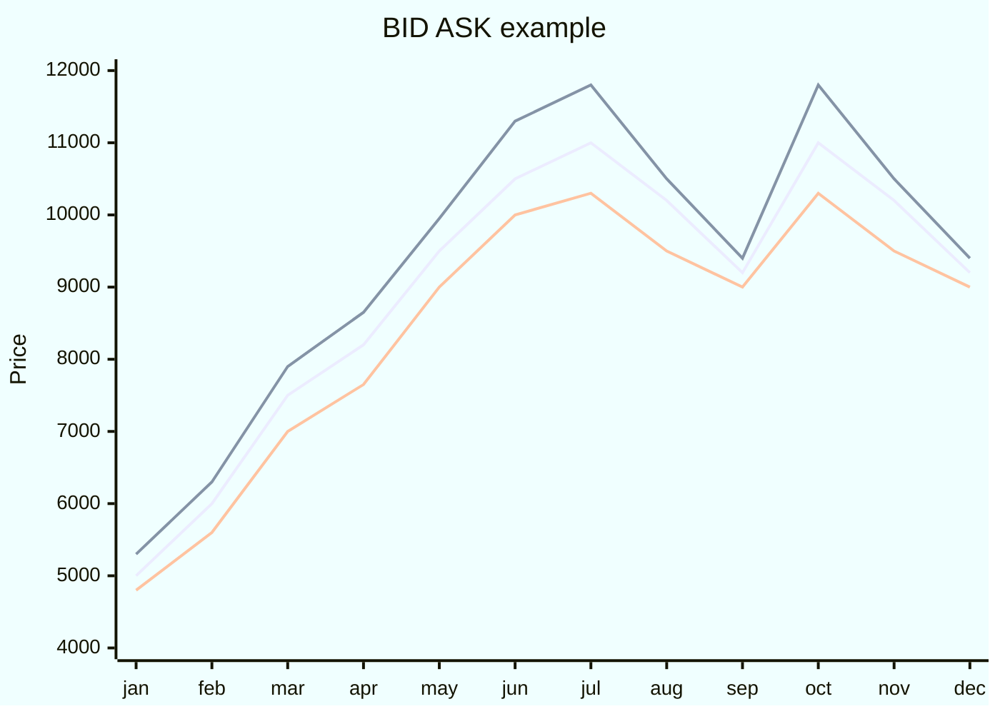

Esempio di come varia il prezzo di ask (richiesta, retta in alto) e bid (offerta, retta in basso).

Prima di addentrarci nello specifico un po' di definizioni:
- **BID** = prezzo più alto che un operatore (market maker) è disposto ad offrire per comprare un tuo asset.
- **ASK** =  prezzo più basso a cui un operatore (market maker) è disposto ad vendere un asset.

Dato che i [[042_market maker]] fanno l'inverso di un trader normale (comprano a bid e vendono ad ask) viene aggiunta molta componente liquida ai mercati, in breve è più veloce e facile per i trader retail vendere e comprare.

### bid ask spread
La differenza tra il prezzo bid e il prezzo ask, nota anche come "forbice denaro-lettera", rappresenta il margine di profitto che l'operatore (ad esempio un broker o market-maker) guadagna sulla transazione.

si calcola nel seguente modo  $bid\ ask\ spread= \frac{ask-bid}{ask}$ e volendo si può fare anche la percentuale

### Liquidità
Lo spread bid-ask è un indicatore importante della liquidità di un mercato e della sua efficienza. Un mercato liquido avrà uno spread più stretto, mentre un mercato meno liquido può avere uno spread più ampio. 

**Esempio:**

Se un titolo ha un bid di 10 euro e un ask di 10,20 euro, lo spread è di 20 centesimi. Chi acquista pagherà 10,20 euro e chi vende riceverà 10 euro.

